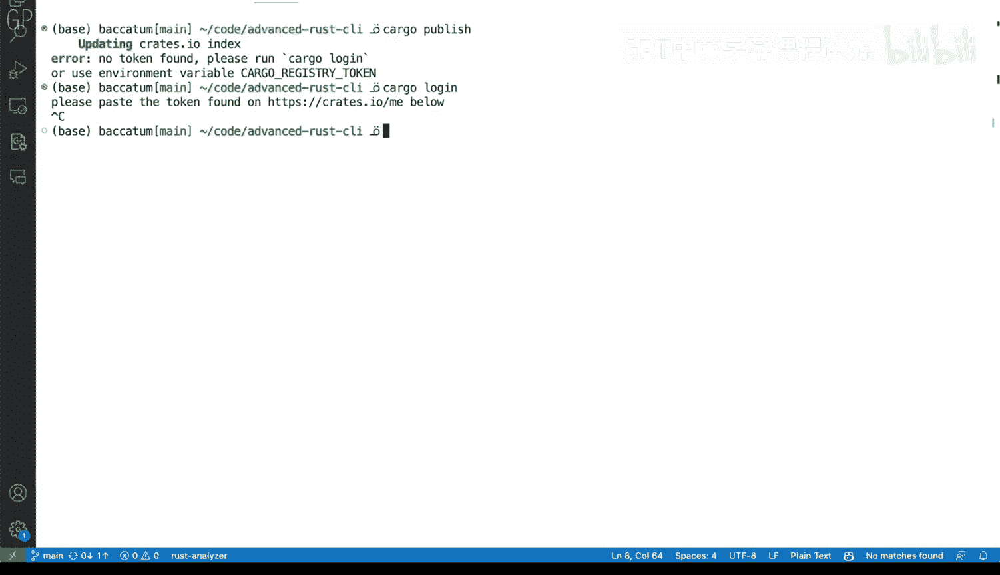

# 037：将Rust应用发布到Crates.io 🚀


在本节课中，我们将学习如何将一个Rust命令行工具发布到Crates.io，这是Rust社区的官方包注册中心。我们将了解发布前的准备工作、必要的配置以及发布的具体流程。

## 概述

发布Rust应用到Crates.io涉及几个关键步骤，包括检查项目配置、确保元数据完整、进行试运行以及最终的认证和发布。我们将使用`cargo publish`命令来完成这些操作。

## 项目配置检查

首先，我们需要检查项目的`Cargo.toml`配置文件。与其他编程语言的工具不同，Rust的发布流程通常不需要在配置文件中进行大量特殊设置。

在我们的示例中，`Cargo.toml`文件包含了项目的依赖项（如`serde_json`和`clap`）以及一些启用的功能。最重要的是，它定义了项目的版本号。

```toml
[package]
name = "ls_block_wrapper"
version = "0.1.0"
...
```

## 发布到Crates.io

我们将使用`cargo publish`命令来发布应用。Crates.io是Rust社区主要的公共包注册中心，所有发布的包都可以在这里被其他开发者找到和使用。

值得注意的是，`cargo publish`命令中的“registry”参数可以指向不同的注册中心。除了公共的Crates.io，你也可以将包发布到私有注册中心，这在企业内网或受限制的开发环境中非常有用。

## 准备工作：Crates.io账户与认证

在开始发布之前，你需要在Crates.io上拥有一个账户。你可以使用GitHub账户快速登录。

登录后，你需要生成一个API令牌（API Token），用于在命令行中进行身份验证。这个令牌可以通过两种方式使用：
1.  将其保存在本地的 `~/.cargo/credentials` 文件中。
2.  通过设置环境变量 `CARGO_REGISTRY_TOKEN`。

## 试运行发布流程

在正式发布前，强烈建议使用 `--dry-run` 标志进行试运行。这个操作会模拟整个发布过程，包括打包、编译和检查，但不会真正上传你的包。

执行以下命令：
```bash
cargo publish --dry-run
```
这个过程会执行多项检查，并警告你可能存在的问题，例如未提交的代码更改或缺失的项目元数据。

## 完善项目元数据

`cargo publish` 的检查机制非常有用，它能帮助我们发现配置中的遗漏。常见的警告包括缺少描述、许可证文件、文档链接或代码仓库地址。

为了通过检查，我们需要在 `Cargo.toml` 的 `[package]` 部分补充这些信息：

```toml
[package]
name = "ls_block_wrapper"
version = "0.1.0"
description = "一个用于包装ls命令的示例工具" # 项目描述
license = "MIT" # 许可证
documentation = "https://docs.rs/ls_block_wrapper" # 文档链接（可指向docs.rs）
repository = "https://github.com/yourusername/advanced-rust-ci" # 代码仓库地址
```

补充信息后，记得提交对 `Cargo.toml` 的更改到Git。

## 处理未提交的更改

如果工作目录中存在未提交的更改（例如你刚刚修改了`Cargo.toml`），`cargo publish`会发出警告。这是为了防止意外发布未版本控制的代码。

你可以选择先提交这些更改：
```bash
git add Cargo.toml
git commit -m “更新项目元数据”
```
或者，如果你确认这些更改无关紧要，可以在发布时使用相应标志强制继续。

## 正式发布与身份验证

当你确认所有检查都通过后，就可以移除 `--dry-run` 标志进行正式发布了。

```bash
cargo publish
```
如果是第一次发布，你会遇到身份验证错误，因为尚未登录。此时，你需要运行：
```bash
cargo login
```
这个命令会提供一个URL，引导你到Crates.io网站获取令牌。将令牌粘贴回终端，即可完成认证。完成登录后，再次执行 `cargo publish` 命令，你的Rust包就会被上传并发布到Crates.io。

## 总结




本节课我们一起学习了将Rust应用发布到Crates.io的完整流程。我们了解了`Cargo.toml`中元数据的重要性，如何使用`cargo publish --dry-run`进行试运行和检查，以及如何通过`cargo login`完成身份验证。遵循这些步骤，你可以顺利地将自己的工具或库分享给整个Rust社区。