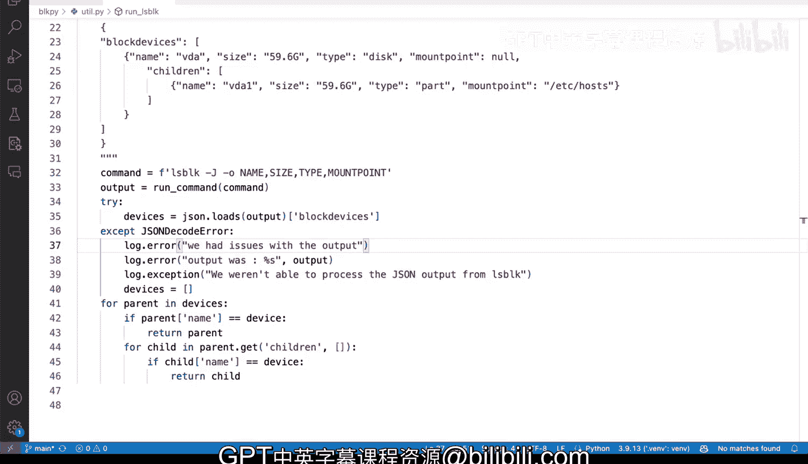

# 046：在Python中处理错误 🐍

在本节课中，我们将学习如何在Python程序中处理运行时错误。我们将重点介绍使用 `try...except` 块来捕获异常，并探讨如何通过日志记录来优雅地处理错误，而不是简单地忽略它们。

## 概述

Python中处理错误通常采用 `try...except` 的方式。这种方式允许我们“尝试”执行可能出错的代码，并在发生异常时“捕获”它，从而防止程序崩溃。然而，简单地捕获所有异常而不记录具体信息是一种不良实践。本节我们将学习如何正确、有效地处理错误。

## 错误处理的常见问题


让我们通过一个终端命令的例子来观察一个典型的错误。我们尝试执行一个会引发异常的命令。

```bash
lsblk -J /dev/vda1
```

执行此命令会引发一个大的异常。这是因为我们在命令中故意添加了无效的参数 `-J`。在后台，这个错误源于一个Python脚本 `utility.py` 的第33行，该行尝试解析JSON数据。

## 不完善的错误处理方式

对于Python初学者，一种常见的错误处理方式是简单地捕获所有异常并打印一条通用信息。

```python
try:
    # 可能出错的代码
    devices = json.loads(output)
except:
    print("There was an error")
```

这种方式存在几个问题：
1.  变量 `devices` 可能未被定义，导致后续代码出现 `NameError`。
2.  我们完全不知道具体发生了什么错误，丢失了所有调试信息。
3.  这只是“吞掉”了异常，并没有真正处理问题。

即使我们尝试捕获特定异常并给变量赋一个默认值（如空列表），如果处理不当，依然不是好的做法。

```python
try:
    devices = json.loads(output)
except json.JSONDecodeError:
    devices = []
```

这种方式虽然避免了程序崩溃，但同样没有记录错误的任何细节，对于调试和问题排查毫无帮助。

## 改进的错误处理：结合日志记录

上一节我们看到了不完善的错误处理方式，本节我们来看看如何利用Python的 `logging` 模块进行改进。

`logging` 模块提供了一个强大的方法 `logger.exception()`，它不仅能记录我们自定义的错误信息，还能自动捕获并记录完整的异常回溯信息。

以下是改进后的代码示例：

```python
import logging
import json

# 配置日志
logging.basicConfig(level=logging.ERROR)
logger = logging.getLogger(__name__)

try:
    devices = json.loads(output)
except json.JSONDecodeError:
    logger.exception("We weren‘t able to process the JSON output from lsblk.")
    devices = []
```

当我们再次运行程序时，终端不仅会显示我们的自定义错误信息，还会打印出完整的异常堆栈跟踪。这让我们能清晰地看到错误发生在哪一行、是什么原因导致的。

## 添加更多有用的上下文信息

我们可以进一步丰富错误日志，添加更多上下文信息，使调试更加容易。

例如，我们可以记录引发错误的原始输出：

```python
try:
    devices = json.loads(output)
except json.JSONDecodeError:
    logger.error(f"We had issues with the output. Output was:\n{output}")
    logger.exception("We weren‘t able to process the JSON output from lsblk.")
    devices = []
```

这样，日志中就会包含导致解析失败的具体数据，极大地便利了问题复现和修复。

## 高级配置：将错误日志写入文件

在实际生产环境中，我们可能不希望将所有详细的错误信息都打印到终端上，以免干扰用户。我们可以将日志配置为写入文件。

以下是配置日志写入文件的示例：

```python
import logging

# 创建一个文件处理器
file_handler = logging.FileHandler('app_error.log')
file_handler.setLevel(logging.ERROR)

# 设置日志格式
formatter = logging.Formatter('%(asctime)s - %(name)s - %(levelname)s - %(message)s')
file_handler.setFormatter(formatter)

# 获取logger并添加处理器
logger = logging.getLogger(__name__)
logger.addHandler(file_handler)

# 现在，logger.exception() 的信息将写入 ‘app_error.log‘ 文件，而不会显示在终端。
```

通过这种方式，我们可以保持终端输出的整洁，同时将所有错误细节完整地保存在日志文件中供后续分析。

## 总结



本节课中我们一起学习了在Python中处理错误的正确方法。我们首先了解了简单使用 `try...except` 并打印通用信息的不良实践及其弊端。接着，我们学习了如何结合 `logging` 模块，使用 `logger.exception()` 来捕获和记录完整的异常信息。最后，我们还探讨了如何为错误添加上下文信息以及如何将错误日志重定向到文件中。这是一种为Python应用程序添加健壮错误处理策略的非常有效的方法。