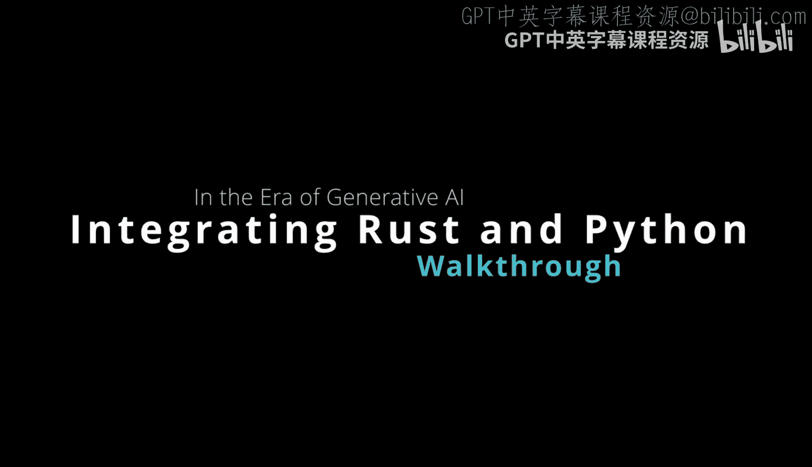
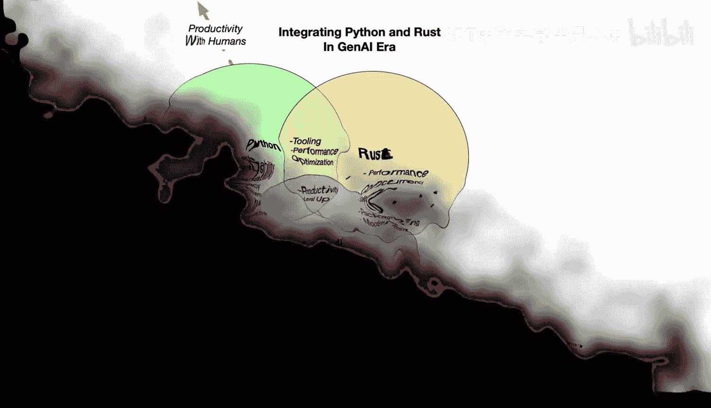

# 047：时机与意义 🚀

在本节课中，我们将探讨在生成式AI时代，如何将Rust与Python这两种语言进行集成。我们将分析两种语言各自的优势，确定最佳的集成时机与方式，并理解生成式AI如何进一步强化这两种语言的能力。

## Python的优势与定位 🐍

上一节我们介绍了课程主题，本节中我们来看看Python语言的核心优势。Python以其**可读性**、**庞大的生态系统**和**极高的开发效率**而闻名。它被设计为一种以人为本的语言，非常适合快速构建原型、Web应用、命令行工具或脚本。

以下是Python的主要特点：
*   **可读性强**：语法简洁明了，易于学习和理解。
*   **生态丰富**：拥有海量的第三方库支持，覆盖数据科学、机器学习、Web开发等众多领域。
*   **开发高效**：提供极佳的交互式反馈循环，能快速验证想法。
*   **流行度高**：是全球最流行的编程语言之一。

## Rust的优势与定位 ⚙️

然而，Python也存在一些局限性，而Rust恰好能解决这些问题。Rust是一种现代系统编程语言，它带来了Python所不具备的先进特性。

以下是Rust解决的关键问题：
*   **真正的并发**：Rust支持真正的多线程，而Python由于全局解释器锁（GIL）的限制，在多线程CPU密集型任务上效率不高。
*   **内存与线程安全**：Rust编译器在编译时就能检查数据竞争等并发错误，确保代码的健壮性。其所有权系统保证了内存安全，无需垃圾回收。
*   **卓越性能**：Rust能提供接近机器码级别的运行性能，同时能耗更低。
*   **现代化的包管理**：Rust的包管理工具Cargo统一且健壮，解决了Python历史上包管理方案分散的问题。

Rust的公式可以概括为：**安全 + 并发 + 性能**。

## 集成时机：强强联合 🤝

了解了两种语言的特点后，我们来看看它们的最佳集成点。两者的交集体现在工具链和性能优化领域。

当需要结合两者的优势时，集成变得非常有意义：
*   **性能关键的工具**：例如，用纯Python编写的代码检查（Linting）工具可能运行缓慢。将其核心部分用Rust重写（如Ruff工具），性能可提升十倍或更多，这在大型代码库上收益显著。
*   **高性能服务包装**：对于推理服务器、Web服务器或其他任何类型的后端服务，用Rust编写核心逻辑能保证高性能与安全，然后通过Python包装提供易用的接口。这利用了Rust的性能和Python的快速开发与丰富生态。

## 生成式AI带来的新变化 🤖

生成式AI的兴起为这两种语言的集成带来了新的变数。它能够自动生成大量代码（可能高达80%），从而放大了两种语言的核心特性。

*   **对Python的增强**：Python本就为人类生产力而设计，生成式AI能进一步提升其开发效率，让开发者更快速地构建应用。
*   **对Rust的增强**：Rust虽然学习曲线较陡，但其严格的编译器能有效捕获生成式AI可能产生的“幻觉”代码（如内存错误、数据竞争）。Python没有编译器进行此类深度检查。因此，生成式AI与Rust的结合异常强大——AI负责生成代码草稿，Rust编译器则充当一个极其严格的代码审查员，确保最终产出的代码既高效又安全。

我们可以这样看待这种变化：在生成式AI的辅助下，**可读性/开发效率（Python侧）** 和 **性能/安全性（Rust侧）** 的天平发生了微妙的倾斜。如果你正在使用生成式AI辅助编程，那么在代码库中更多地使用Rust开始变得更具吸引力。

## 总结 📝

本节课中我们一起学习了在生成式AI时代集成Rust与Python的时机与意义。关键要点如下：
1.  **Python**擅长快速原型开发、拥有丰富生态，是以人为本的高效语言。
2.  **Rust**在性能、内存安全、真正并发和现代化工具链方面具有绝对优势。
3.  最佳**集成点**在于用Rust构建性能关键的核心组件（如工具、服务），并用Python进行包装和快速集成。
4.  **生成式AI**放大了两者的优势，尤其与Rust结合时，能通过严格的编译器检查，生产出既高效又安全的可靠代码。

在决定使用哪种语言或如何集成时，应基于项目对性能、安全性和开发速度的具体需求进行权衡。