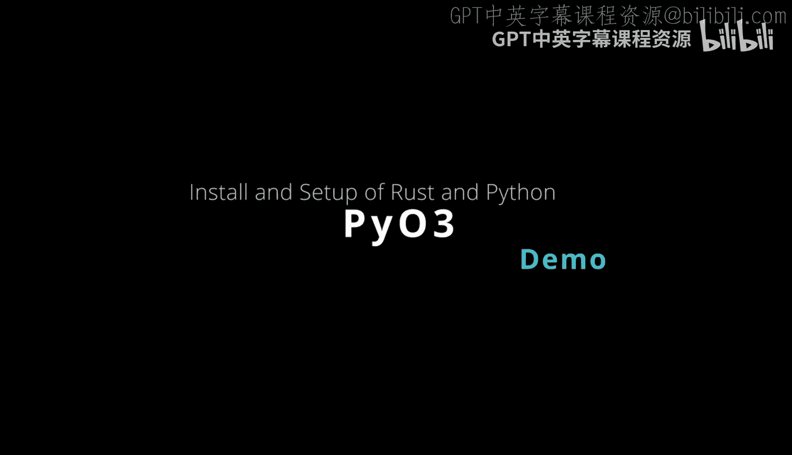
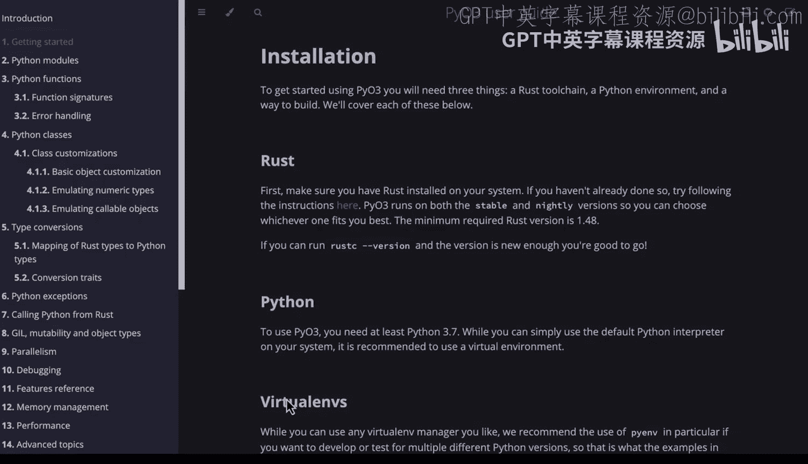

# 048：安装与配置 🚀



在本节课中，我们将学习如何搭建PyO3的开发环境。PyO3是一个用于创建Python扩展模块的Rust库，它允许你在Rust中编写高性能的Python代码。我们将从安装必要的工具链开始，一步步配置好开发环境。

## 环境准备

首先，你需要确保系统中安装了三个核心组件：Rust工具链、Python环境以及一个Python虚拟环境管理工具。以下是具体的检查与安装步骤。

### 1. 检查Python安装



打开终端，输入以下命令来验证Python是否已安装：
```bash
python3 --version
```
如果系统返回了Python 3的版本号（例如 `Python 3.10.6`），说明Python已就绪。如果未安装，请访问[Python官网](https://www.python.org/downloads/)下载并安装。

### 2. 检查Rust安装

接下来，验证Rust是否已安装：
```bash
rustc --version
```
如果看到Rust的版本信息，则安装成功。如果未安装，请访问[Rustup官网](https://rustup.rs/)，按照指引安装Rust工具链。

### 3. 创建Python虚拟环境

为了隔离项目依赖，我们创建一个Python虚拟环境。一个便捷的技巧是将虚拟环境创建在用户主目录下，便于记忆和管理。
```bash
python3 -m venv ~/.venv
```
如果系统提示 `venv` 模块未找到，你可能需要先安装 `python3-venv` 包（例如在Ubuntu上使用 `sudo apt install python3-venv`）。

创建完成后，激活虚拟环境：
```bash
source ~/.venv/bin/activate
```
为了更便捷，你可以将 `source ~/.venv/bin/activate` 这行命令添加到你的 `~/.bashrc` 或 `~/.zshrc` 文件中，这样每次打开终端时都会自动激活该环境。

## 安装构建工具

上一节我们准备好了基础环境，本节中我们来安装项目构建所需的关键工具。

在激活的虚拟环境中，使用 `pip` 安装 `maturin`。`maturin` 是一个用于构建和发布基于PyO3的Rust-Python混合项目的工具。
```bash
pip install maturin
```

## 创建PyO3项目

工具安装完毕后，现在我们可以创建一个新的PyO3项目。

遵循官方教程，我们使用 `maturin` 初始化一个名为 `pyo3_example` 的项目：
```bash
maturin init pyo3_example
```
此命令会创建一个同名目录。进入该目录：
```bash
cd pyo3_example
```

进入项目目录后，再次运行 `maturin` 命令。它会引导你进行项目设置，这里我们选择默认的PyO3配置即可。
```bash
maturin init
```

## 项目结构解析

现在我们已经完成了基础设置，接下来看看项目的核心文件结构，理解PyO3是如何连接Python和Rust的。

查看项目根目录下的 `src/lib.rs` 文件，这是Rust代码的主入口。你可以看到一个基本的PyO3项目结构，其中定义了一个可供Python调用的函数。

同时，查看 `Cargo.toml` 文件，你会发现它已经自动配置了 `pyo3` 作为依赖项，并将库类型设置为 `cdylib`，这是创建Python扩展模块所必需的。

## 构建与测试

一切配置就绪后，最后一步是构建项目并在Python中测试它。

在项目根目录下，运行以下命令来编译Rust代码并生成Python模块：
```bash
maturin develop
```
命令执行成功后，启动Python解释器：
```bash
python
```
在Python交互环境中，导入我们刚刚构建的模块并测试其功能：
```python
import pyo3_example
pyo3_example.sum_as_string(1, 2)
```
如果一切正常，你将看到输出 `‘3’`。这证明你已经成功地从Python调用了用Rust编写的函数，获得了性能提升。

最后，你可以将本项目添加到版本控制中，例如使用Git：
```bash
git init
git add .
git commit -m “Adding pyo3_example project”
```

## 总结


本节课中我们一起学习了PyO3的入门安装与配置。我们逐步检查并安装了Rust、Python和虚拟环境，使用 `maturin` 工具创建并初始化了一个PyO3项目，剖析了项目的基本结构，并最终成功构建模块，在Python中验证了Rust函数的调用。这个过程为你在Rust中编写高性能Python扩展打下了坚实的基础。