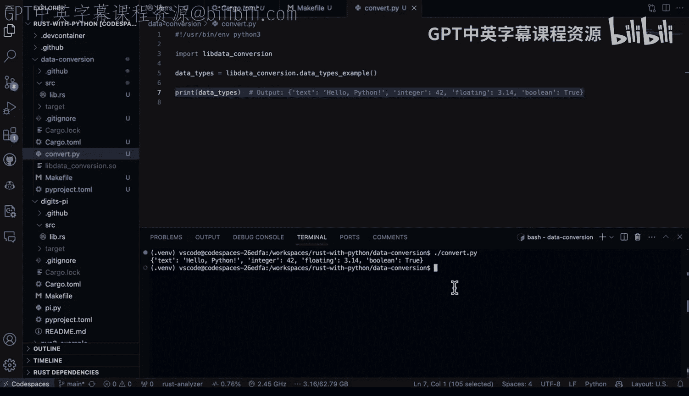

# 050：Rust到Python 🦀➡️🐍


在本节课中，我们将学习如何将Rust中的数据类型转换为Python数据结构。这是一个在Python和Rust之间进行交互时非常常见的任务，尤其适用于将Rust中计算密集型操作的结果传递给Python环境使用。

## 项目结构与核心概念

首先，我们来看一个具体的项目示例。项目的核心逻辑位于 `src/lib.rs` 文件中，在一个名为 `data_conversion` 的模块内。

以下是该模块的导入部分，它引入了必要的PyO3库，使我们能够在Rust中操作Python对象。

```rust
use pyo3::prelude::*;
use pyo3::types::PyDict;
```

上一节我们介绍了项目的基本结构，本节中我们来看看具体的函数实现。

## 核心函数实现

我们定义了一个名为 `data_types_example_py` 的Python函数，它负责执行主要的转换工作。该函数返回一个 `PyResult` 对象，这是PyO3中用于处理可能出错的Python对象返回值的类型。

```rust
#[pyfunction]
fn data_types_example_py() -> PyResult<&PyDict> {
    // 函数体将在下文展开
}
```

在函数内部，我们首先定义了一些Rust原生数据类型。

```rust
let text = "Hello from Rust!".to_string(); // Rust字符串
let integer = 42_i32;                       // 32位有符号整数
let floating = 3.14159_f64;                 // 64位浮点数
let boolean = true;                         // 布尔值
```

接下来，我们将在Rust中创建一个Python字典，并将上述Rust数据插入其中。

## 创建并填充Python字典

为了在Rust中构建一个Python字典，我们使用 `Python::with_gil` 来获取Python的全局解释器锁（GIL），这是安全操作Python对象所必需的。

```rust
Python::with_gil(|py| {
    let dict = PyDict::new(py);
    // 接下来填充字典
})
```

获取字典对象后，我们需要将Rust数据逐一插入。以下是向字典中添加键值对的方法。

```rust
dict.set_item("text", text)?;
dict.set_item("integer", integer)?;
dict.set_item("floating", floating)?;
dict.set_item("boolean", boolean)?;
Ok(dict)
```

`set_item` 方法用于插入键值对。每对键值都对应我们之前定义的Rust变量。`?` 操作符用于传播可能发生的错误。

## 将函数暴露为Python模块

为了使这个Rust函数能被Python调用，我们需要将其包装在一个模块中并导出。

```rust
#[pymodule]
fn lib_data_conversion(_py: Python, m: &PyModule) -> PyResult<()> {
    m.add_function(wrap_pyfunction!(data_types_example_py, m)?)?;
    Ok(())
}
```

`#[pymodule]` 宏将 `lib_data_conversion` 函数标记为模块的入口点。`m.add_function` 将我们定义的 `data_types_example_py` 函数添加到模块中，使其在Python中可用。

## 构建与编译项目

为了将Rust代码编译成Python可以导入的共享库，我们需要使用Cargo进行构建。一个 `Makefile` 可以简化这个过程。

以下是构建命令的示例：

```makefile
build:
    cargo build --release
    cp target/release/libdata_conversion.so ./
```

运行 `make build` 命令会执行两个步骤：
1.  使用 `cargo build --release` 以发布模式编译Rust项目。
2.  将生成的 `.so` 共享库文件复制到当前工作目录。

## 在Python中调用Rust函数

构建成功后，我们可以在Python脚本中导入并使用这个Rust模块。

首先，导入以 `lib` 开头的共享库文件（不包含 `.so` 后缀）。

```python
import libdata_conversion
```

然后，直接调用我们在Rust中暴露的函数。

```python
result = libdata_conversion.data_types_example_py()
print(result)
```

执行这段Python代码，将会输出一个包含我们定义的文本、整数、浮点数和布尔值的Python字典。

## 总结

本节课中我们一起学习了如何将Rust数据类型转换为Python数据结构。整个过程可以概括为以下几个关键步骤：
1.  在Rust中定义函数并使用PyO3库。
2.  在函数内部创建Python字典并插入Rust数据。
3.  将函数包装为Python模块。
4.  使用Cargo将Rust代码编译为 `.so` 共享库。
5.  在Python中导入该库并调用函数。



这种方法非常适用于将Rust中执行的高性能计算或复杂操作的结果，无缝传递给Python生态系统进行后续处理或展示。