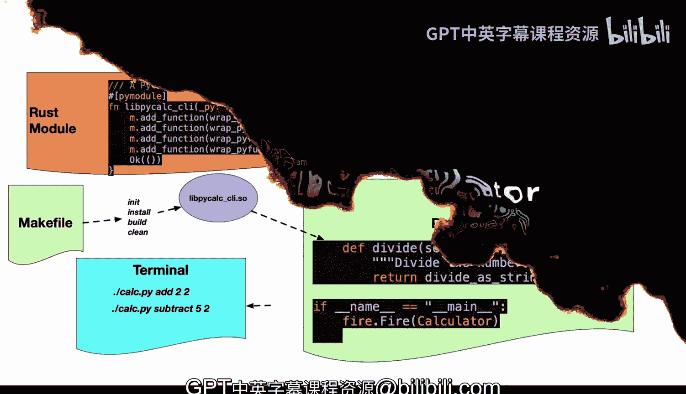
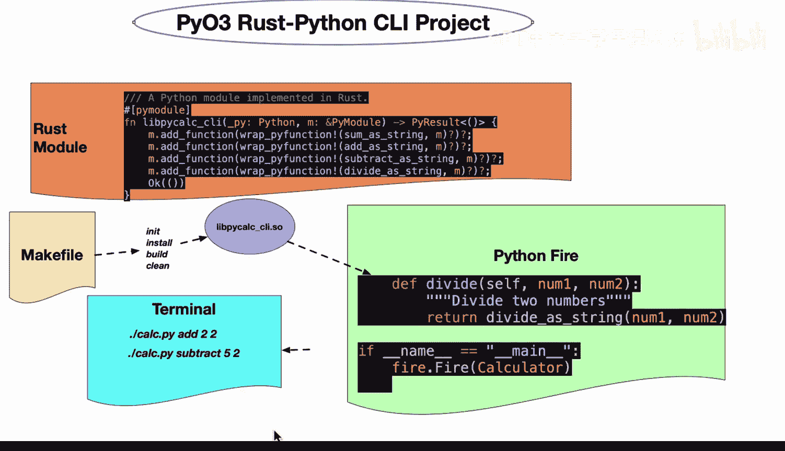

# 052：PyO3项目架构图解 🧩




在本节课中，我们将学习如何构建一个结合Rust高性能计算与Python便捷性的项目。我们将通过一个具体的PyO3项目架构图，来理解如何将Rust代码封装为Python模块，并使用Python Fire库轻松创建命令行工具。

---

## 项目架构概述

上图展示了一个典型的PyO3（Rust与Python交互）项目结构。这种模式适用于需要将计算密集型逻辑（如数值运算、复杂数据处理或机器学习运维任务）用Rust实现，同时保留Python的易用性和丰富生态的项目。

## Rust核心逻辑部分

上一节我们介绍了项目的整体架构，本节中我们来看看Rust部分的具体实现。

Rust代码负责实现核心的重型逻辑。这利用了Rust作为全球性能最佳语言之一的优势。在Rust代码中，你需要构建业务逻辑，然后通过几行代码将其暴露为Python模块。

以下是构建Python模块的关键代码示例：
```rust
#[pymodule]
fn lib_pcalc_ci(_py: Python, m: &PyModule) -> PyResult<()> {
    m.add_function(wrap_pyfunction!(sum_numbers, m)?)?;
    m.add_function(wrap_pyfunction!(add_string, m)?)?;
    m.add_function(wrap_pyfunction!(subtract_string, m)?)?;
    m.add_function(wrap_pyfunction!(divide_string, m)?)?;
    Ok(())
}
```
在这个计算器示例中，我们构建了四个函数：`sum_numbers`、`add_string`、`subtract_string`和`divide_string`。每个函数的功能都清晰明了。

## 构建与自动化

一旦Rust代码编写完成，下一步是构建项目并将其集成到Python环境中。手动操作（如复制共享对象文件）可能很繁琐，因此使用Makefile来自动化这一流程是明智的选择。

以下是推荐的Makefile命令：
```makefile
build:
    cargo build --release
    cp target/release/libpcalc_ci.so ./pcalc_ci.so
```
运行`make build`命令可以自动完成Rust代码的编译，并将生成的共享库文件（如`libpcalc_ci.so`）复制到指定位置，为Python调用做好准备。

## Python集成与命令行工具

现在，我们已经准备好了Rust模块，接下来看看如何将其集成到Python应用中。我推荐使用Google的Python Fire库，它可以极大地简化命令行工具的创建过程。

Python Fire库能够自动将Python类和函数转化为命令行接口，无需编写任何样板代码。以下是如何使用它：

首先，创建一个Python类来封装Rust模块的功能：
```python
import fire
import pcalc_ci  # 导入我们编译好的Rust模块

class Calculator:
    def add(self, num1, num2):
        return pcalc_ci.add_string(num1, num2)
    
    def subtract(self, num1, num2):
        return pcalc_ci.subtract_string(num1, num2)
    
    def divide(self, num1, num2):
        return pcalc_ci.divide_string(num1, num2)

if __name__ == '__main__':
    fire.Fire(Calculator)
```
通过`fire.Fire(Calculator)`这一行代码，`Calculator`类中的所有方法就都变成了命令行命令。

## 工作流总结

本节课中我们一起学习了构建PyO3项目的完整工作流。

我认为，**最有效的Rust与Python集成公式**是：**让Rust负责其擅长的重型计算任务，让Python负责其擅长的快速开发和生态集成**。




通过结合Python Fire与Rust，你可以用极少的代码创建一个高性能的命令行工具。例如，在终端中你可以这样使用：
```bash
./calculator.py add 2 2
./calculator.py subtract 5 2
```
这种工作流充分发挥了两种语言的优势，对于希望提升性能的Python项目来说，是一个极佳的组合，我强烈推荐采用。