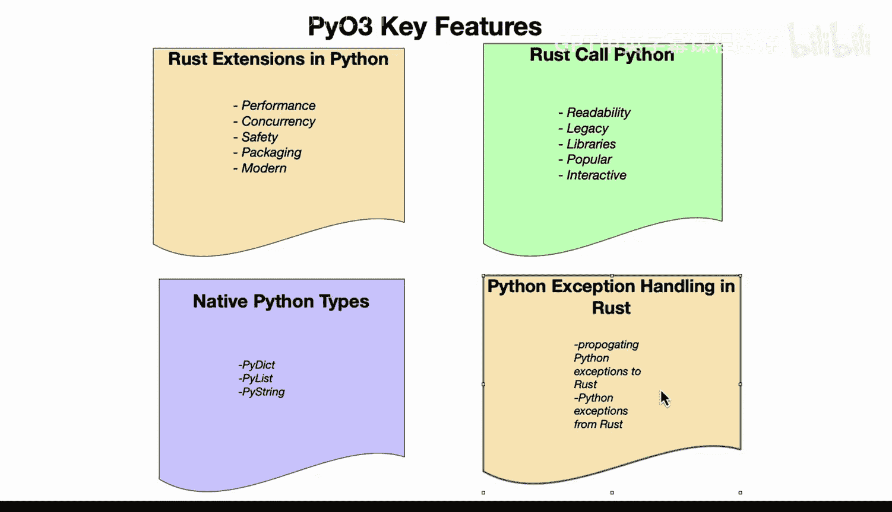

# 054：异常、转换与属性 🚀

在本节课中，我们将学习PyO3的核心高级特性。PyO3是一个强大的库，它允许Rust和Python代码无缝地协同工作。我们将重点探讨三个关键方面：如何在Rust中处理Python异常、如何在两种语言间转换数据类型，以及如何操作Python对象的属性。

---

## 概述

PyO3提供了多种功能，使开发者能够将Rust的高性能与Python的易用性和庞大生态系统结合起来。我们将逐一探索这些功能，理解它们如何在实际项目中发挥作用。

---

## Rust扩展Python 🛠️

首先，我们来看看PyO3如何允许开发者用Rust编写Python扩展。

这意味着你可以编写高性能且安全的代码，并能在Python环境中无缝使用它。此外，使用Rust进行打包通常效果极佳。

以下是Rust扩展Python的几个关键点：
*   允许开发者使用Rust编程语言编写Python扩展。
*   可以编写高性能的安全代码。
*   能在Python环境中无缝使用。
*   使用Rust时，打包效果通常很好。

---

## Rust调用Python 📞

上一节我们介绍了用Rust扩展Python，本节中我们来看看Rust如何调用Python代码。

这样做的原因有很多：Python代码通常易于阅读和理解；Python拥有大量遗留代码，你可能需要与之交互；并且由于Python已有30多年的历史，其库生态系统非常广泛和流行。

因此，允许Rust代码直接调用Python，使你能够执行诸如调用脚本、函数以及操作Python对象等任务。

PyO3也提供了处理原生类型的能力。对于原生类型，你可以使用`PyDict`、`PyList`、`PyString`等。这本质上是对你熟悉的Python类型的封装，你可以将它们当作原生的Rust类型来使用。这为Rust和Python之间的数据转换提供了一种无缝的方式，让你感觉像在家一样熟悉。

以下是Rust调用Python的几个关键点：
*   Python代码可读性强，易于理解。
*   Python拥有大量遗留代码。
*   Python的库生态系统非常广泛和流行。
*   允许Rust代码直接调用Python脚本和函数。
*   可以操作Python对象。
*   可以使用`PyDict`、`PyList`、`PyString`等封装类型。
*   这些类型可以在Rust中作为原生类型使用。
*   这为两种语言间的数据转换提供了无缝方式。

---

## 处理异常 ⚠️

之前我们探讨了双向调用，现在让我们关注一个重要的集成方面：异常处理。

例如，根据你所做的事情，在Rust中首先构建Python异常处理可能是一个好主意。PyO3提供了从Rust中处理这些Python异常的工具。

这可能意味着将Python异常传播到Rust，然后从Rust代码中引发该Python异常。你可以用这个功能做很多事情，例如，创建一个场景：一个Rust函数调用了一个会引发异常的Python函数，然后你可以在Rust中处理这个异常。

通过将Rust和Python结合使用，这里有很多集成功能。事实上，它可以合法地替代历史上许多通过C语言完成的Python交互。Rust是一种现代编译语言，并且与生成式AI编码工具配合得非常好。

以下是处理异常的几个关键点：
*   可以在Rust中构建Python异常处理逻辑。
*   PyO3提供了从Rust处理Python异常的工具。
*   可以将Python异常传播到Rust。
*   可以从Rust代码中引发Python异常。
*   例如，Rust函数可以调用引发异常的Python函数，并在Rust中处理。
*   结合使用Rust和Python具有许多集成优势。
*   它可以替代许多历史上用C语言完成的Python交互。
*   Rust是一种现代编译语言。
*   Rust与生成式AI编码工具配合良好。

---

## 总结

本节课中，我们一起深入探索了PyO3的高级特性。我们学习了如何用Rust编写高性能的Python扩展，如何让Rust代码调用并操作Python对象和函数，以及如何在两种语言间无缝地处理和传播异常。这些功能使得Rust和Python能够强强联合，充分利用双方的优势来构建更强大、更安全的应用程序。