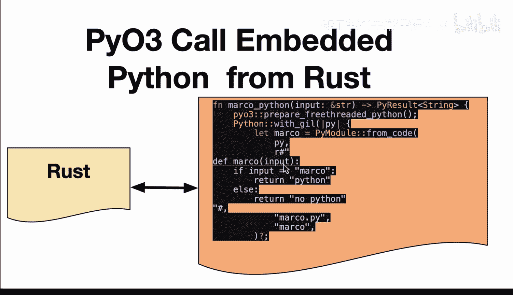

# 057：在Rust中嵌入Python 🐍


在本节课中，我们将学习如何在Rust程序中嵌入并执行Python代码。通过使用`PyO3`库，我们可以将现有的Python脚本或业务逻辑集成到Rust应用程序中，从而结合Python的灵活性与Rust的性能和安全性。这种方法特别适用于构建命令行工具、微服务或无服务器函数。

---

## 概述与准备工作

上一节我们介绍了Rust与外部系统交互的基本概念。本节中，我们来看看如何具体地在Rust代码中嵌入一个Python解释器来执行Python脚本。

首先，我们需要一个项目结构。以下是一个典型的项目布局，包含必要的配置文件和脚本。

```
embedded_python/
├── Cargo.toml
├── Makefile
└── src/
    └── main.rs
```

以下是各文件的核心内容说明。

### 项目配置文件



我们需要在`Cargo.toml`中声明对`pyo3`库的依赖。

```toml
[package]
name = "embedded_python"
version = "0.1.0"
edition = "2021"

[dependencies]
pyo3 = { version = "0.18", features = ["auto-initialize"] }
```

### 构建辅助文件

`Makefile`文件用于定义一些便捷的命令，以建立高效的开发反馈循环。它通常包含代码格式化、代码检查和运行命令。

```makefile
format:
	cargo fmt

lint:
	cargo clippy

run:
	cargo run

all: format lint run
```

---

## 编写Rust嵌入Python代码

现在，让我们进入核心部分，编写在Rust中调用Python逻辑的代码。

首先，我们需要导入必要的类型和模块。`PyO3`提供了与Python交互所需的所有工具。

```rust
use pyo3::prelude::*;
use pyo3::types::PyString;
```

接下来，我们定义一个Rust函数，它接收一个字符串参数，并将这个参数传递给内嵌的Python代码进行处理。

该函数的主体遵循一个标准模式：首先准备一个可多线程运行的Python环境，然后加载并执行我们的Python代码片段。

```rust
fn call_python_script(input: &str) -> PyResult<String> {
    // 准备一个“自由线程”的Python解释器，允许在多线程环境中运行
    Python::with_gil(|py| {
        // 从字符串代码创建Python模块
        let code = r#"
def marco(input):
    if input == "Marco":
        return "Python"
    else:
        return "No Python"
"#;
        let module = PyModule::from_code(py, code, "", "")?;
        
        // 获取模块中的`marco`函数并调用它
        let func = module.getattr("marco")?;
        let result = func.call1((input,))?;
        
        // 将Python的返回结果转换为Rust的String
        result.extract::<String>()
    })
}
```

在上面的代码中：
1.  `Python::with_gil`获取Python的全局解释器锁（GIL），这是与Python交互所必需的。
2.  我们定义了一个简单的Python函数`marco`，它根据输入返回不同的字符串。
3.  通过`PyModule::from_code`，我们将字符串形式的Python代码编译成一个模块。
4.  然后，我们获取这个模块中的`marco`函数，并用Rust传入的参数调用它。
5.  最后，我们将Python函数的返回值提取为Rust的`String`类型。

---

## 调用与运行

定义了核心函数后，我们在Rust的`main`函数中调用它，并打印结果。

```rust
fn main() {
    println!("从Rust调用嵌入的Python...");
    
    match call_python_script("Marco") {
        Ok(result) => println!("结果: {}", result), // 应输出“Python”
        Err(e) => eprintln!("错误: {}", e),
    }
    
    match call_python_script("Pollo") {
        Ok(result) => println!("结果: {}", result), // 应输出“No Python”
        Err(e) => eprintln!("错误: {}", e),
    }
}
```

使用我们之前在`Makefile`中定义的命令，可以轻松地运行整个程序。

在终端中执行：
```bash
make run
```
或者直接使用：
```bash
cargo run
```

如果一切正确，你将在终端看到如下输出：
```
从Rust调用嵌入的Python...
结果: Python
结果: No Python
```

---

## 工作流程与优势

让我们回顾一下这个高效的工作流程。以下是开发过程中可以遵循的步骤：

1.  **编写代码**：在Rust中编写嵌入Python的逻辑。
2.  **代码格式化**：使用`cargo fmt`或`make format`来保持代码风格一致。
3.  **代码检查**：使用`cargo clippy`或`make lint`进行静态分析，捕捉潜在问题。
4.  **运行测试**：使用`cargo run`或`make run`执行程序，验证功能。

这种将Python嵌入Rust的方法为Python开发者提供了强大的优势：
*   **利用现有代码**：可以复用经过充分测试的Python脚本或库。
*   **享受Rust生态**：能够利用Rust在性能、内存安全和并发方面的优势。
*   **严格的开发环境**：Rust编译器严格的检查机制，结合格式化器和linter工具，能在生成式AI辅助编程时提供高质量的反馈，有助于构建更健壮的应用。

---

## 总结


本节课中我们一起学习了如何在Rust中嵌入Python代码。我们了解了`PyO3`库的基本用法，掌握了将Python脚本作为字符串嵌入到Rust函数中并执行的关键步骤。通过一个简单的“Marco Polo”游戏示例，我们看到了数据如何在两种语言间安全传递。最后，我们探讨了结合使用Makefile、代码格式化器和linter来建立高效、严格的Rust开发工作流程的价值。这种方法让开发者既能利用Python的快速原型能力和丰富库生态，又能获得Rust带来的系统级性能与安全性，是开发现代应用程序的一个强大技术组合。