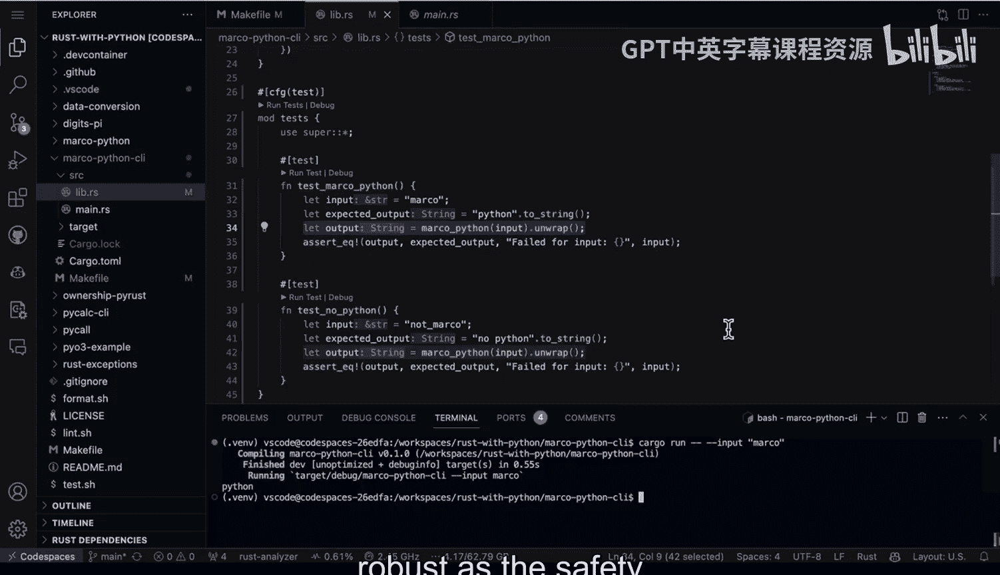

# 060：增强版嵌入式Python Rust CLI测试 🧪


在本节课中，我们将学习如何为嵌入Python代码的Rust命令行工具编写单元测试。我们将探讨为何测试至关重要，并演示一个具体的测试案例，展示如何通过测试发现并修复业务逻辑中的错误。

---

上一节我们介绍了构建嵌入式Python工具的基本框架。本节中我们来看看如何通过单元测试来确保业务逻辑的健壮性。


上图展示了我认为构建嵌入式Python工具的最佳实践。我们不仅需要一个命令行界面，还需要确保业务逻辑在面对代码变更或其他开发者协作时，依然能保持正确性。不能仅仅因为工具能编译运行，就假设业务逻辑一定正确。可能存在潜在问题。因此，我们需要通过编写单元测试来验证输入和逻辑。


接下来，让我们看看具体如何操作。首先，我们再次看到这段代码。我们将进入一个Github代码空间来仔细查看其逻辑。

这里是一个封装了Python 3嵌入式代码的CI工具，它接收输入。那么，它具体接收什么输入，又会做什么呢？如果我们浏览代码，会发现它期望输入“Marco”，但在这个案例中，它返回了“Bob”。也许某个开发者认为这是一个不错的逻辑。让我们运行一下这段代码看看。


运行命令 `cargo run --help`，可以看到帮助菜单。如果想实际传入输入，我们可以输入“Marco”。结果显示“Bob”。这看起来很奇怪，假设我是产品经理，我会觉得这不对。那么，让我们运行测试看看。

如何运行测试呢？如果我们查看Makefile，会发现它非常简单，就是 `cargo test`。我们可以输入 `make test` 或 `cargo test`。让我们执行 `cargo test`。

查看测试结果，我们发现这里确实存在问题。这正是编写单元测试的意义所在。我们看到一个名为 `test_marco` 的测试失败了，但有一个测试是成功的。我们甚至可以追溯到具体的代码行：`sourcelib` 的第35行。

让我们回到第35行，滚动查看。事实上，问题就在这里，我们需要仔细调查。如果我们向下滚动代码，会发现实际发生的情况是：代码期望返回“Python”，但实际返回了其他内容。我们需要修复这个问题，确保代码不再返回错误的结果。

回到我们的代码位置，我们看到问题在于：我本应返回“Python”。测试本身告诉我们期望的结果是“Python”。因此，我们需要修复这段代码。

修复代码后，让我们快速回顾一下测试是如何帮助我们调试的。编写一个简单单元测试的方法是使用以下样板代码：

```rust
#[cfg(test)]
mod tests {
    use super::*;

    #[test]
    fn test_marco() {
        let input = "Marco"; // 模拟命令行输入
        let expected_output = "Python"; // 期望的输出
        let actual_output = your_business_logic_function(input); // 调用业务逻辑函数
        assert_eq!(actual_output, expected_output); // 断言结果是否符合预期
    }
}
```

每个以 `#[test]` 标注的函数都是一个测试。测试本身很直接：设置输入为“Marco”，就像命令行工具那样，然后声明我们期望得到“Python”。这就是问题所在：测试本身告诉我们代码是错误的。可能是其他开发者在修改代码时出了错，但我们通过测试捕捉到了它。

然后我们查看输出，并使用断言（`assert_eq!`）来验证实际输出是否符合预期。在这个案例中，测试告诉我们它期望“Python”，但实际得到了“Bob”。这样我们就获得了调试这个应用所需的所有信息。

现在我已经修复了代码，让我们再次运行 `cargo test`。它会重新编译并运行测试。很好，所有测试都通过了。这里的核心逻辑就是：要构建并集成这些单元测试。

尽管Rust是一门非常出色的语言，但它无法预知未来业务逻辑会如何变更。这就是单元测试如此重要的原因。如果我们再次运行修复后的工具，它会完全按照我们的预期执行。

因此，花一点时间编写测试是一个非常好的做法，尤其是在生成式AI可以帮助你编写测试的今天。为什么不构建一些业务逻辑测试呢？甚至可以将它们放在你的库（Libs）中，使其更简单。

这样，你不仅能确保通过持续交付获得可复现的部署，还能验证你的代码逻辑与其著名的安全性和性能一样健壮。

😊



---


本节课中我们一起学习了为嵌入式Python的Rust CLI工具编写单元测试的重要性与方法。我们通过一个具体案例，演示了如何利用测试发现业务逻辑错误、如何定位问题代码，以及如何修复并验证修复结果。记住，结合Rust的安全性与全面的单元测试，是构建健壮、可靠应用程序的关键。