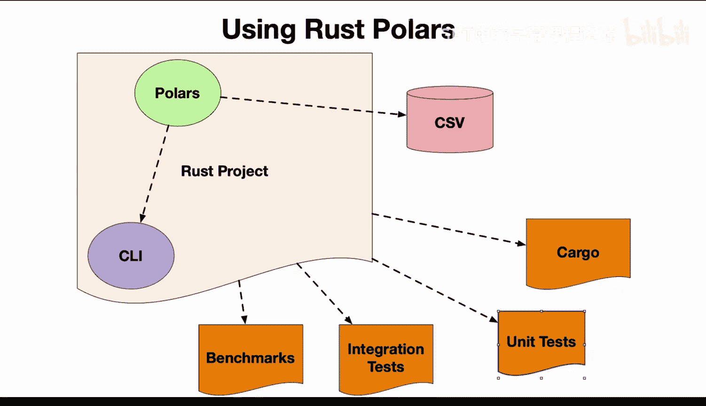
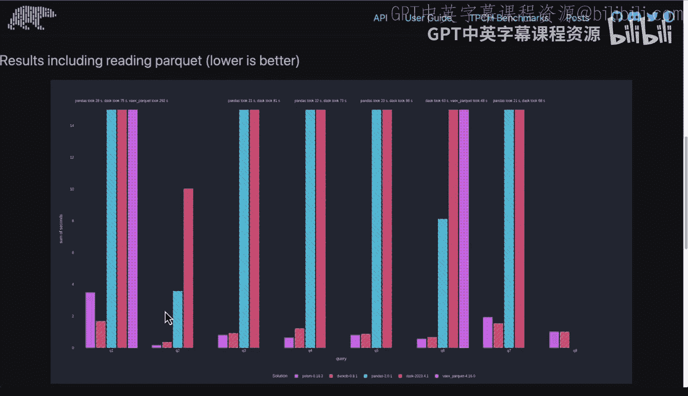
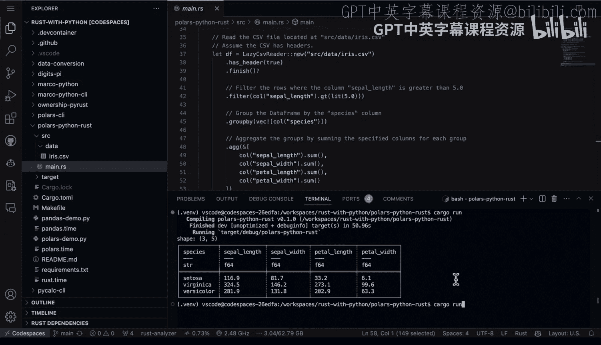

# 063：在Python和Rust中使用Polars


## 概述
在本节课中，我们将学习如何在Rust项目中使用Polars数据框库。我们将从一个实际项目的角度出发，了解如何设置项目、编写数据处理代码，并执行一些典型的数据操作，如过滤、分组和聚合。

## 项目结构与设置
上一节我们介绍了Polars库的概况，本节中我们来看看如何在一个具体的Rust项目中设置和使用它。

首先，一个Rust项目生态系统包含Cargo包管理系统。Cargo会负责安装Polars以及项目可能需要的其他库，例如用于命令行解析的`clap`或用于性能基准测试的`criterion`。

项目设置完成后，下一步通常是添加集成测试、单元测试和基准测试。将所有部分整合在一起，可以验证工具的性能、业务逻辑以及交付的二进制工具的契约。



以下是项目设置的核心步骤：
1.  **初始化项目**：使用`cargo new`命令创建一个新的Rust项目。
2.  **添加依赖**：在`Cargo.toml`文件中添加`polars`依赖项。
3.  **组织代码**：在`src`目录下编写主要的Rust代码。

## 核心代码解析
现在，让我们深入代码，看看如何使用Polars进行具体的数据操作。



在项目源代码目录中，我们有一个数据文件（例如经典的鸢尾花数据集`iris.csv`）和一个主文件`main.rs`。

`main.rs`文件中的代码将执行以下操作：
1.  **过滤**：筛选出`sepal_length`列值大于5的行。
2.  **分组**：根据`species`列对数据进行分组。
3.  **聚合**：为每个分组计算其他列（如`sepal_width`, `petal_length`, `petal_width`）的总和。

本质上，我们将执行数据框的典型基本操作。

以下是代码实现的关键步骤：
1.  从`polars` crate中导入必要的模块。
2.  定义`main`函数。在Rust中，一个简单的项目只需要一个`main`函数。
3.  读取`iris.csv`文件。
4.  执行过滤操作。
5.  执行分组操作。
6.  执行聚合操作，对每个组的特定列求和。
7.  触发计算并将结果收集到数据框中。
8.  输出最终结果。

这是一个相当直接的项目，能够初步体验Polars的功能。

```rust
// 示例代码结构示意
use polars::prelude::*;

fn main() -> Result<(), Box<dyn std::error::Error>> {
    // 读取CSV文件
    let df = CsvReader::from_path("iris.csv")?.finish()?;

    // 过滤: sepal_length > 5
    let filtered = df.filter(&df.column("sepal_length")?.gt(5)?)?;

    // 分组与聚合: 按species分组，并求和
    let grouped = filtered.groupby(["species"])?
        .select(["sepal_width", "petal_length", "petal_width"])
        .sum()?;

    // 输出结果
    println!("{:?}", grouped);
    Ok(())
}
```

## 运行与结果
我喜欢使用`Makefile`来管理构建、运行和测试等任务。不过，对于这个简单的项目，我们直接使用`cargo run`命令即可。

进入项目目录，执行`cargo run`命令。程序运行速度极快，几乎瞬间完成。

运行结果会将数据整理成一个紧凑的3行×5列的结构（假设有3个物种）。输出列包括：
*   `species` (字符串类型): 显示鸢尾花种类（如Setosa, Versicolor, Virginica）。
*   `sepal_length_sum`: 萼片长度总和。
*   `sepal_width_sum`: 萼片宽度总和。
*   `petal_length_sum`: 花瓣长度总和。
*   `petal_width_sum`: 花瓣宽度总和。

这些分组结果清晰地展示了我们查询的聚合数据。



## 总结
本节课中我们一起学习了Rust生态下的Polars库。它是一个出色的高性能库，让你能够以极快的方式进行数据操作。我们通过一个实际示例，演示了如何设置项目、读取数据、执行过滤、分组和聚合等常见数据框操作，并见证了其闪电般的执行速度。