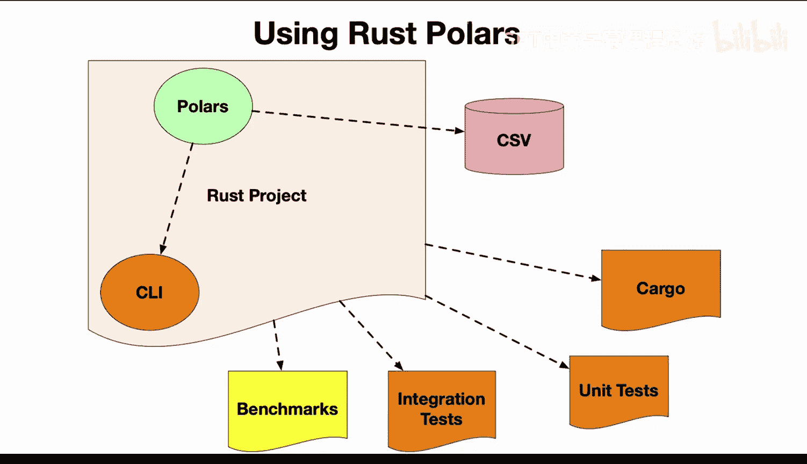
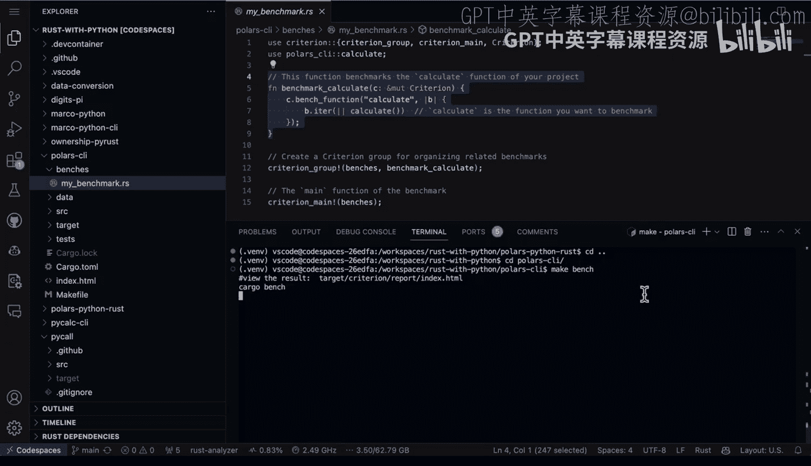
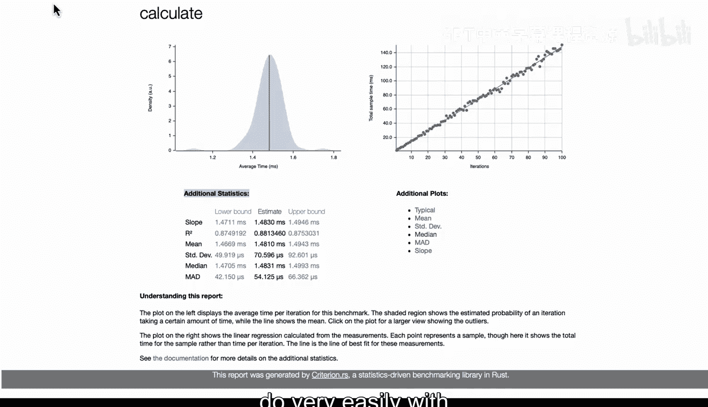

# 067：构建性能基准测试 📊


在本节课中，我们将学习如何为Rust代码构建性能基准测试。我们将通过一个具体的项目，对比Rust、Python pandas以及Python polars库在处理相同数据操作时的性能差异。课程将涵盖两种基准测试方法：使用简单的Makefile进行宏观对比，以及使用专业的`criterion`库进行微观、数据驱动的性能分析。

---

## 项目概述与代码结构

首先，我们有一个Rust polars项目，其中包含多种不同的组件。本节课的重点是性能基准测试。我们将进行两种不同类型的基准测试：首先，使用相同接口对比Python与Rust的性能，同时也对比基于pandas的接口；其次，我们将深入到更细粒度的层面，使用名为`criterion`的基准测试库对代码进行详细剖析。



让我们先来看看代码结构。第一步，我创建了这个名为“polars Python rust”的项目。其中有一些关键文件需要查看。

首先，这里有一个主文件（`main.rs`），它执行了一系列操作，包括聚合和分组等。

```rust
// Rust代码示例：执行聚合与分组操作
// ... (具体代码逻辑)
```

在pandas中，我也做了非常类似的事情，同样执行了一些分组操作。此外，我还使用了Polars库编写了一个基于Python的实现。

因此，我们现在有几个不同的版本来进行测试。

---

## 使用Makefile进行宏观基准测试

那么，一次性测试所有这些版本的最佳方法是什么？我喜欢使用Makefile。

接下来，让我们查看这里的Makefile。在Makefile中，我定义了几个目标：
*   `rust-benchmark`：运行`cargo build --release`构建优化后的Rust二进制文件，然后计时运行它。
*   `pandas-benchmark`：测试Python pandas版本。
*   `polars-benchmark`：测试Python polars版本。这个版本应该与Rust版本性能相近，因为它们使用相同的库。
*   `benchmark`：一个总目标，依次运行以上所有基准测试。

我认为这是测试一些想法（例如“Python的性能总是足够好”）的绝佳方式。与其猜测，不如通过实际编写代码来验证。

现在，让我们来运行这个基准测试。我将执行命令 `make benchmark`。

运行后，我们可以看到结果：
*   Rust版本的运行时间约为 **0.55秒**。
*   Python pandas版本的运行时间约为 **4.8秒**。
*   Python polars版本的运行时间约为 **1.6秒**。

从结果可以看出，pandas版本明显更慢（约5秒），而Rust版本仅需约半秒，这是一个非常显著的差异。同时，尽管Python polars同样使用Python，但由于Polars库内部的优化，其性能（1.6秒）也远优于pandas。这是一个很好的例子，说明在特定场景下（例如大规模运行的AWS Lambda函数），性能差异可能直接转化为巨大的成本差异。

---

## 使用Criterion库进行微观基准测试

第二种基准测试代码的方法是使用更专业的工具。我将进入另一个目录 `polars-ci`，这里我使用了名为`criterion`的库。让我们看看它是如何工作的。

在这个项目中，我们看到`criterion`已被安装，并且在`Cargo.toml`文件中有一个新的`[[bench]]`部分，它指向我们的基准测试文件。

接下来，让我们查看基准测试文件 `benches/benchmark.rs`。这个文件使用`criterion`库，并引入了项目中的`calculate`函数。它的作用是：对这个`calculate`函数进行基准测试。



这里的核心思想是，我们不应仅仅猜测“Python性能足够好”或“Rust性能足够好”，而应该使用数据科学的方法，通过实际基准测试这个特定操作来了解真实情况。

我们可以通过运行命令 `make bench` 来执行这个基准测试。

运行完成后，`criterion`会在 `target/criterion` 目录下生成详细的报告。我们可以打开报告文件夹并查看`report`目录下的内容。这里有一个基准测试报告。


如果我们点击查看`calculate`函数的报告，可以看到它提供了类似数据科学风格的分析，展示了我们函数的实际性能。报告会显示平均时间（单位为毫秒），我们可以看到这个函数运行速度极快。

此外，我们还可以查看实际的迭代次数，以及其他统计信息，例如标准差、R平方值、斜率等。这些都是观察数据的很酷的方式。简而言之，我们可以看到这个函数的执行时间在毫秒级别，是一个非常快速的函数。

---

## 课程总结



本节课中，我们一起学习了为代码进行性能基准测试的重要性。Rust使得这项工作变得非常容易，无论是通过简单的Makefile进行宏观对比，还是使用像`criterion`这样功能更丰富的库进行细致的、数据驱动的分析。通过实际测试而非猜测，我们可以做出更明智的技术决策，优化性能并控制成本。