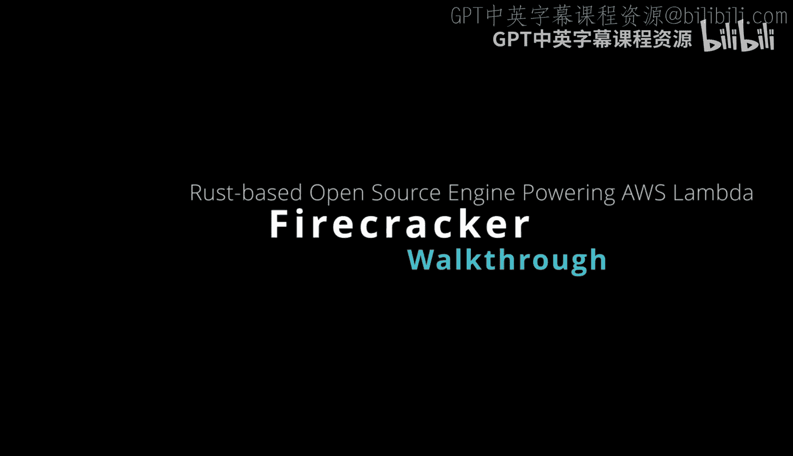
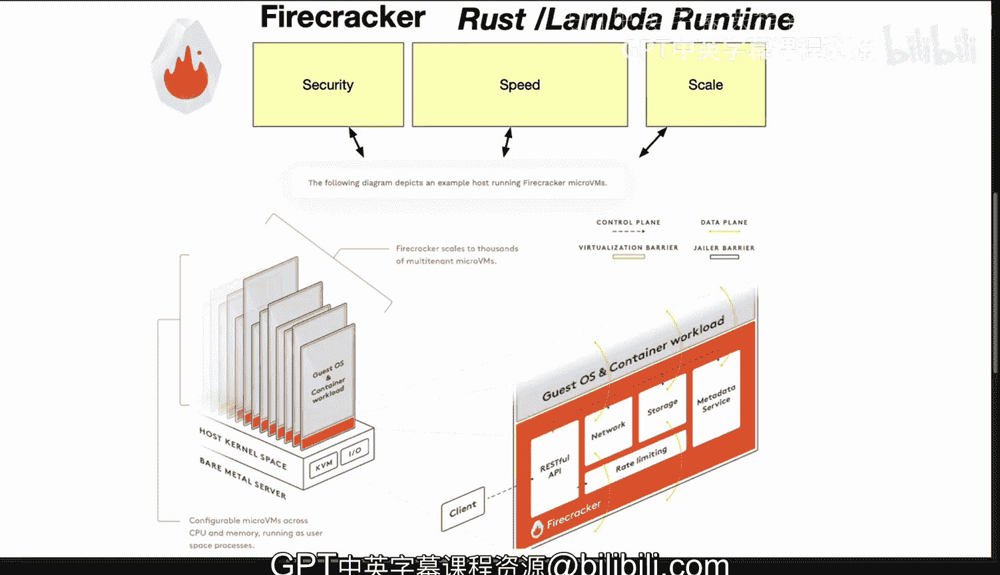

# 069：Firecracker项目详解 🔥

在本节课中，我们将深入探讨一个名为Firecracker的开源项目。这是一个用Rust语言编写的虚拟机，专门用于运行多租户容器和基于函数的服务，并优化性能与安全。我们将了解其架构、优势以及为何Rust是构建此类项目的理想选择。

## 项目概述

Firecracker是一个虚拟机，它专为运行多租户容器和基于函数的服务而设计，并致力于优化性能与安全性。该项目使用Rust语言构建。Rust因其安全性和性能特性，成为解决此类问题的绝佳选择。

## 核心架构：微虚拟机

上一节我们介绍了Firecracker的总体目标，本节中我们来看看其核心架构——微虚拟机。

这种架构意味着Firecracker是轻量级的，并且启动速度极快。这使得它非常适合无服务器计算场景。实际上，它是AWS Lambda服务的底层引擎。

微虚拟机架构带来了以下关键优势：
*   **开销极低**：因为它只包含最基础的必需组件。
*   **安全性高**：Rust语言的安全特性有助于最小化风险，并减少可被攻击的表面区域。

## 主要特性与优势

了解了其轻量级架构后，我们来看看Firecracker具体有哪些强大的特性。

以下是Firecracker的一些其他重要特性：
*   **快速启动与扩展**：它能在几分之一秒内启动数千个微虚拟机，从而实现应用程序的快速伸缩。
*   **低内存占用**：对内存资源的消耗非常小。
*   **与容器运行时集成**：这使其能够与AWS Fargate、Kubernetes及其他类型的容器平台良好协作。

因此，Firecracker不仅是Lambda和Fargate的底层引擎，也是一个成功的开源项目。

## 总结与启示

本节课中我们一起学习了Firecracker项目。它作为一个展示Rust语言强大能力的案例，很难找到比它更成功的开源项目了。

这充分表明，如果你需要进行大规模、极致轻量级的计算，Rust是你的最佳选择。这也是为什么在数据工程、MLOps和云计算领域，Rust在某种意义上成为一种“秘密武器”——因为它能高效地构建出既安全又高性能的代码。