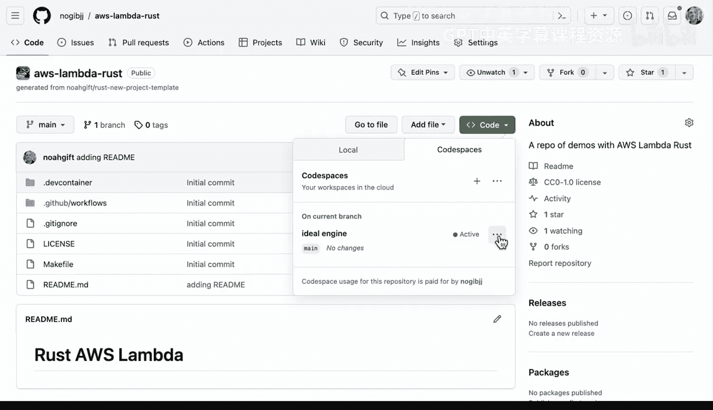
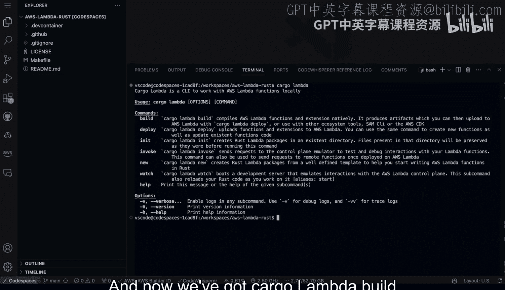

# 070：配置VSCode AWS工具包与CodeWhisperer支持Rust 🛠️🤖


## 概述
在本节课中，我们将学习如何为Visual Studio Code配置AWS工具包，并启用Amazon CodeWhisperer，以支持使用Rust语言进行AWS开发。我们将涵盖在基于云的GitHub Codespaces环境和本地VSCode中安装与配置的步骤。

---

## AWS工具包简介
一个必备的AWS开发工具是**AWS Toolkit for Visual Studio Code**。它允许你深入连接到为AWS开发的各个方面，特别是在无服务器计算领域。此外，它还允许你使用诸如**Amazon CodeWhisperer**之类的功能，该功能可以提供生成式AI代码补全。

上一节我们介绍了AWS开发的基本概念，本节中我们来看看如何在实际环境中配置这些工具。

---

## 在GitHub Codespaces中配置
如果你使用**GitHub Codespaces**（一个可以运行在浏览器中的云端开发环境），并在此处创建了一个代码空间，那么你可以启动它。如图所示，工具包已经安装完毕。

如果我想知道这是如何完成的，可以转到“扩展”面板。查看**AWS Toolkit**，你会发现它已经与基于网页版的Visual Studio Code集成。



进一步观察，可以看到**CodeWhisperer**也已安装。

---

## 启用与使用CodeWhisperer
那么，如何看到它运行呢？我们可以转到AWS面板。

请注意，底部有一个名为“开发者工具”的区域，在“CodeWhisperer”选项下，我们可以执行诸如“恢复自动建议”或运行“安全扫描”等操作。它提供了一些高级功能，可以根据你的工作流程（例如与GitHub Copilot并行使用）来工作。你也可以根据需要临时禁用它。

主要收获是，你可以在基于网页的GitHub Codespaces环境中同时使用这些工具。

---


## 其他配置方法：Cargo Lambda
还有其他方法需要注意，其中之一是使用**Cargo Lambda**。我们可以复制相关命令进行设置。


设置完成后，我们可以在终端中输入命令：
```bash
cargo lambda
```
现在，我们就有了`cargo lambda build`、`deploy`、`init`、`watch`、`help`等命令可用。

---

## 在本地VSCode中配置
我们同样可以在常规的本地Visual Studio Code中完成此配置。事实上，我已经在此处安装了它。

我本地版本的VSCode中同样有**AWS CodeWhisperer**。此外，我还连接了我的IAM凭证，使我能够查看整个AWS账户。通常，将开发环境与你的AWS账户集成是一个好主意。

同样，你只需在扩展中搜索“AWS Toolkit”并安装，它就可以设置好整个环境。

---

## 集成开发的优势
为使用Rust和AWS Lambda开发而设置好此环境后，一个好处是：当你通过Cargo Lambda部署了某些功能后，你可以右键点击它并直接调用，或者从终端调用。

**Visual Studio Code内部的AWS Toolkit**以及与**CodeWhisperer**的集成（我们也可以从中获取代码建议），为开发AWS Rust工具提供了一个出色的界面。




---

## 总结
本节课中，我们一起学习了如何在GitHub Codespaces和本地Visual Studio Code中配置AWS Toolkit与CodeWhisperer，以支持Rust语言的AWS开发。我们了解了工具的基本功能、安装步骤以及集成后带来的便捷操作，例如直接调用部署的Lambda函数。这些工具能显著提升开发无服务器应用的效率。