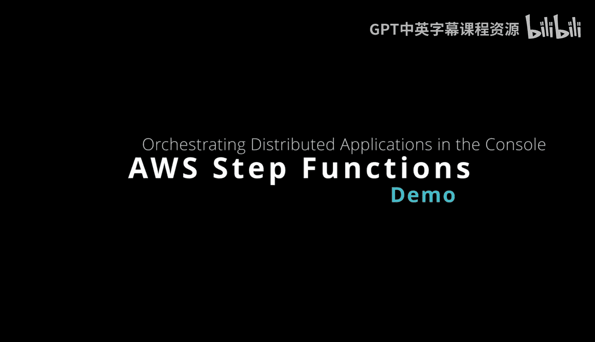
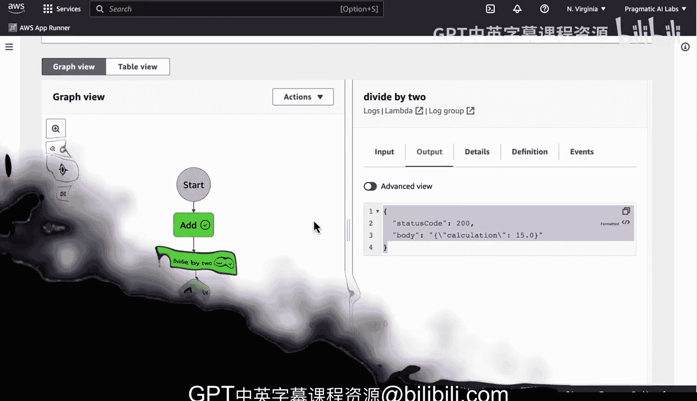

# 074：使用Step Functions控制台 🚀



在本节课中，我们将学习如何使用AWS Step Functions控制台来编排一个由两个AWS Lambda函数组成的分布式应用。我们将通过一个简单的示例，演示如何将“加法”和“除以2”两个函数串联起来，并观察数据如何在它们之间流转。

---

## 概述

我们将利用AWS Step Functions这一无服务器编排服务，来协调两个预先构建好的Lambda函数：“加法”函数和“除以2”函数。通过Step Functions的可视化工作流，我们可以轻松地定义执行顺序、传递数据，并获得强大的调试和可观察性能力。

---

## 访问Step Functions控制台

首先，我们需要进入AWS Step Functions的控制台界面。在这里，我们可以创建和管理状态机，即我们的工作流定义。

## 定位已有的Lambda函数

在创建状态机之前，我们需要知道要编排哪些Lambda函数。我通常会转到AWS Lambda控制台，并按“最后修改时间”排序，以快速找到我之前构建的两个函数：`divide_by_two` 和 `add`。

## 创建新的状态机

接下来，我们点击“创建状态机”。对于原型设计，可视化工作流编辑器非常直观高效，因此我们选择使用它。

## 设计工作流

我们知道需要编排两个Lambda函数。以下是构建步骤：

1.  从左侧面板拖拽一个“Lambda调用”任务到画布中。
2.  将这个任务命名为 **`Add`**，以便清晰地标识其作用。
3.  配置该任务，指定要调用的Lambda函数为 **`add`**。
4.  再次拖拽第二个“Lambda调用”任务到画布，放在第一个任务之后。
5.  将第二个任务命名为 **`DivideBy2`**。
6.  配置该任务，指定要调用的Lambda函数为 **`divide_by_two`**。

**关键配置点**：每个任务的“函数名称”必须与我们Lambda控制台中的实际函数名完全一致。Step Functions会自动将上一个任务的输出作为下一个任务的输入载荷，这得益于我们函数的设计。

## 审查与创建

完成可视化设计后，我们点击“下一步”，可以审查整个状态机的JSON定义。再次点击“下一步”，为状态机命名，例如 **`AddAndDivide`**，然后点击“创建状态机”。

## 执行工作流

状态机创建成功后，我们可以立即执行它。点击“开始执行”。要触发这个工作流，我们需要提供初始输入数据，格式通常是一个JSON对象。

我们输入以下测试数据：
```json
{
  "x": 10,
  "y": 20
}
```
然后点击“开始执行”。

## 观察执行过程

执行开始后，我们可以实时地、逐步地观察工作流的运行状态：
1.  **第一步 (`Add`)**：我们可以看到输入是 `{"x":10, "y":20}`。执行完成后，输出是这两个数的和，例如 `{"total": 30}`。
2.  **第二步 (`DivideBy2`)**：Step Functions会自动将第一步的输出 `{"total": 30}` 作为第二步的输入。执行完成后，输出是总数除以2的结果，例如 `{"result": 15}`。

通过这个界面，我们可以清晰地看到数据在函数间的传递过程，以及每一步的输入和输出。

---

## 总结



本节课中，我们一起学习了如何使用AWS Step Functions控制台来编排Lambda函数。我们完成了从定位函数、可视化设计工作流、配置任务到执行和调试的完整流程。Step Functions的强大之处在于它提供了出色的可观察性、调试能力和可复现性，让你能精确掌控分布式系统的数据流转。结合像Rust这样高效、安全且支持现代编译的工具，Step Functions成为了构建下一代机器学习运维（LLMOps）和数据工程工作流的强大方式。我们轻松地利用了两个现有函数，通过AWS Step Functions构建起了完整的编排逻辑。