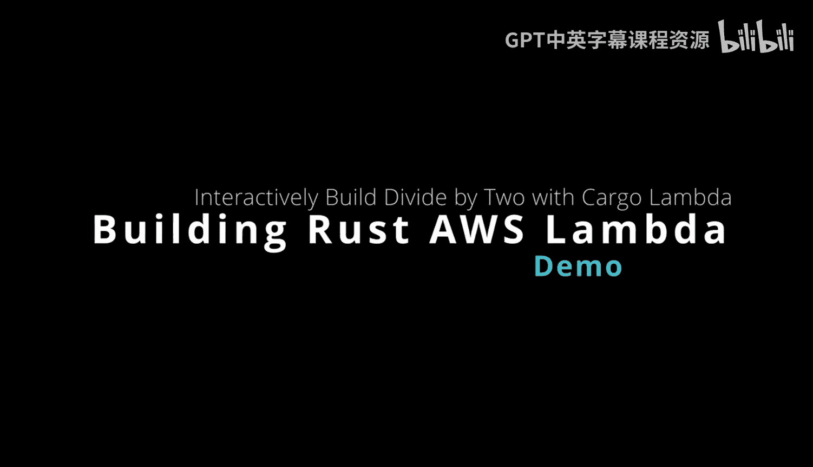
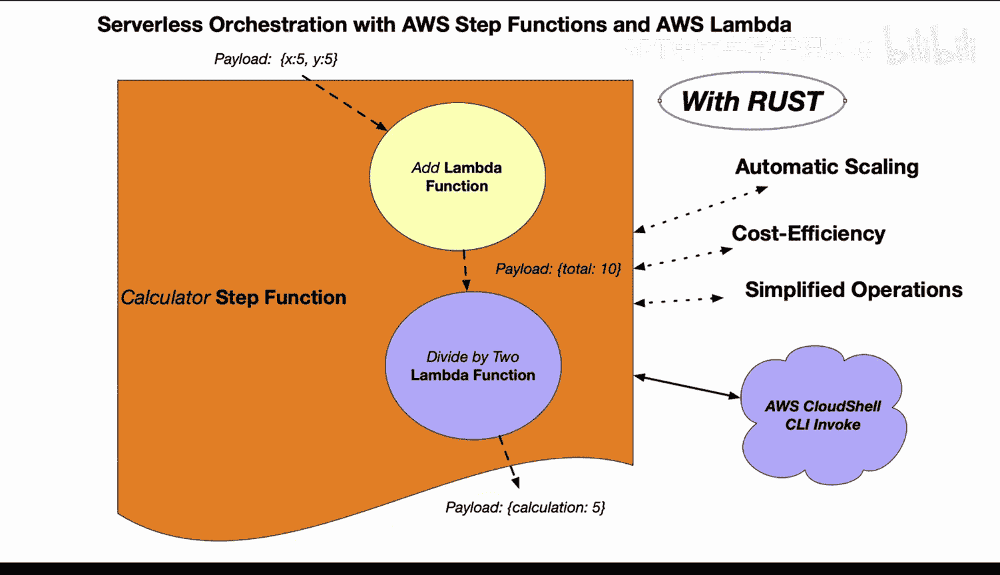
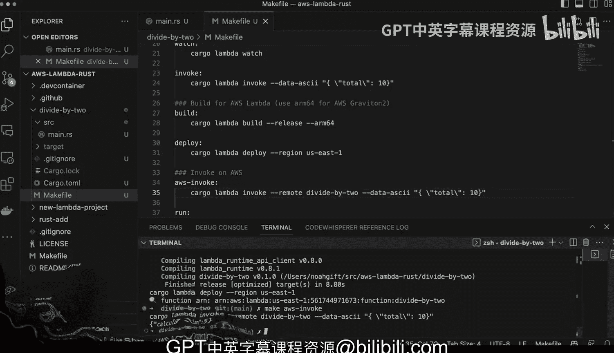

# 077：构建Rust AWS Lambda除二函数



## 概述
在本节课中，我们将学习如何使用Rust语言从头开始构建一个简单的AWS Lambda函数。这个函数的功能是接收一个数字载荷，将其除以二，并返回计算结果。我们将涵盖从项目初始化、代码编写、本地测试到最终部署的完整流程。

---

## 项目初始化与设置

上一节我们介绍了本课程的目标，本节中我们来看看如何初始化一个新的Rust Lambda项目。



首先，我们使用`cargo-lambda`工具创建一个新的Lambda函数项目。我们将项目命名为`divide_by2`。

```bash
cargo lambda new divide_by2
```

创建项目后，我们进入项目目录。为了简化后续的构建和部署流程，我们通常会准备一个`Makefile`文件来帮助我们执行常用命令。

---

## 编写函数逻辑

在项目初始化完成后，我们需要编写核心的函数逻辑。以下是实现步骤：

1.  **定义函数意图**：我们首先明确函数的目标。函数名为`divide_by_two`，它接收一个名为`total`的数字，并返回其一半作为`calculation`结果。
2.  **修改请求与响应结构**：我们需要调整自动生成的代码模板中的数据结构，以匹配我们的输入（`total`）和输出（`calculation`）。
3.  **实现核心计算**：在`main`函数中，我们处理传入的载荷，执行除法运算，并构造响应。

以下是核心代码修改部分的示例。我们定义了一个包含`total`字段的请求结构体和一个包含`calculation`字段的响应结构体。

```rust
// 请求载荷结构
struct Request {
    total: f64,
}

// 响应结构
struct Response {
    calculation: f64,
}

// 处理函数
async fn function_handler(event: Request) -> Result<Response, Error> {
    let calculation = event.total / 2.0;
    Ok(Response { calculation })
}
```

---

## 本地测试与调试

代码编写完成后，在部署到云端之前，进行本地测试至关重要。这能帮助我们快速发现并修复问题。

以下是进行本地测试的步骤：

1.  **启动本地Lambda运行时**：我们使用`make watch`命令（其背后是`cargo lambda watch`）来启动一个本地Lambda模拟环境，并监控代码变化。
2.  **调用测试函数**：在另一个终端中，我们使用`make invoke`命令来模拟一次函数调用。我们需要准备一个包含测试数据（例如`{"total": 10}`）的JSON文件作为输入。
3.  **验证输出**：观察函数返回的响应，确认`calculation`字段的值是否为`5`，以验证函数逻辑正确。

如果测试成功，我们将看到类似 `{"calculation": 5.0}` 的输出。

---

## 构建与部署到AWS

本地测试通过后，就可以将函数部署到AWS Lambda服务了。

以下是构建和部署的步骤：

1.  **构建发布版本**：运行`make build`命令。这会使用`cargo lambda build`编译Rust代码，并针对AWS Graviton2处理器（ARM64架构）进行优化，以获得更好的性价比。
2.  **部署函数**：运行`make deploy`命令。这个命令会使用AWS CLI或Serverless Framework将编译好的二进制文件打包并上传到你的AWS账户，创建或更新对应的Lambda函数。
3.  **远程调用验证**：部署完成后，你可以再次使用`make invoke`命令（此时会指向云端函数）或直接通过AWS控制台进行远程调用，以确保函数在云环境中也能正常工作。

整个过程自动化程度高，只需几条命令即可完成从代码到云服务的交付。

---



## 总结
本节课中我们一起学习了使用Rust构建AWS Lambda函数的完整流程。我们从使用`cargo lambda`创建新项目开始，接着编写了接收输入、执行计算并返回结果的函数逻辑。然后，我们在本地环境中对函数进行了测试和调试。最后，我们将函数编译为ARM64架构的二进制文件，并将其成功部署到了AWS Lambda服务。通过这个简单的“除二函数”示例，你掌握了使用Rust开发无服务器函数的基本方法。