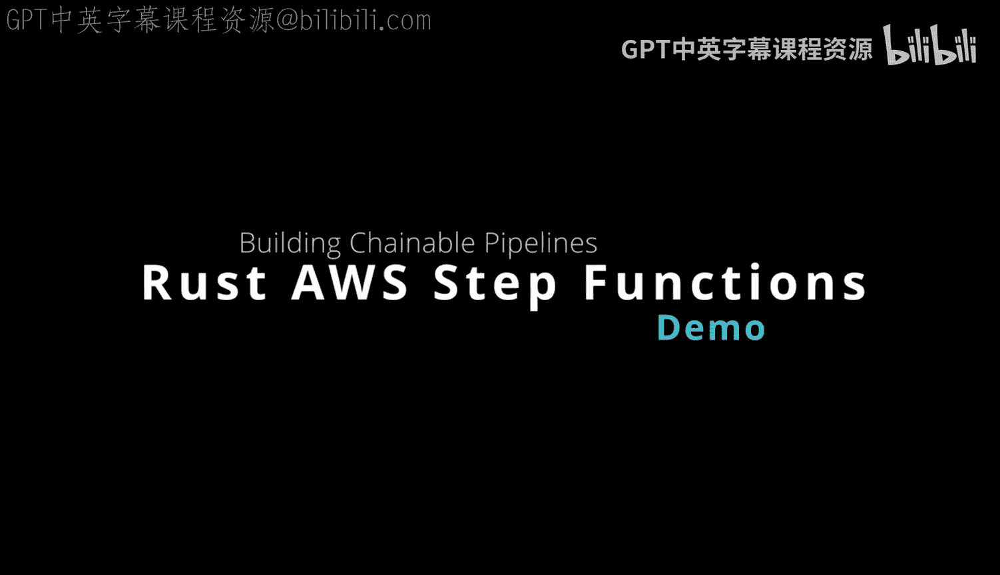
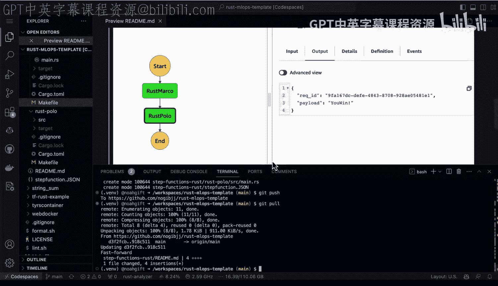
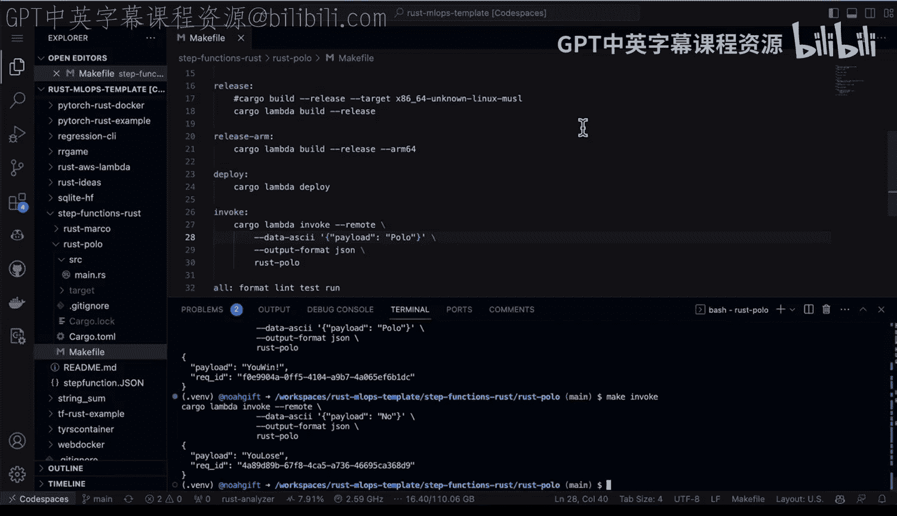
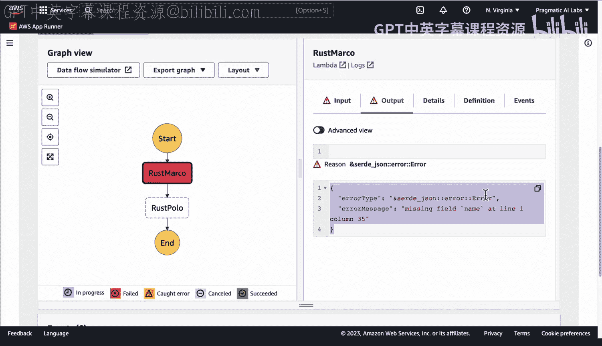

# 079：构建可链式调用的Rust AWS Step Functions 🧩



在本节课中，我们将学习如何使用Rust语言构建可与AWS Step Functions链式调用的Lambda函数。我们将创建两个简单的Lambda函数，并通过AWS Step Functions将它们连接成一个工作流，实现类似“乐高积木”式的可视化编排。

## 概述

AWS Step Functions是一种强大的无服务器工作流服务，允许你将多个操作（如Lambda函数）链接在一起。一个函数的输出可以作为下一个函数的输入。其优势在于提供了可视化的拖放界面来创建工作流，并具备出色的执行过程内省和调试能力。我们将使用Rust和`cargo-lambda`工具来实现这一功能。



## 创建第一个Lambda函数（Rust Marco）

首先，我们使用`cargo-lambda`库来创建第一个Lambda函数。

以下是创建和配置`rust-marco`函数的步骤：

1.  **创建项目**：使用`cargo lambda new rust-marco`命令创建一个新的Lambda项目。
2.  **编写函数逻辑**：在`src/main.rs`中，我们定义处理程序。函数接收一个包含`name`字段的JSON输入。
3.  **核心逻辑**：如果输入的`name`是“Marco”，则返回`body`为“polo”的响应；否则返回“nobody”。我们使用`tracing`库添加日志以便调试。
4.  **构建与部署**：使用`make release`和`make deploy`命令（或对应的`cargo lambda`命令）来构建和部署函数。

以下是`rust-marco`函数的核心代码逻辑：

```rust
async fn function_handler(event: LambdaEvent<Value>) -> Result<Value, Error> {
    let (event, _context) = event.into_parts();
    let name = event["name"].as_str().unwrap_or("");

    let body = if name == "Marco" { "polo" } else { "nobody" };
    tracing::info!("Response body: {}", body);

    let resp = Response { body: body.to_string() };
    Ok(serde_json::to_value(&resp)?)
}
```

## 创建第二个Lambda函数（Rust Polo）

接下来，我们创建第二个函数，它将处理第一个函数的输出。

以下是创建和配置`rust-polo`函数的步骤：

1.  **创建项目**：同样使用`cargo lambda new rust-polo`创建项目。
2.  **编写函数逻辑**：这个函数期望接收一个包含`body`字段的JSON输入（即上一个函数的输出）。
3.  **核心逻辑**：检查`body`字段是否包含“polo”字符串。如果包含，则返回“you win”；否则返回“you lose”。
4.  **构建与部署**：同样使用`make`命令或`cargo lambda`进行构建和部署。

以下是`rust-polo`函数的核心代码逻辑：

```rust
async fn function_handler(event: LambdaEvent<Value>) -> Result<Value, Error> {
    let (event, _context) = event.into_parts();
    let body = event["body"].as_str().unwrap_or("");

    let result = if body.contains("polo") { "you win" } else { "you lose" };
    tracing::info!("Game result: {}", result);

    let resp = Response { body: result.to_string() };
    Ok(serde_json::to_value(&resp)?)
}
```

## 在AWS控制台创建Step Functions工作流

现在我们已经有了两个可以独立运行的Lambda函数，下一步是在AWS控制台中将它们链接起来。

以下是创建Step Functions状态机的步骤：

1.  在AWS Step Functions控制台点击“创建状态机”。
2.  在可视化编辑器中，从左侧拖放一个“Lambda调用”任务到画布中。
3.  配置该任务，选择我们部署的`rust-marco`函数。
4.  再拖放第二个“Lambda调用”任务。
5.  配置第二个任务，选择`rust-polo`函数。Step Functions会自动将第一个任务的输出作为第二个任务的输入传递。
6.  连接两个任务，为状态机命名（例如`rust-marco-polo-chain`）并创建。



工作流的定义类似于以下JSON结构（由控制台可视化生成）：

```json
{
  "Comment": "A simple Marco Polo chain",
  "StartAt": "RustMarco",
  "States": {
    "RustMarco": {
      "Type": "Task",
      "Resource": "arn:aws:lambda:REGION:ACCOUNT_ID:function:rust-marco",
      "Next": "RustPolo"
    },
    "RustPolo": {
      "Type": "Task",
      "Resource": "arn:aws:lambda:REGION:ACCOUNT_ID:function:rust-polo",
      "End": true
    }
  }
}
```

## 执行与测试工作流

创建好状态机后，我们可以执行它并观察结果。

以下是执行和验证工作流的步骤：

1.  在状态机详情页点击“开始执行”。
2.  提供输入数据，例如：`{"name": "Marco"}`。
3.  观察执行过程。你可以看到每个步骤的输入和输出，这为调试提供了极大的便利。
4.  成功的执行流将是：`rust-marco`接收`{"name":"Marco"}`，返回`{"body":"polo"}`；`rust-polo`接收此结果，返回`{"body":"you win"}`。
5.  你可以尝试输入`{"name": "其他名字"}`来触发失败或不同的执行路径，并观察系统如何反应。

## 总结



本节课中，我们一起学习了如何使用Rust构建可链式调用的AWS Step Functions。我们首先使用`cargo-lambda`创建并部署了两个简单的Lambda函数。然后，我们在AWS控制台中通过拖放方式，将这两个函数连接成一个可视化的工作流。最后，我们执行了该工作流，并利用Step Functions的内省功能观察了数据的传递过程。这种方法使得构建、编排和调试复杂的无服务器工作流变得直观且高效。