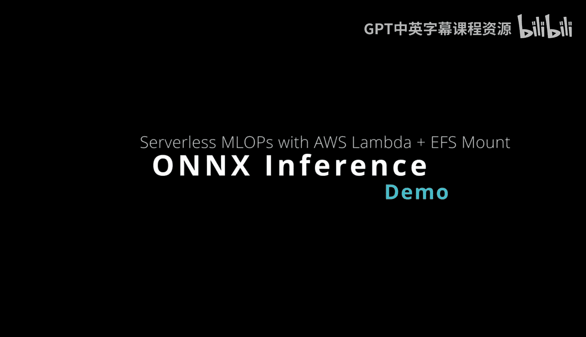
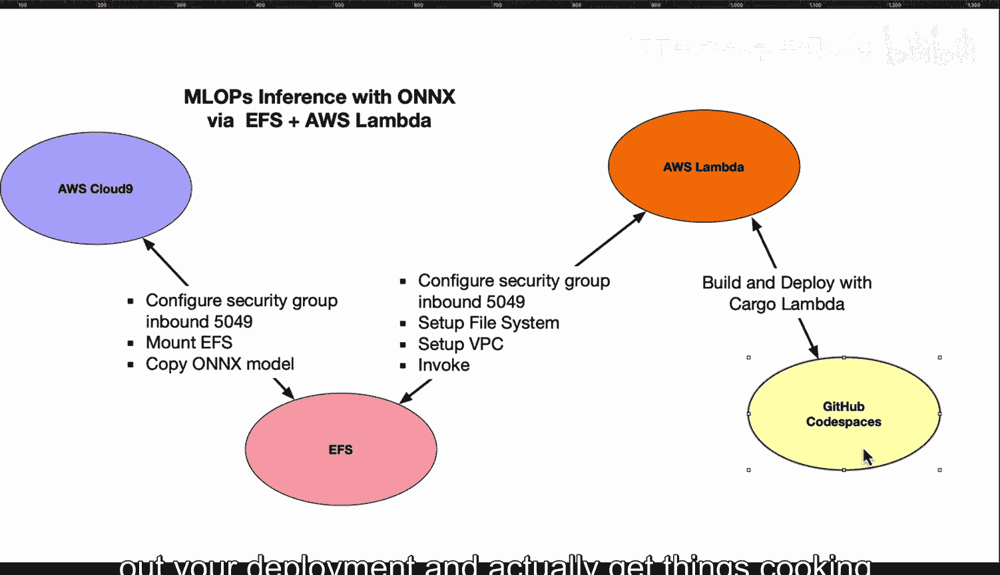
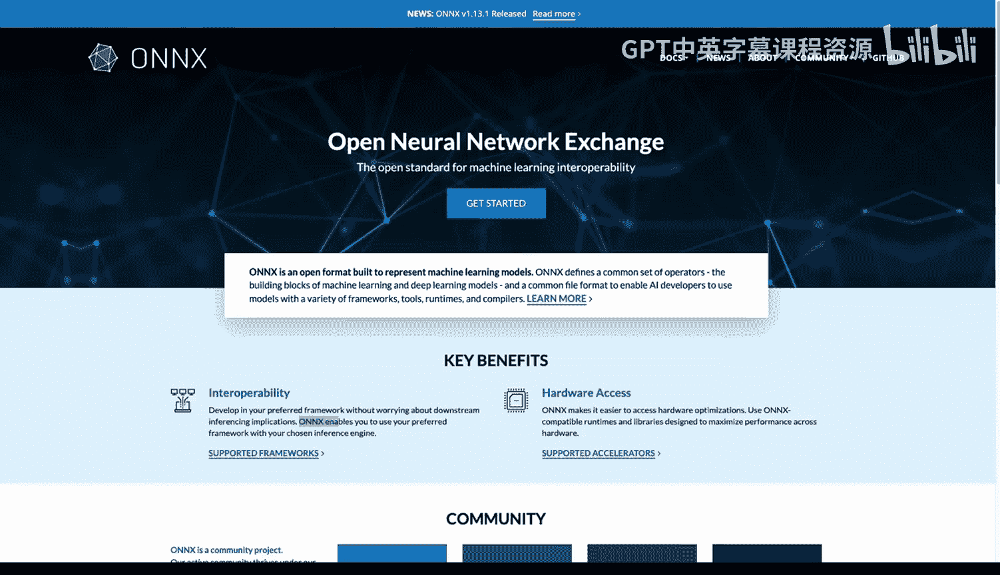
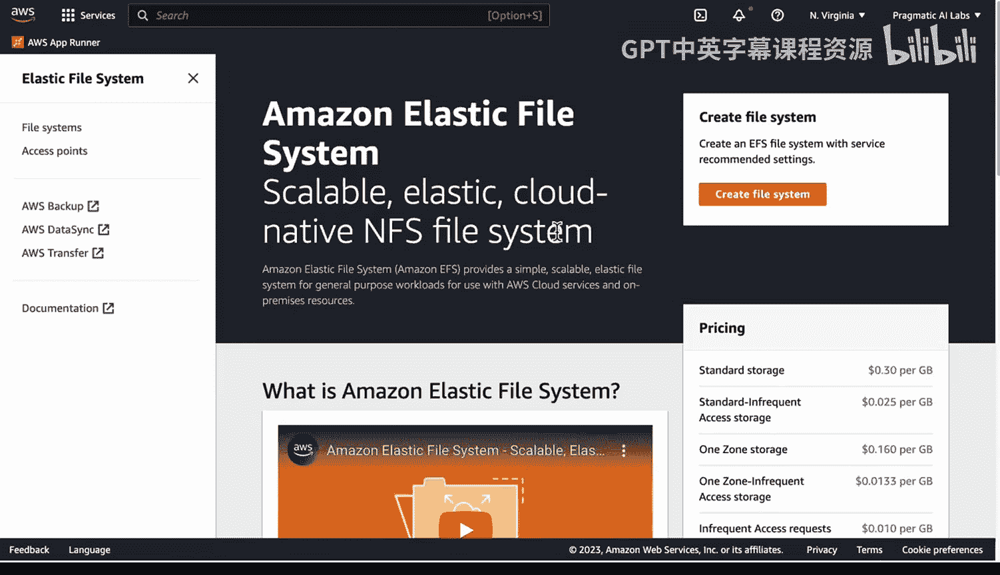
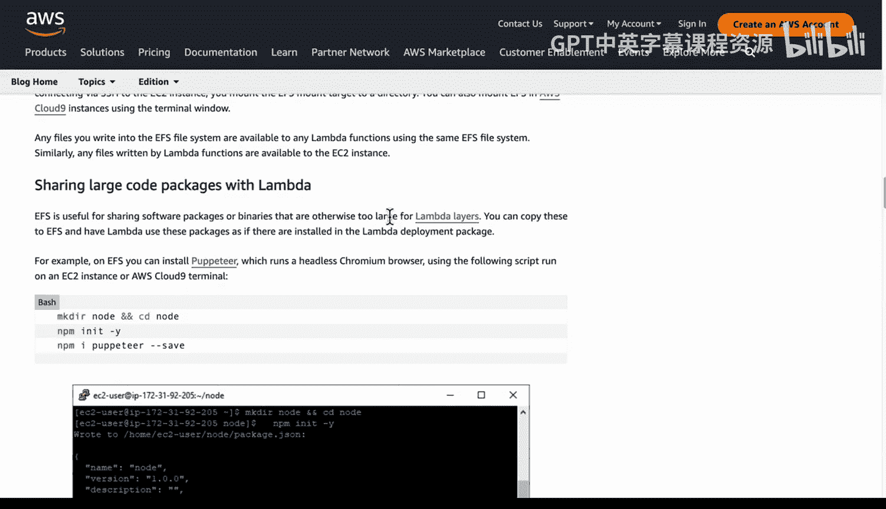
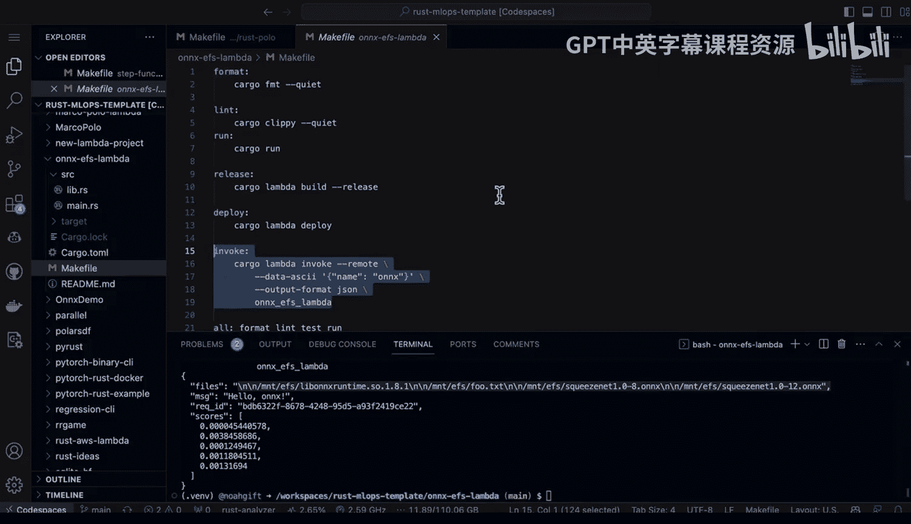
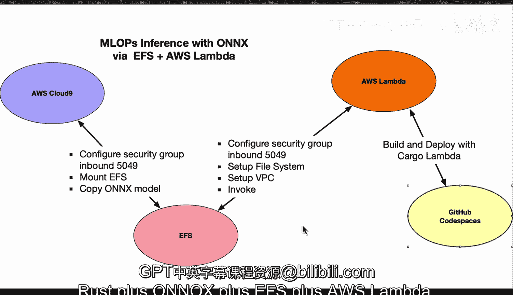

# 080：基于EFS挂载的AWS Lambda无服务器MLOps 🚀



在本教程中，我们将学习如何构建一个基于AWS Lambda的无服务器机器学习推理服务。该服务使用ONNX模型格式，模型文件通过Amazon EFS（弹性文件系统）挂载。我们将涵盖从环境设置、安全配置到代码部署的完整流程。

## 概述 📋

上一节我们介绍了无服务器MLOps的概念，本节中我们来看看如何具体实现一个基于EFS和AWS Lambda的ONNX模型推理服务。核心目标是将大型模型文件存储在EFS中，并通过高性能的Rust语言编写的Lambda函数进行调用，从而无需管理服务器即可提供推理服务。

## 架构与核心组件 🏗️

整个架构的核心是Amazon EFS文件系统，所有服务都必须能通过端口**5049**与其通信。以下是实现此架构所需的关键步骤。

### 1. 创建并配置Amazon EFS

首先，你需要在AWS控制台创建一个EFS文件系统。

*   在AWS控制台导航至“Amazon EFS”服务。
*   点击“创建文件系统”，通常选择默认配置即可。

创建完成后，需要将其挂载到你的开发环境（例如AWS Cloud9）以便上传模型文件。



以下是挂载EFS的关键步骤：
*   在EFS控制台，找到你的文件系统，点击“附加”按钮。
*   选择使用“EFS挂载助手”的选项，它会生成一个挂载命令。
*   在你的Cloud9实例终端中运行该命令，例如：`sudo mount -t efs -o tls fs-12345678:/ /mnt/efs`。
*   确保与该EFS关联的安全组允许来自你开发环境的**5049**端口的入站流量。

### 2. 配置网络与安全组

这是确保服务间能通信的关键一步。你需要配置安全组规则，允许Lambda函数和你的开发机器访问EFS。





*   在EC2控制台的“安全组”部分，找到与你的EFS文件系统关联的安全组。
*   添加入站规则，允许来自你的Lambda函数VPC的IP范围或特定安全组的**TCP 5049**端口流量。
*   同样，确保你的Cloud9实例的安全组也允许与EFS通信。

### 3. 设置AWS Lambda函数

现在，我们来配置将调用EFS中模型的Lambda函数。

首先，在Lambda控制台创建一个新的函数。然后需要进行两项关键配置：

**配置VPC：**
*   在Lambda函数的“配置”标签下，找到“VPC”设置。
*   将你的Lambda函数放入与EFS文件系统相同的VPC中，并选择已配置好**5049**端口规则的安全组。

**配置文件系统：**
*   在“配置”标签下，找到“文件系统”设置。
*   点击“添加文件系统”。
*   你需要提供EFS文件系统ID和一个**访问点**。
*   访问点需要在EFS控制台中单独创建。在EFS控制台，进入“访问点”标签，点击“创建访问点”，并为其指定一个路径（如`/lambda`）。
*   在Lambda配置中，将本地挂载路径设置为例如`/mnt/efs`。

### 4. 开发与部署Rust Lambda函数

环境配置完成后，我们开始编写和部署推理代码。我们推荐使用GitHub Codespaces作为开发环境。

以下是核心的Rust代码结构，用于从EFS加载ONNX模型并进行推理：

```rust
// 示例：从EFS路径加载ONNX模型
use ort::Session;

fn load_model_from_efs() -> Result<Session, ort::Error> {
    // 模型文件位于EFS挂载点
    let model_path = "/mnt/efs/models/squeezenet.onnx";
    Session::builder()?
        .with_model_from_file(model_path)?
        .commit()
}

// 执行推理的函数
fn run_inference(input_data: &[f32]) -> Result<Vec<f32>, ort::Error> {
    let session = load_model_from_efs()?;
    // ... 准备输入张量 ...
    // session.run(...)
    // ... 处理并返回输出 ...
}
```



为了便于测试和部署，可以创建一个`Makefile`：

```makefile
deploy:
	cargo lambda deploy --profile your-aws-profile

invoke:
	cargo lambda invoke --remote \
  		--data-ascii '{"image_url": "https://example.com/cat.jpg"}' \
  		--profile your-aws-profile
```

使用`cargo lambda`工具可以轻松地构建、部署和远程调用你的Rust Lambda函数。

### 5. 调试与验证

在部署后，验证一切是否正常工作至关重要。

建议在代码中添加一个辅助函数，用于列出EFS挂载点中的文件，以确认模型已正确加载：

```rust
fn list_efs_files(path: &str) -> std::io::Result<()> {
    for entry in std::fs::read_dir(path)? {
        let entry = entry?;
        println!("Found in EFS: {:?}", entry.path());
    }
    Ok(())
}
```



调用此函数可以在Lambda日志中看到模型文件列表，这是有效的调试手段。

## 总结 🎯

本节课中我们一起学习了构建基于EFS和AWS Lambda的无服务器MLOps推理管道的完整流程。我们回顾一下关键步骤：首先创建并挂载EFS文件系统，并确保安全组开放**5049**端口；接着配置Lambda函数的VPC和文件系统挂载，关联EFS访问点；然后使用Rust和`cargo-lambda`工具开发并部署推理代码；最后通过添加调试信息来验证部署。



这种架构结合了Rust的高性能、ONNX的模型通用性、EFS的共享存储以及Lambda的无服务器优势，为生产环境部署机器学习模型提供了一种高效、可扩展且无需管理基础设施的解决方案。