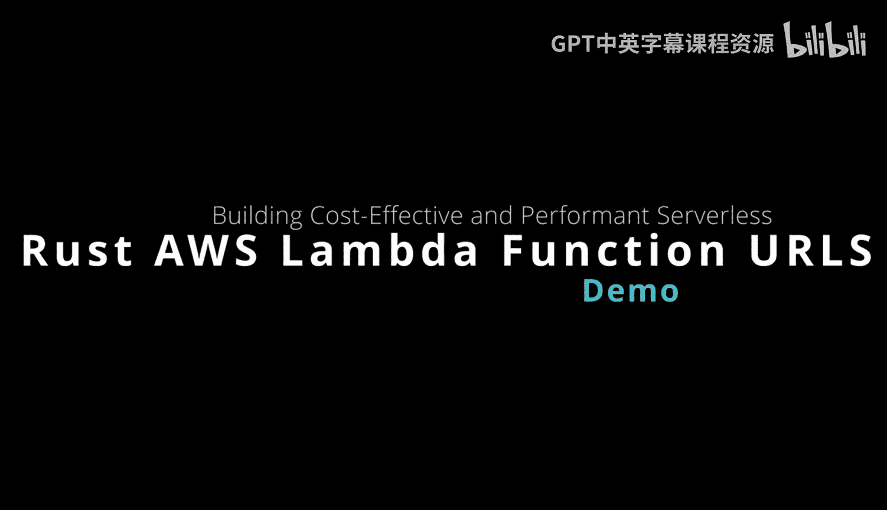
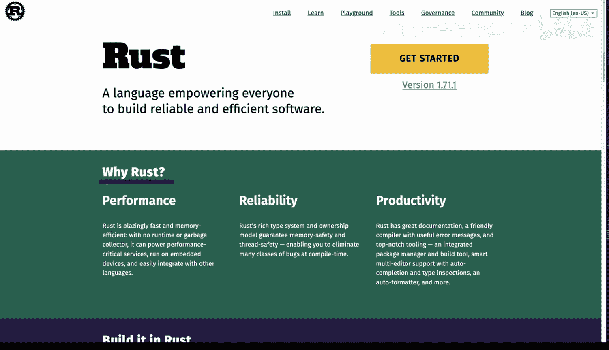
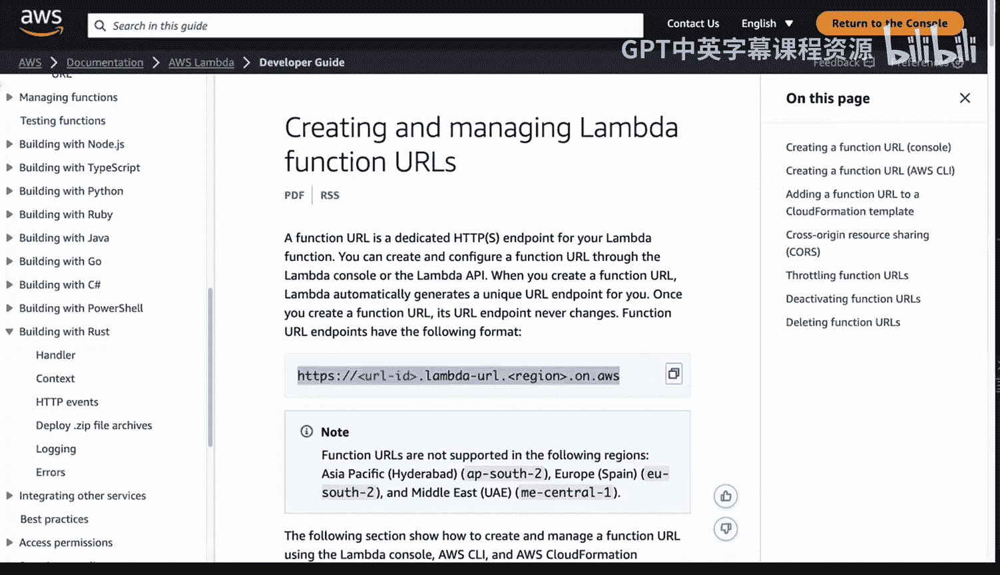
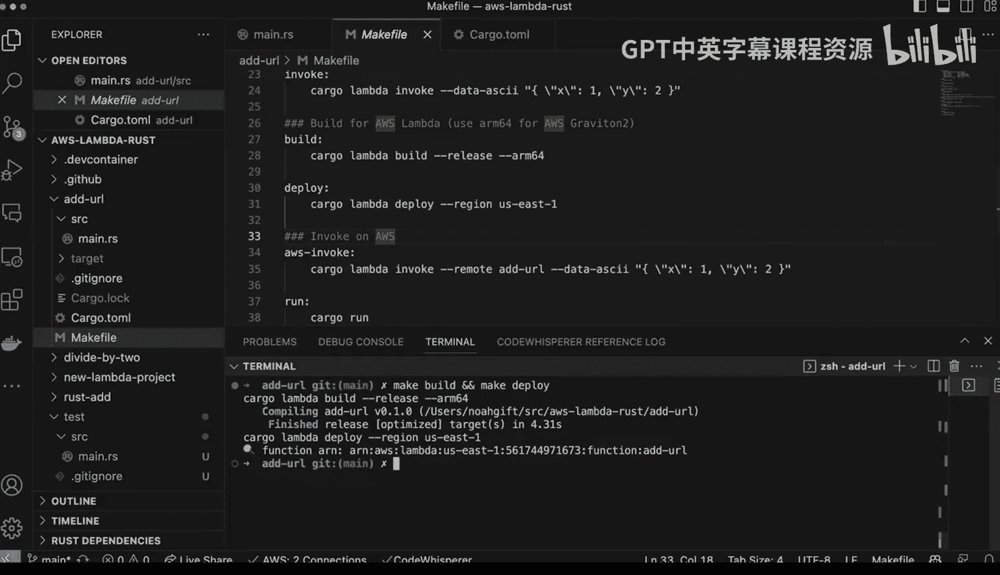
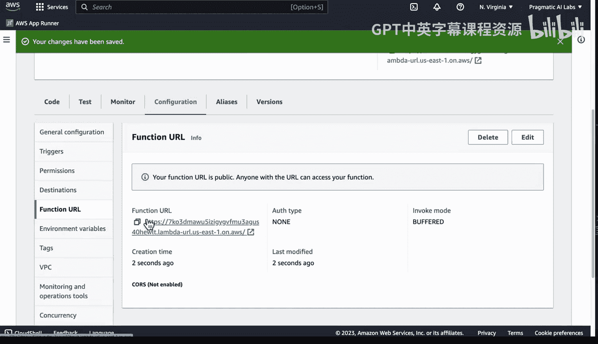
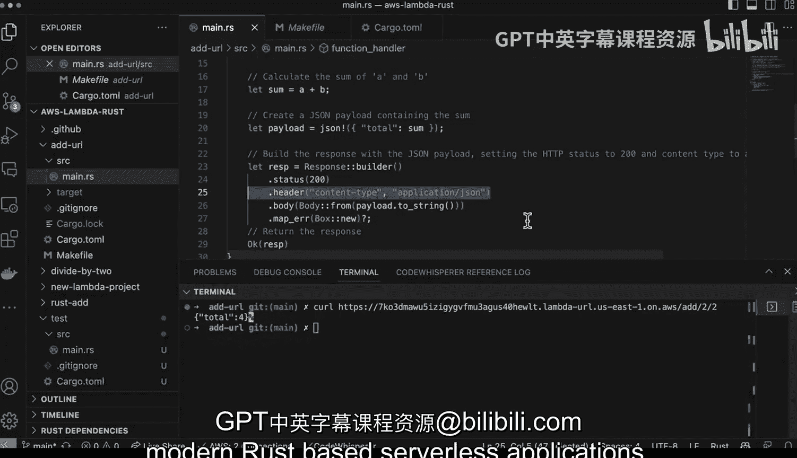

# 081：使用Rust构建AWS Lambda函数URL



## 概述

在本节课中，我们将学习如何使用Rust语言构建一个高性能的AWS Lambda函数URL。我们将通过一个简单的加法服务示例，演示从本地开发到云端部署的完整流程。你将了解到如何利用Rust和`cargo-lambda`工具快速创建、测试并部署一个无服务器的RESTful服务。

---

## 1. 项目初始化与工具介绍

上一节我们介绍了课程目标，本节中我们来看看如何初始化一个Rust Lambda项目。

我们将使用`cargo-lambda`工具来创建和管理项目。这是一个专门为Rust语言优化AWS Lambda开发而设计的工具链。

以下是使用`cargo-lambda`创建新项目的命令：

```bash
cargo lambda new test
```

执行此命令后，工具会询问是否创建一个HTTP函数。选择“是”后，它会生成一个包含基础模板代码的项目。这个模板为我们处理了Lambda运行时与Rust之间的集成，提供了一个良好的起点。

---

## 2. 核心功能实现

现在我们已经有了项目基础，本节中我们来看看如何实现一个具体的业务逻辑：解析URL路径并进行加法运算。





我们的目标是创建一个服务，当访问`/add/{a}/{b}`这样的URL时，能够返回两个数字的和。为了实现这个功能，我们需要添加必要的依赖并编写处理逻辑。

首先，在`Cargo.toml`文件中添加`serde_json`依赖，用于处理JSON序列化：

```toml
serde_json = "1.0"
```

接下来，我们修改主处理函数。以下是实现的核心步骤：

1.  从传入的HTTP请求中提取URL路径。
2.  手动解析路径，将其按`/`分割成多个部分。
3.  提取路径中的两个数字参数（例如，`add/2/3`中的`2`和`3`）。
4.  将两个数字相加。
5.  构建一个包含结果的JSON响应并返回。

以下是实现此逻辑的代码框架：

```rust
use lambda_http::{run, service_fn, Body, Error, Request, RequestExt, Response};
use serde_json::{json, Value};

async fn function_handler(event: Request) -> Result<Response<Body>, Error> {
    // 1. 提取路径
    let path = event.uri().path();
    // 2. 分割路径
    let parts: Vec<&str> = path.split('/').collect();
    // 3. 提取参数 (假设路径格式为 /add/2/3)
    let a: i32 = parts.get(2).unwrap_or(&"0").parse().unwrap_or(0);
    let b: i32 = parts.get(3).unwrap_or(&"0").parse().unwrap_or(0);
    // 4. 计算和
    let sum = a + b;
    // 5. 构建JSON响应
    let payload = json!({ "total": sum });

    let resp = Response::builder()
        .status(200)
        .header("content-type", "application/json")
        .body(Body::from(payload.to_string()))
        .map_err(Box::new)?;
    Ok(resp)
}
```

---

## 3. 本地测试与运行

功能实现完成后，在部署到云端之前，我们需要在本地进行测试以确保其正常工作。

我们可以使用`cargo lambda watch`命令在本地启动一个模拟Lambda环境的服务器。这个命令会监听代码变化并自动重新编译。

```bash
cargo lambda watch
```

服务器启动后（默认在`localhost:9000`），我们可以使用`curl`命令来测试我们的加法服务：

```bash
curl http://localhost:9000/add/2/2
```

如果一切正常，你应该会收到一个JSON响应：`{"total":4}`。本地测试成功意味着我们的逻辑是正确的，可以准备进行云端部署。

---

## 4. 构建与云端部署

经过本地验证，本节中我们来看看如何将应用部署到AWS Lambda。

部署过程主要分为两步：构建和部署。我们可以使用项目中的`Makefile`（如果存在）或直接使用`cargo-lambda`命令来完成。

以下是典型的部署命令，它们会为ARM架构（Lambda上成本更低的运行时）构建项目，并处理上传等事宜：

```bash
make build
make deploy
```

部署脚本会自动处理诸如创建执行角色、配置权限等基础设施任务。部署完成后，你的函数就会出现在AWS Lambda控制台中。

---

## 5. 配置函数URL

函数部署成功后，默认还不能通过公共URL访问。我们需要为其配置一个“函数URL”。

以下是配置步骤：
1.  登录AWS管理控制台，进入Lambda服务。
2.  找到刚刚部署的函数（例如名为`add_url`的函数）。
3.  进入函数的“配置”选项卡。
4.  在左侧菜单中选择“函数URL”。
5.  点击“创建函数URL”。
6.  在认证类型中选择“NONE”（仅用于演示，生产环境应使用更安全的认证方式）。
7.  点击“保存”。

配置完成后，AWS会生成一个唯一的HTTPS端点。复制这个URL，我们就可以像访问普通Web服务一样访问我们的Lambda函数了。

---

## 6. 验证云端服务



最后，让我们验证部署在云端的服务是否工作正常。



使用`curl`命令，访问你刚刚获得的函数URL，并附加上路径参数：

```bash
curl https://your-unique-id.lambda-url.region.on.aws/add/2/3
```

如果返回`{"total":5}`，那么恭喜你，一个使用Rust编写的高性能、无服务器URL服务已经成功在AWS Lambda上运行起来了。

---

## 总结



本节课中我们一起学习了使用Rust构建AWS Lambda函数URL的完整流程。我们从项目初始化开始，使用`cargo-lambda`工具生成了基础模板。然后，我们实现了一个解析URL路径并执行加法运算的核心处理函数，并在本地进行了测试。接着，我们完成了针对ARM架构的构建，并将应用部署到了AWS Lambda。最后，我们为函数配置了可公开访问的URL，并成功验证了云端服务的运行。整个过程表明，Rust凭借其高性能和安全性，是构建现代无服务器REST应用的绝佳选择。