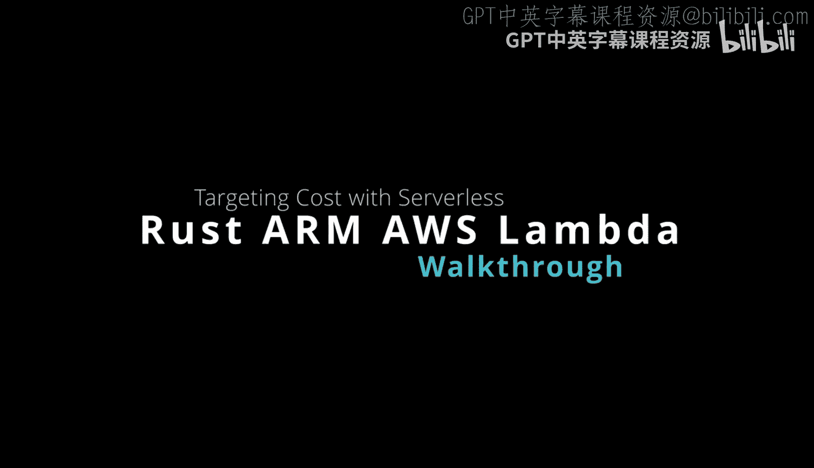
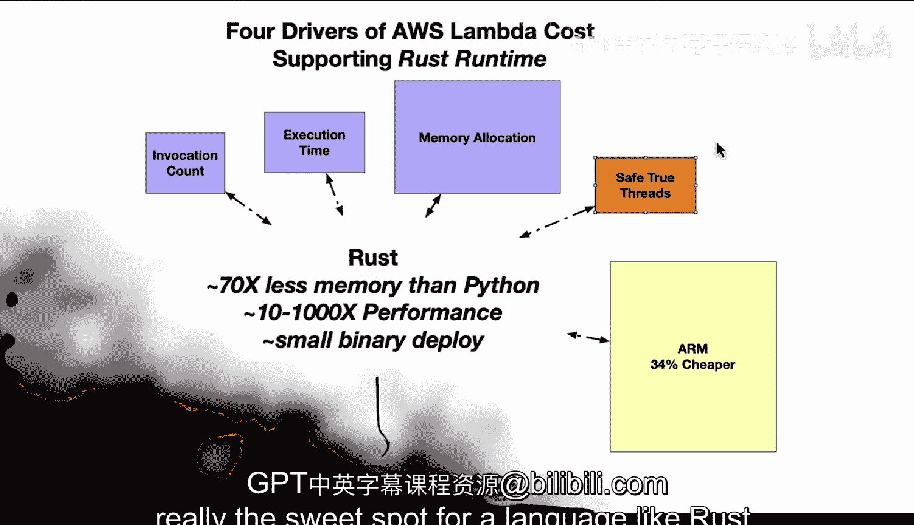

# 082：通过ARM64架构降低Rust AWS Lambda成本 💰



在本节课中，我们将学习如何通过结合Rust编程语言和ARM64架构来显著降低AWS Lambda的运行成本。我们将分析成本的驱动因素，并解释Rust与ARM架构如何协同作用以实现最佳性价比。

---

## 概述

AWS Lambda的成本主要由四个因素驱动。使用Rust运行时可以有效优化这些因素，从而降低成本。此外，基于ARM架构的实例能提供额外的价格优势。本节将逐一剖析这些驱动因素，并说明Rust与ARM64结合为何是服务器无计算（Serverless）的理想选择。

---

## AWS Lambda成本的四大驱动因素 🚀

以下是影响AWS Lambda成本的四个主要方面，使用Rust运行时可以对这些方面进行优化。

### 1. 调用次数与执行时间
显然，Lambda的使用量越少，产生的费用就越低。这包括调用次数和执行时间。Rust卓越的计算性能在此处发挥巨大作用，因为它能带来**10倍到1000倍**的性能提升。性能公式可以简化为：
`总成本 ∝ 调用次数 × 平均执行时间`
更快的执行速度直接减少了计费时间。

### 2. 内存分配
Lambda根据分配的内存收费。Rust凭借其高效的内存管理，在平均场景下能减少高达**7倍**的内存使用量。这意味着你可以配置更低的内存规格，从而节省费用。其核心优势在于无垃圾回收和精准的内存控制。

### 3. 并发处理
Rust支持安全的多线程（`safe true threads`），能够更好地利用并发。在高并发场景下，这有助于更快地处理请求，间接减少了所需的计算资源总量和费用。

### 4. 架构选择：ARM64实例
除了语言层面的优化，基础设施的选择也至关重要。基于ARM架构的AWS实例（如使用Graviton2处理器的实例）平均比同规格的x86实例便宜**34%**。对于计算密集型应用，这能带来显著的成本节约。

---

## 超越成本：额外优势 ✨

上一节我们介绍了核心的成本驱动因素，本节中我们来看看选择Rust与ARM64架构还能带来哪些额外好处。

### 能效与环保目标
如果您的组织有关注能效或环保目标，ARM处理器是更优的选择。与x86架构相比，这类处理器功耗更低。这有助于企业达成其绿色计算（Green Computing）目标。

### 极致性能优化
Rust提供底层系统控制能力和高效的内存管理。开发者可以利用这些特性，专门为ARM64架构构建高度优化的应用程序。这可以进一步减少执行时间。虽然Lambda本身单价不高，但执行时间仍是计费依据，因此任何性能提升都能直接转化为成本节约。代码层面的优化示例如下：
```rust
// 利用Rust和ARM架构特性进行高效计算
fn optimized_computation(data: &[i32]) -> i32 {
    data.iter().sum() // 简单的例子，实际中可使用SIMD等ARM指令集优化
}
```

### 卓越的可扩展性
当我们将Rust的性能、低内存占用与ARM实例的成本优势结合起来时，其效益对于可变的工作负载尤其明显。这种组合提供了极高的性价比，使应用能够经济高效地应对流量高峰。

### 硬件能力支持
AWS提供了为ARM64优化的特定实例（如搭载Graviton2处理器的实例）。针对这些实例并使用Rust进行开发，可以充分发挥硬件的全部能力，从而进一步提升成本效益。

---

## 总结



本节课中我们一起学习了如何通过Rust和ARM64架构降低AWS Lambda成本。我们分析了成本的四大驱动因素——调用次数、执行时间、内存分配和并发，并揭示了Rust如何在每个环节提供优化。此外，ARM64实例的价格优势、能效和硬件支持，与Rust的低层控制能力相结合，使其成为服务器无计算场景下近乎默认的优选方案。虽然其他任务（如数据可视化或快速API原型开发）可能适合脚本语言，但对于追求高性能、低成本和可扩展性的Serverless应用，Rust与ARM64的组合无疑是“甜蜜点”。