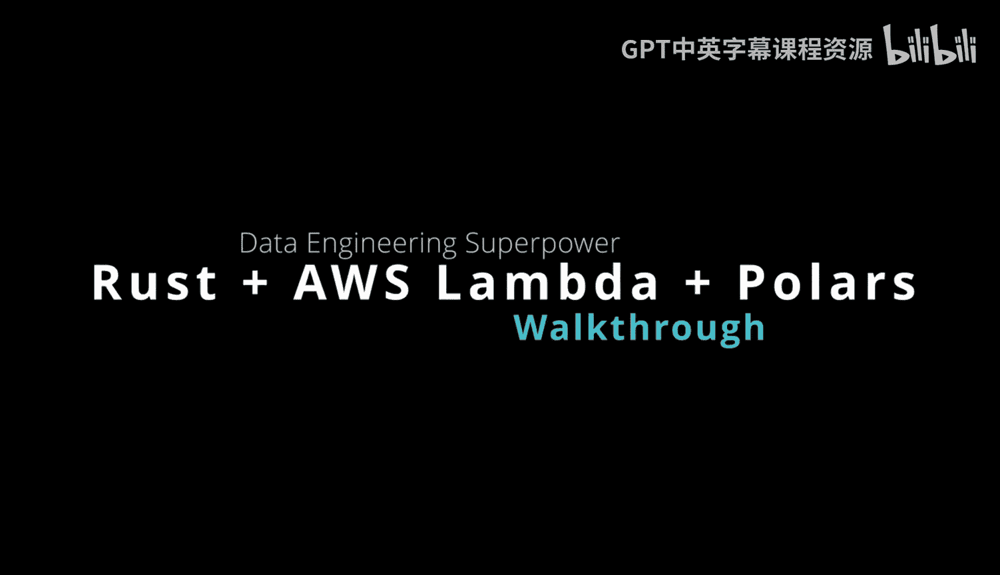
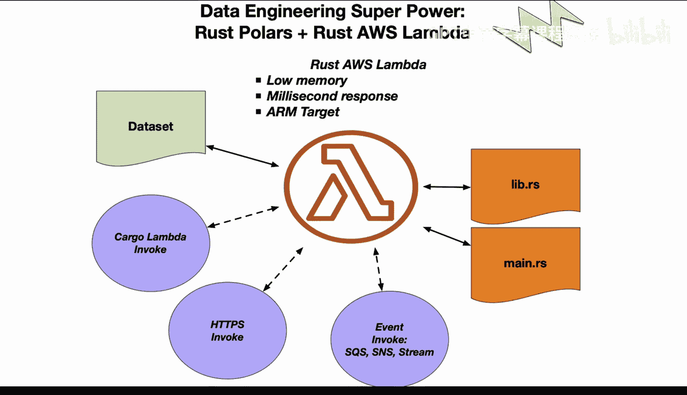

# 083：83_04_01_Polars Rust AWS Lambda应用 🚀



在本节课中，我们将学习如何结合Rust生态中的Polars数据框库与AWS Lambda服务，构建高性能、低成本的数据工程应用。我们将探讨其核心优势、架构原理以及实践方式。

---

## 概述 📋

数据工程领域拥有一项“超能力”，即 **Rust Polars**（Rust数据框库）与 **Rust AWS Lambda** 的结合。这种组合能带来低内存消耗、毫秒级响应、卓越的性能以及低廉的成本。与Python、Java等解释型语言相比，Rust凭借其内存安全性和无垃圾回收机制，提供了更快的执行速度和更可预测的性能。

上一节我们介绍了Rust在系统编程中的优势，本节中我们来看看如何将其应用于数据工程和云服务。

---

## Polars：高性能数据框库 ⚡

Polars是这项“秘密武器”的核心部分。它是一个用Rust实现的高速数据框库，其设计目标是在速度上超越许多其他语言的同类库。

**核心公式/代码示例：**
```rust
// 使用Polars进行数据操作的基本示例
use polars::prelude::*;

fn main() -> Result<()> {
    let df = DataFrame::new(vec![
        Series::new("name", &["Alice", "Bob", "Charlie"]),
        Series::new("value", &[10, 20, 30]),
    ])?;
    println!("{:?}", df);
    Ok(())
}
```

其卓越的性能使其成为全球最快的数据框库之一。

---

## AWS Lambda：无服务器架构 ☁️

在AWS Lambda上运行Rust代码，可以充分利用无服务器架构的可扩展性和效率。

以下是几种与AWS Lambda交互和调用的方式：
*   **`cargo lambda invoke`**：通过命令行直接调用。
*   **URL端点**：通过HTTP URL触发函数。
*   **事件驱动**：响应特定事件（如S3文件上传）。

你可以将核心业务逻辑代码与库集成，然后在`main`函数中处理Lambda调用，并利用优秀的`cargo-lambda`库将其部署到AWS运行时环境。

---

## 并行处理能力 🔄

Rust的所有权系统和内置并发支持，使得高效的并行执行成为可能。这在Python（受GIL限制）和Java（存在其他并发问题）等语言中要复杂得多。

因此，你能够充分利用多核处理器的能力，这在处理数据时能带来显著的性能提升。

---

## 成本效益 💰

基于ARM架构的Lambda函数与优化的Rust二进制文件结合，可以带来更短的执行时间和更低的内存使用率。

与基于Python和Java的解决方案相比，这直接转化为更低的运行成本。

---

## 安全性与可靠性 🛡️

Rust以其强大的安全性保证而闻名，尤其是在内存安全和线程安全方面。这类错误在Python和Java中要常见得多。

---

## 集成与现代工具链 🛠️

Rust拥有全球最优秀的生态系统之一，工具链活跃且不断增长。

以下是其生态中的关键工具和库：
*   **Cargo生态系统**：提供了强大的包管理和构建工具。
*   **`cargo-lambda`**：专门用于简化Rust Lambda函数的开发和部署。
*   **Polars**：正成为数据框处理的新兴标准。

此外，AWS Lambda服务本身已经非常成熟和成功。有趣的是，其底层采用的**Firecracker**开源虚拟化框架也是用Rust构建的。

---



## 总结 🎯


本节课中我们一起学习了Rust Polars与AWS Lambda如何共同构成数据工程的“新兴超能力”。我们探讨了其在性能、成本、安全性和现代工具链集成方面的显著优势。Rust为构建高效、可靠且经济的数据处理应用提供了强大的基础，值得每一位数据工程师深入了解和实践。