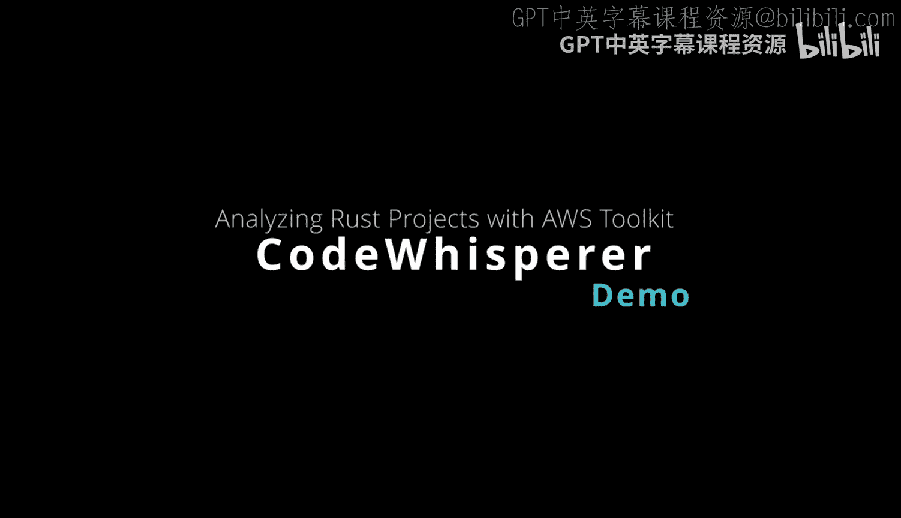
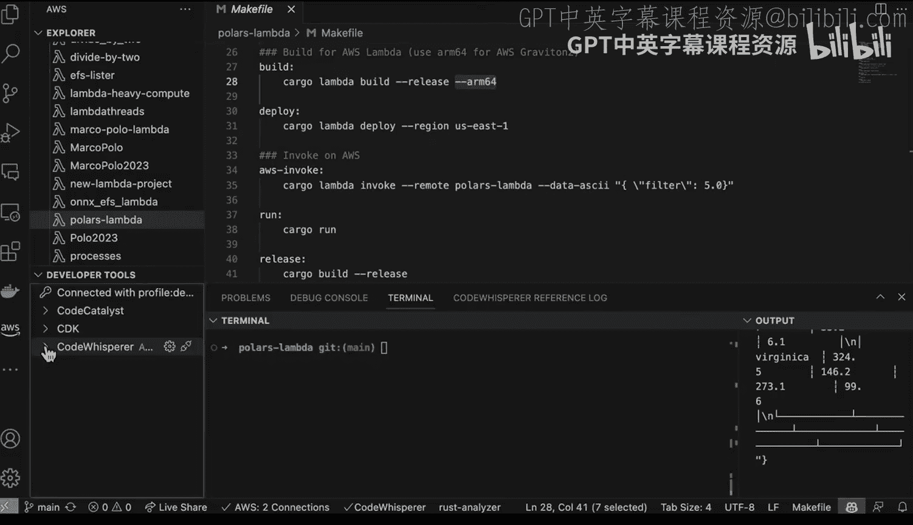
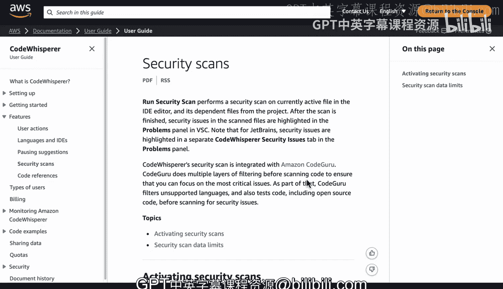

# 086：使用CodeWhisperer和AWS工具包分析Rust Lambda代码 🛠️

在本节课中，我们将学习如何利用AWS Toolkit和CodeWhisperer工具来分析和改进一个已能正常工作的Rust Polars Lambda函数。我们将重点关注如何通过安全扫描、代码建议和注释来提升代码质量。

## 初始Lambda函数与工具准备

这里我们有一个功能正常的Rust Polars Lambda函数。我们的目标是探索如何让它变得更好。

首先，我们可以通过Github Copilot扩展来操作。让我们暂时全局禁用它。可以看到，这里高亮显示它已被禁用。

现在，如果我们转到AWS Toolkit，可以看到这里有许多可以尝试的功能。其中之一就是Lambda服务。我们知道这个Lambda函数名为“Polars Lambda”。实际上，我们可以直接进入并调用它，这似乎是开始熟悉工具的好方法。

## 调用Lambda函数进行测试

如果我们在这里选择“在AWS上调用”，我只需要在括号内输入一些内容，例如输入“filter”。我们可以填入数字5，然后继续调用它。它能正常工作吗？完美。这样我就能够实际与它进行交互了。

## 引入CodeWhisperer进行代码分析

接下来我们还能做什么？另一件很酷的事情是，如果我们关闭当前窗口，可以转向CodeWhisperer。CodeWhisperer能够提供自动代码建议。

查看CodeWhisperer的文档，有几个要点需要指出：它可以扫描你的代码，以高亮并识别安全问题。随着支持的语言越来越多，会有一个矩阵显示何时能进行完整扫描，以及建议功能何时完全可用。我们可以在这里查看。

我们可以看到，随着这个工具的不断发展，目前对Java、Python、JavaScript、TypeScript和C#的支持质量最高。但它也支持为Rust等语言生成代码。每个月都会有更多的开发和训练进行，从而获得更广泛的支持。

## CodeWhisperer的安全扫描与集成优势

对于Rust这类语言，CodeWhisperer也能进行安全扫描。我们可以看到，安全扫描可以在活动文件上执行。

这是一个非常棒的集成功能，当你构建AWS特定代码时，可以免费获得。因此，处理AWS Lambda和Rust的一个最佳实践就是使用像CodeWhisperer这样的工具来进行安全扫描、代码建议，甚至为你的代码添加注释，使其更加清晰明了。

## 总结

本节课中，我们一起学习了如何使用AWS Toolkit调用和测试Rust Lambda函数，并重点介绍了如何利用CodeWhisperer工具来提升代码质量。我们了解到CodeWhisperer不仅能提供代码补全建议，还能执行安全扫描，帮助开发者编写更清晰、更安全的AWS Lambda代码。随着工具的持续更新，对Rust等语言的支持也将越来越完善。