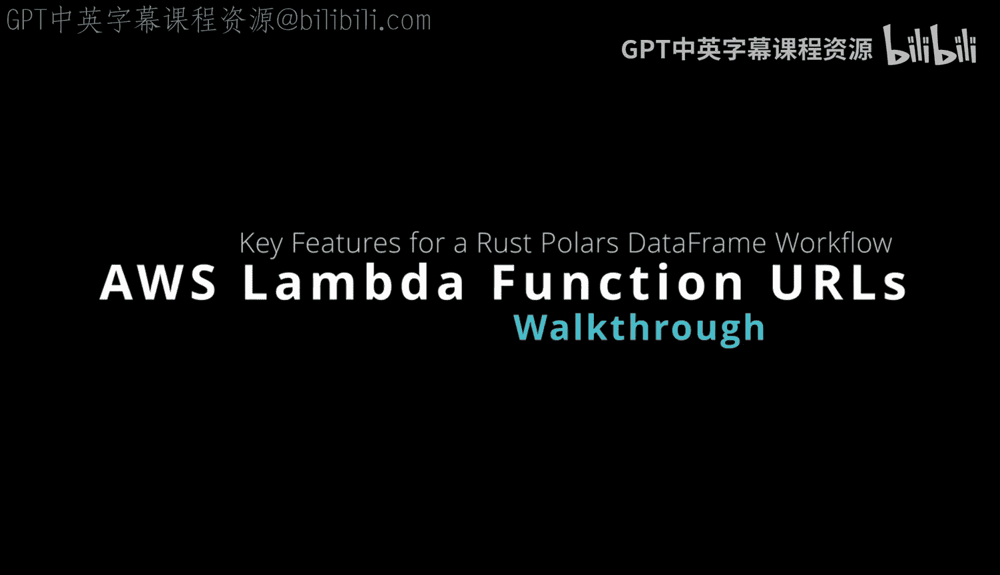
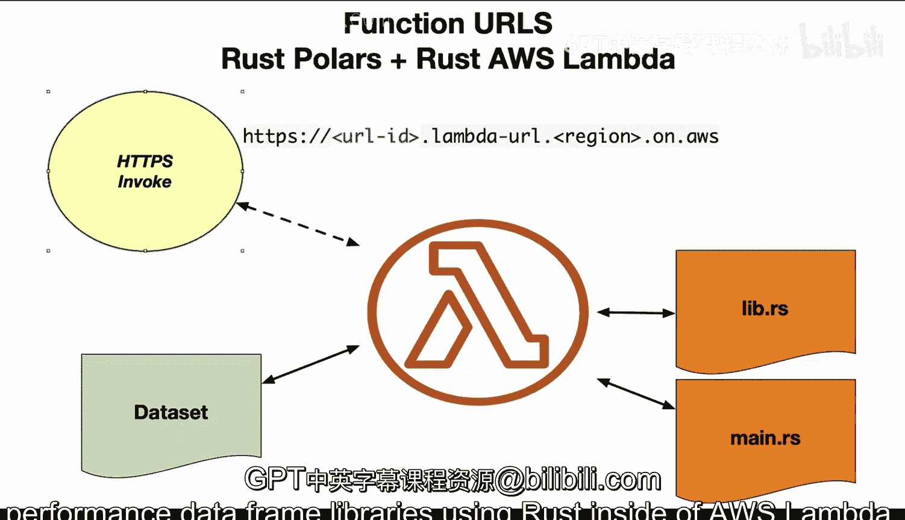

Rust编程4-5：04：AWS Lambda函数URL详解 🚀



在本节课中，我们将学习AWS Lambda函数URL这一强大功能，它允许我们轻松地将部署在Lambda上的高性能Rust应用（例如使用Polars数据框库）暴露为可通过HTTP直接访问的Web端点。

上一节我们介绍了如何在AWS Lambda中集成Rust库，本节中我们来看看如何通过函数URL功能，让外部服务或浏览器能够直接调用我们的Lambda函数。

---

函数URL为每个Lambda函数提供了一个唯一的、固定的HTTP(S)端点。其URL结构遵循特定的格式。

URL的基本模式如下：
```
https://<url-id>.lambda-url.<region>.on.aws/
```
其中，`<url-id>`是系统生成的唯一标识符，`<region>`是您的Lambda函数所部署的AWS区域。

---

关于身份验证，函数URL主要支持两种配置方式。

以下是两种主要的身份验证类型：
*   **AWS_IAM**：调用者需要使用AWS凭证对请求进行签名（例如使用SigV4签名）。这提供了基于IAM策略的精细访问控制。
*   **NONE**：无需任何身份验证。函数URL将公开可访问，适用于公开API或需要简化调用的场景。

---

配置好函数URL后，您可以通过多种方式轻松地测试和调用它。

您可以使用以下工具进行测试：
*   **网页浏览器**：直接访问URL（对于`GET`请求或无身份验证的URL）。
*   **cURL命令**：在命令行中发送HTTP请求。
*   **Postman**：图形化界面工具，方便构建和发送复杂请求。
*   **AWS专用cURL** (`aws curl`)：一个已集成SigV4签名能力的cURL变体，便于测试需要IAM认证的URL。

---

调用函数URL时，您可以向它发送包含数据的请求载荷。

请求支持标准的HTTP载荷格式。您可以将数据以JSON对象的形式放在请求体中发送，并可以设置不同的属性。Lambda函数会接收到这个完整的HTTP事件。

---

Lambda函数返回的响应遵循一个特定的结构，便于客户端处理。

响应格式包含以下几个关键部分：
*   **状态码**：标准的HTTP状态码（如200、404、500）。
*   **响应头**：包含`Content-Type`等元数据的HTTP头。
*   **响应体**：函数返回的实际内容。
*   **Cookies**：服务器可以设置的Cookie信息。
*   **Base64编码指示器**：一个布尔标志，指示响应体是否经过了Base64编码。

Lambda运行时会自动将函数的不同输出类型（如纯文本字符串或JSON对象）映射到合适的HTTP响应。

---

在安全方面，根据您选择的身份验证类型，需要采取相应的措施。

如果您的函数URL配置为`AWS_IAM`认证，则必须使用**SigV4协议**对发出的HTTP请求进行签名。这确保了请求的完整性和来源可信。您可以使用前面提到的`aws curl`或配置了相应插件的Postman来简化签名过程。

---

此外，函数URL的功能还受到一些基础设施层面的支持。

关于区域和网络协议，需要注意：
*   **区域支持**：函数URL在所有提供Lambda服务的AWS区域均可用。
*   **IP协议**：同时支持**IPv4**和**IPv6**地址，您可以根据需求进行配置。

---



本节课中我们一起学习了AWS Lambda函数URL的核心概念与使用方法。总而言之，函数URL是一种极其便捷的方式，它能让我们将基于Rust高性能库（如Polars）构建的Lambda函数，快速暴露为可通过HTTP访问的API，极大地简化了无服务器应用的集成与调用流程。