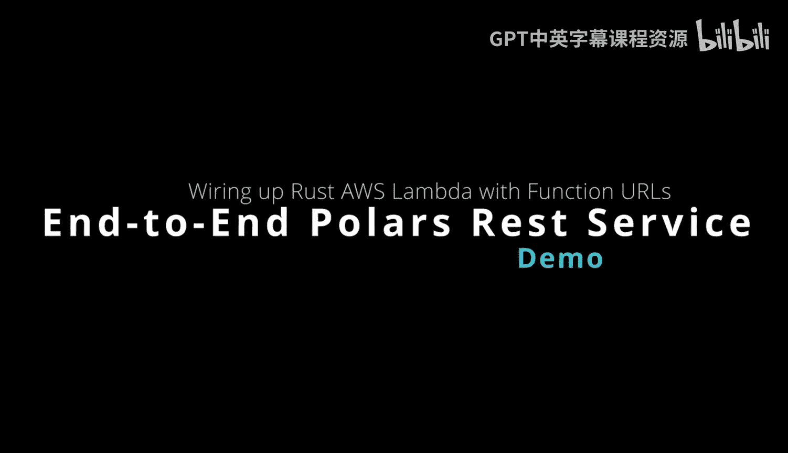
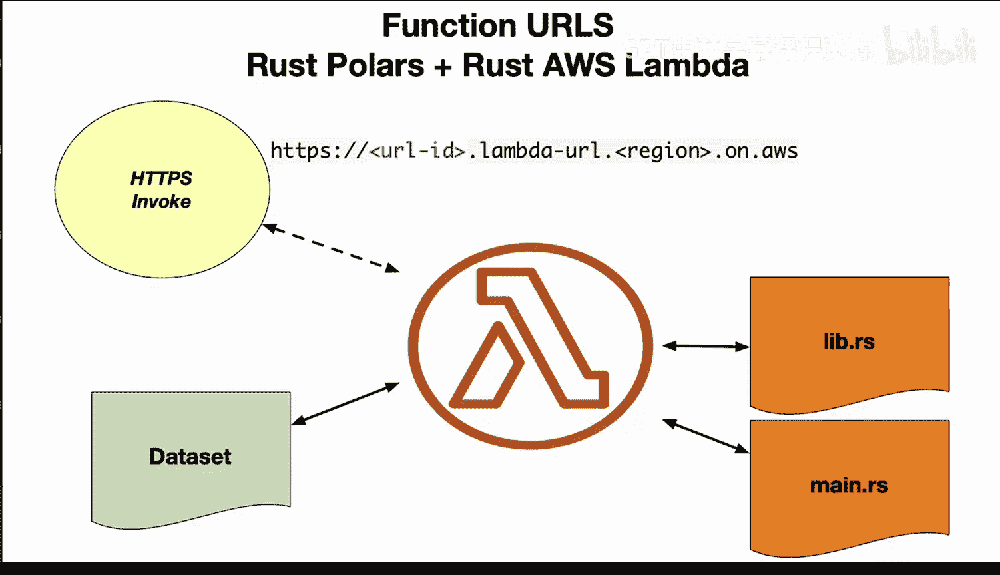
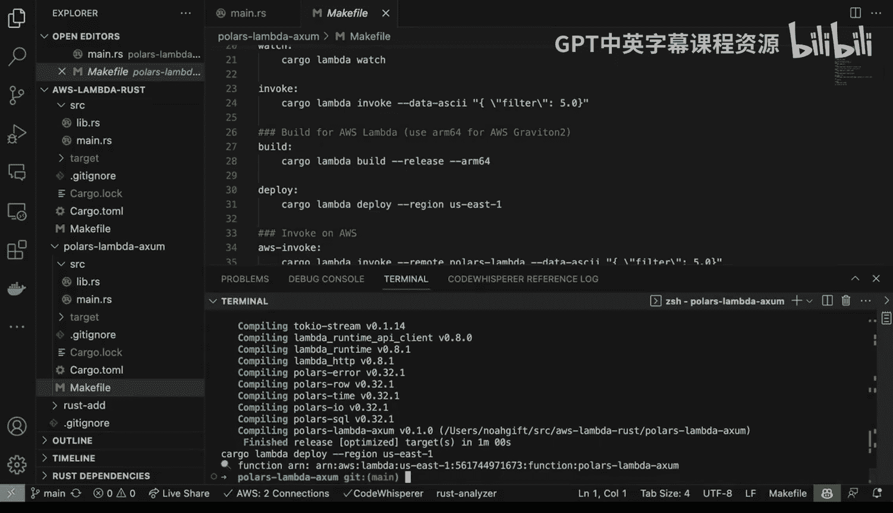
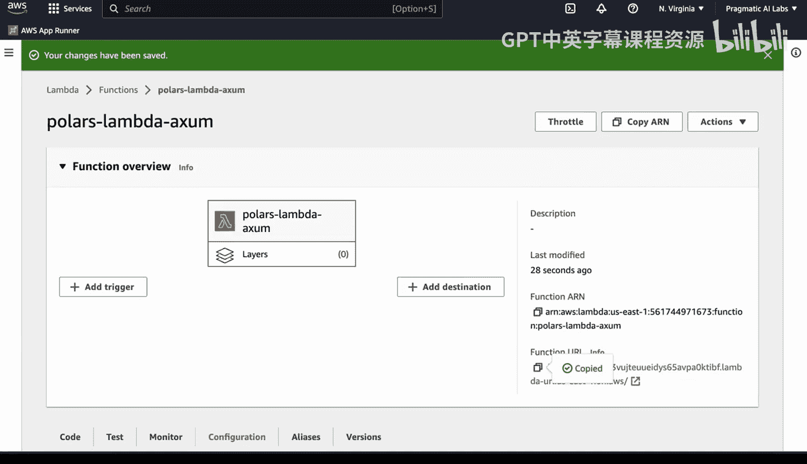
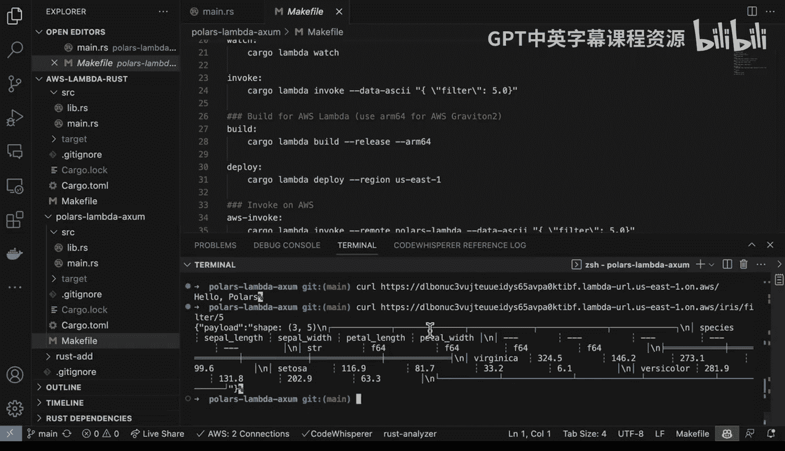

# 088：构建并部署支持函数URL的Polars Rust AWS Lambda 🚀



在本节课中，我们将学习如何构建一个基于Polars和Rust的AWS Lambda函数，并为其启用函数URL，从而创建一个可以通过HTTP直接调用的数据查询服务。

---

## 项目结构概览



首先，我们来看一下项目的代码结构。通过运行 `tree -I target` 命令，可以清晰地看到项目的目录布局。

```
.
├── Cargo.toml
├── src
│   ├── lib.rs
│   └── main.rs
└── ...
```

核心文件是 `src/lib.rs` 和 `src/main.rs`。`lib.rs` 包含了所有与Polars数据处理相关的核心逻辑，而 `main.rs` 则负责处理HTTP路由和Lambda函数入口。

---

## 核心代码解析

上一节我们了解了项目结构，本节中我们来看看具体的代码实现。`main.rs` 文件使用了一个Web框架来处理路由。

```rust
// 示例路由结构
#[tokio::main]
async fn main() -> Result<(), Error> {
    // 初始化路由
    let app = Router::new()
        .route("/", get(hello_world))
        .route("/filter/{value}", get(filter_data));
    // ... Lambda运行器配置
}
```

以下是代码中的两个主要路由处理函数：

1.  **根路径路由 (`/`)**: 返回一个简单的“Hello Polars”消息。
2.  **数据过滤路由 (`/filter/{value}`)**: 这是核心功能。它接收一个路径参数 `{value}`，调用 `lib.rs` 中的函数对内置的Iris数据集进行过滤和计算，最后将结果转换为JSON格式返回。

`lib.rs` 中的函数封装了Polars数据框的操作，例如 `df.filter(...)` 和 `df.select(...)`。

---

## 本地测试与运行

理解了代码结构后，我们需要在部署前进行本地测试。以下是本地测试的步骤。

首先，使用 `make watch` 命令（其内部调用 `cargo lambda watch`）在本地启动Lambda模拟环境。

```bash
make watch
```

服务启动后，我们可以使用 `curl` 命令来测试两个端点。

1.  测试根路径：
    ```bash
    curl http://localhost:9000
    ```
    预期返回：`"Hello Polars"`

2.  测试数据过滤功能，例如查询 `sepal_length` 大于5的数据：
    ```bash
    curl http://localhost:9000/filter/5
    ```
    预期返回一个经过过滤和计算的JSON格式数据数组。

---

## 构建与部署到AWS Lambda

本地测试通过后，就可以将应用部署到生产环境了。我们将构建一个高效的ARM64版本以节省成本。

1.  运行构建命令：
    ```bash
    make build
    ```

2.  运行部署命令：
    ```bash
    make deploy
    ```
    此命令会将编译好的二进制文件打包并部署到您AWS账户中配置的Lambda函数。

---

## 配置函数URL并远程调用

部署成功后，我们需要在AWS控制台中为Lambda函数启用函数URL功能，这样才能通过HTTP直接访问。



1.  登录AWS控制台，导航到Lambda服务。
2.  找到刚刚部署的函数，进入其“配置”选项卡。
3.  选择“函数URL”，点击“创建函数URL”。
4.  在认证类型中选择“NONE”（仅用于演示，生产环境请使用更安全的认证方式）。
5.  创建完成后，复制生成的URL。

现在，我们可以像测试本地服务一样，使用 `curl` 和这个URL来远程调用我们的Lambda函数了。

```bash
curl https://{your-function-url}.lambda-url.{region}.on.aws/filter/5
```



如果一切顺利，您将收到与本地测试相同的JSON响应。这标志着一个完整的、基于Polars和Rust的、并通过AWS Lambda函数URL提供服务的Web API已成功部署。

---

## 总结



本节课中我们一起学习了如何将一个集成了Polars库的Rust应用部署为AWS Lambda函数。我们首先分析了项目代码结构，然后进行了本地测试，接着将其构建并部署到云端，最后通过启用和调用函数URL，实现了无需API网关即可直接通过HTTP访问的数据查询服务。这套流程展示了利用Rust和Serverless架构构建高性能数据后端的高效路径。