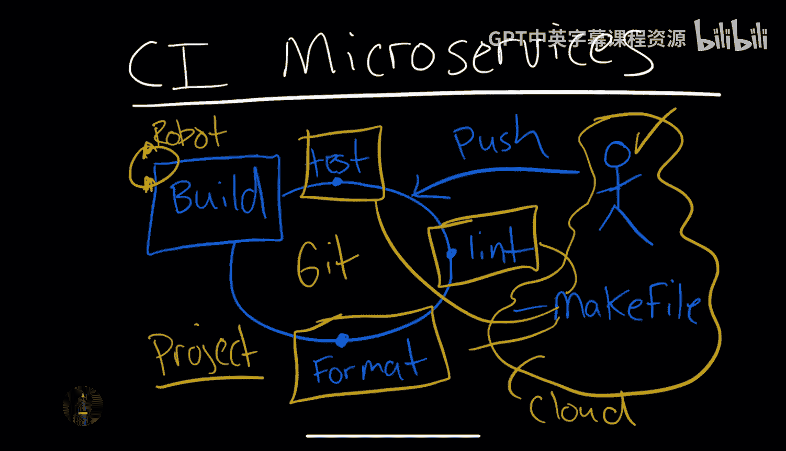
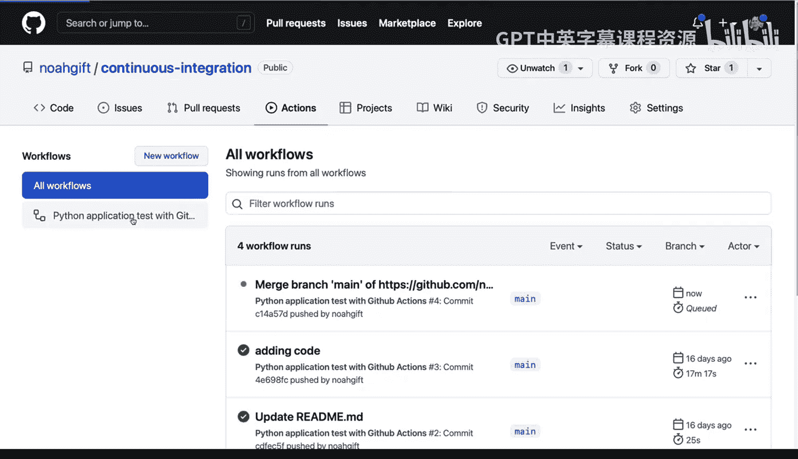
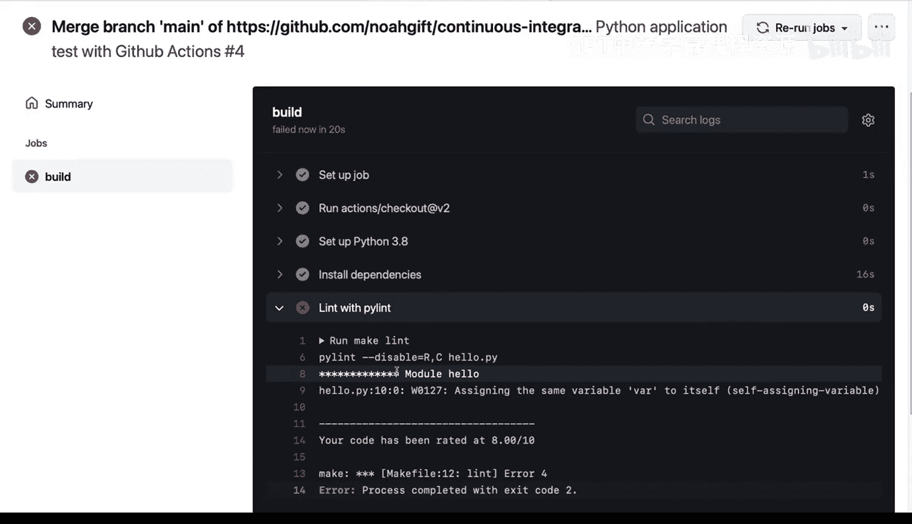
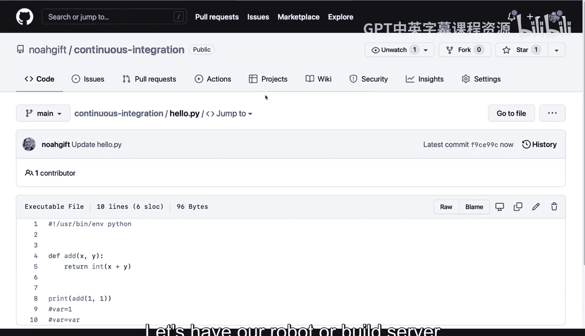
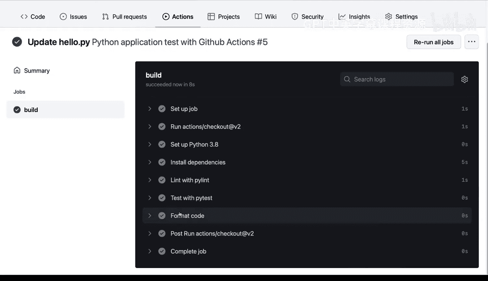
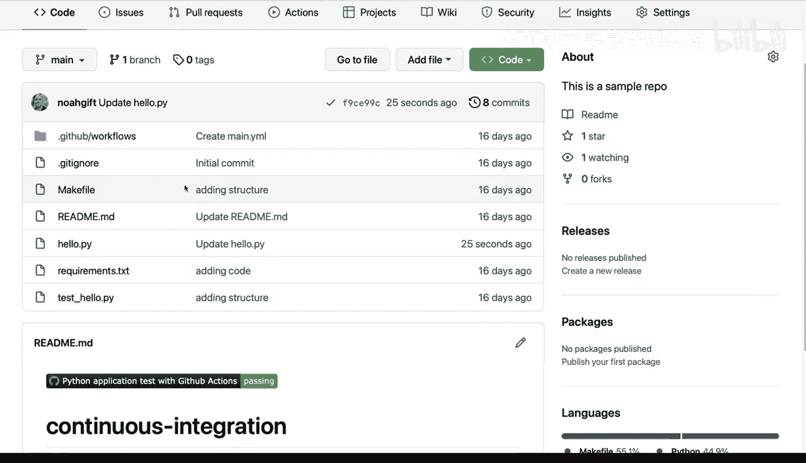

# 092：微服务持续集成 🚀

在本节课中，我们将学习如何为微服务项目建立一个持续集成生态系统。我们将从最重要的第一步——项目结构开始，并了解如何通过自动化流程来测试、检查代码规范性和格式化代码，以确保每次代码提交的质量。

## 概述

持续集成的核心在于，每当开发者（也就是你）将更改推送到基于Git的代码仓库时，系统能够自动测试、检查代码规范并格式化代码。我们将使用一个包含`Makefile`的项目结构，该文件定义了所有本地可执行的操作。同时，我们还将设置一个构建服务器（机器人），它会在云端持续工作，确保代码质量，为后续的部署做好准备。建立本地的持续集成环境是一个关键概念，它能让你的项目在准备投入生产时处于就绪状态。

接下来，让我们看看如何在Github项目的实践中实现这一点。

## 项目结构解析

现在，让我们来看一个专为持续集成和后续持续交付设置的项目结构。以下是其关键组成部分：

首先，在这个名为`noahgift-continuous-integration`的代码仓库中，我们有一个`Github workflows`目录。这里是构建系统的配置所在。在本例中，我们使用Github Actions，但它也可以是Jenkins、AWS Code Build等其他构建系统。该系统会按照我们的指令测试代码。

我们可以查看`main.yml`文件来了解具体的命令。该文件规定，在每次推送或开发者做出更改时，系统会启动一个Ubuntu虚拟机，使用Python 3.8，并执行以下步骤：`make install`、`make lint`、`make test`以及后续的`make format`。这种结构非常出色，我建议所有持续集成项目都采用类似设置。

接下来，我们看看代码本身的环境，也就是项目的各个子组件。这里有一个`README.md`文件（这总是一个好主意），一个显示构建系统状态的徽章，一个执行两数相加的基础功能文件，一个用于测试代码的测试文件，以及一个包含版本化包依赖的`requirements.txt`文件。这个依赖文件非常重要，它能确保环境的可复现性，让我知道构建系统使用的Python包版本与我测试时完全一致。

最后，如果我们查看`Makefile`文件本身，可以看到它实际上是一系列“配方”的集合，定义了`make install`、`make test`、`make format`和`make lint`等命令。这就是整个项目的结构。

## 实践演练：在真实环境中使用

那么，在现实世界中该如何使用这个结构呢？我们可以使用基于云的开发环境，例如Github Codespaces，来启动并查看它。

现在我们进入了这个Github Codespaces环境。请注意，我有一个终端，左侧显示了所有代码文件，并且我已经创建了一个虚拟环境。你可以使用`virtualenv`命令创建自己的虚拟环境。在我的情况下，我编辑了`.bashrc`文件，并直接将激活环境的`source`命令添加了进去（关于如何编辑`.bashrc`文件，我们在Bash部分的另一节课中有详细讲解）。

现在，我将再次浏览项目结构，并运行`make all`命令。让我们看看它会做什么：它会安装依赖、检查代码规范、测试我们的代码。这一切的妙处在于，我能得到一个清晰的反馈循环，告诉我一切正常。

现在，如果代码中存在问题会怎样？这里有一个很好的小例子：如果我让一个变量赋值给它自己，这不一定会导致代码崩溃，但可能会在未来引发潜在问题。在这种情况下，我们可以看到两个不同的问题：我们让变量赋值给它自己，而且我实际上从未让这个变量做任何事情，从未给它赋值。现在，如果我修改它，仍然能看到这个变量存在警告问题。第一个问题是异常或错误，会导致代码无法运行；另一个则只是警告。无论如何，代码规范检查工具都能捕获到这个Bug。

接下来，我将推送这个更改。现在执行`git push`来推送这些更改。完成后，我可以回到仓库页面，观察构建系统的运行。这就是持续集成系统的优势：它是一个监视我们代码的机器人，可以把它想象成一个不断清理问题、查找安装问题、代码规范问题和测试问题的守护者。由于我们有一条错误信息，代码规范检查在这里会失败，表明代码确实存在规范性问题。

## 问题修复与自动化流程

我们该怎么办？幸运的是，修复过程非常简单。我甚至不需要进入我的开发环境，可以直接在这个文件中进行编辑。我可以看到这里有问题，实际上并不需要这两行代码。让我们修复它，然后让我们的机器人（构建服务器）检查一下，看它是否能通过。

现在，我们等待构建服务器运行这个任务。它开始设置代码、安装依赖。最终，我们看到代码规范检查通过了，代码格式化也通过了，所有步骤都顺利完成了。

## 总结

本节课中，我们一起学习了为微服务建立持续集成生态系统的核心步骤。我们首先了解了项目结构的重要性，它包含一个定义所有自动化操作的`Makefile`。接着，我们探讨了如何利用Github Actions等构建服务器，在代码提交后自动执行测试、规范检查和格式化。通过实践演示，我们看到了如何在Github Codespaces环境中运行这些检查，以及当代码出现问题时，系统如何快速给出反馈并指导我们轻松修复。这个过程是每个进行微服务开发、命令行工具开发，乃至任何Python软件开发的项目都应该具备的。它极大地提升了代码质量和开发效率。