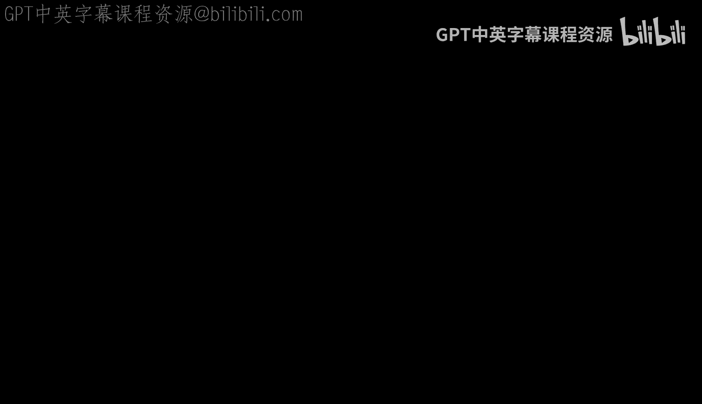
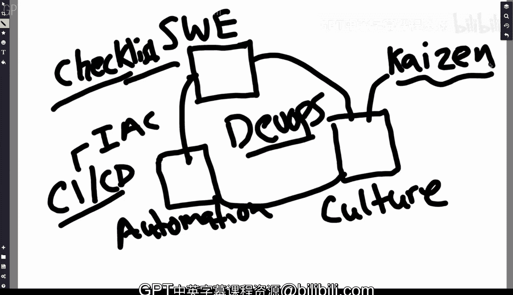

# 094：什么是DevOps 🚀

在本节课中，我们将学习DevOps的核心概念。我们将探讨DevOps的三个主要组成部分，并理解它们如何共同构成一个高效的软件开发和运维反馈循环。

---

当有人提到DevOps时，其核心组成部分是什么？为了进行总结，我们可以将其归纳为几个关键方面。

首先，我们有**软件工程最佳实践**。这可以被视为一个基础模块。

其次，存在一种**文化层面的要求**。这意味着公司的文化需要拥抱持续改进的理念。

最后，是**最终的结果**。这主要体现在自动化上。

如果我们深入探讨，DevOps的本质可以看作是软件工程最佳实践、组织文化和自动化的结合体。它形成了一个反馈循环。缺少其中任何一个环节，都无法实现真正的DevOps。这个反馈循环是理解DevOps的关键。

那么，什么是软件工程最佳实践？我们稍后会详细讨论。粗略地说，它指的是在构建项目时遵循的一系列标准化操作清单。

关于自动化，我们刚刚已经提及。这主要指的是**持续集成/持续部署**的概念，即能够持续地交付代码。与此紧密相关的还有**基础设施即代码**的概念，它也扮演着重要角色。

在文化方面，核心是“**改善**”这一理念。这是一个源自日本汽车工业的术语，意为持续改进。

---

## 核心组成部分详解

以下是构成DevOps的三个核心支柱：

1.  **软件工程最佳实践**
    *   在项目开发过程中，需要遵循一套明确的、可重复的检查清单或流程。

2.  **自动化**
    *   核心是 **CI/CD**，实现代码的持续集成与部署。
    *   延伸概念包括 **基础设施即代码**。

3.  **组织文化**
    *   核心是 **改善**，即一种致力于持续改进的文化。

---

## 总结

本节课中，我们一起学习了DevOps的基本构成。我们了解到，DevOps并非单一的工具或技术，而是**软件工程最佳实践**、**自动化**（尤其是CI/CD）与倡导**持续改进**的**组织文化**三者的有机结合。这三者共同构成了一个强大的反馈循环，是成功实施DevOps的关键。