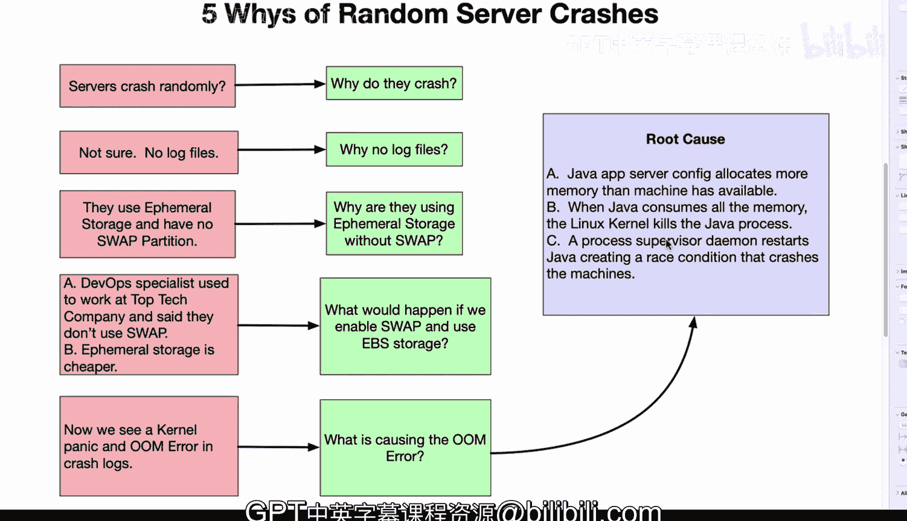

# 095：改善方法论 🛠️

在本节课中，我们将学习两种核心的改善方法论：**PDCA循环**和**五问法**。这些方法不仅适用于制造业，也广泛应用于软件工程和问题解决中，旨在通过系统性的步骤持续改进流程和根除问题。

## PDCA循环：持续改进的科学方法 🔄

上一节我们介绍了改善方法论的重要性，本节中我们来看看第一个核心方法——PDCA循环。PDCA是“计划、执行、检查、处理”的缩写，它是科学方法在制造或软件工程领域的具体应用。

以下是PDCA循环的四个阶段：

1.  **计划**：在此阶段，你需要识别问题。例如，我们需要构建一个查看库存的自动化工具。
2.  **执行**：接下来，尝试实施解决方案。一旦完成初始原型，你需要进行检查。
3.  **检查**：检查以确保方案确实实现了业务目标。例如，如果围绕库存进行了自动化，它应该能提供准确的库存计数。你需要分析结果。
4.  **处理**：如果方案有效，就将其作为生产设施的一个组成部分付诸行动。如果无效，则需要回到计划阶段，识别问题所在，然后重复此过程。

因此，PDCA循环是一个不断改进事物的迭代过程。这是**改善方法论**的一个关键组成部分。

## 五问法：探寻问题的根本原因 ❓

了解了PDCA循环后，我们来看看另一个强大的工具——五问法。它通过连续追问“为什么”来深入挖掘问题的根本原因。

以下是一个来自我职业生涯的真实且非常严重的案例：

我们遇到服务器随机崩溃的问题。通过连续追问，我们最终找到了根本原因。

1.  **为什么服务器会崩溃？** 答案是不确定，因为没有日志文件，我们无法调查崩溃原因。
2.  **为什么没有日志文件？** 提出这个问题后，我们发现系统使用的是临时存储，这种存储会在重启后消失，并且没有交换分区。
3.  **为什么系统使用没有交换分区的临时存储？** 答案是，曾在一家顶级科技公司工作的DevOps专家说他们那里不使用交换分区，并且临时存储更便宜。
4.  **如果我们启用交换分区并使用EBS存储会怎样？** EBS存储是跨重启持久化的块存储。通过这一步，我们能够在崩溃日志中显示存在内核恐慌和内存不足错误，从而调试问题。
5.  **是什么导致了那个错误？** 现在我们看到根本原因是：Java应用服务器配置文件分配的内存超过了机器可用内存。这导致应用软件本身消耗了所有内存，并且因为没有交换分区可写入，Linux内核不得不介入并杀死了Java进程。最后，一个用于管理并自动重启进程的监管程序制造了一个竞态条件，导致机器崩溃。

通过这五个问题，我们解决了一个非常棘手的问题，并找到了根本原因。并非所有问题都能通过五问法解决，但许多问题可以。这体现了改善方法论的核心原则：追根溯源，持续找出原因并修复它。

## 总结 📝

本节课中我们一起学习了两种关键的改善方法论。**PDCA循环**提供了一个迭代框架，用于计划、测试、检查和实施改进。**五问法**则是一种强大的诊断工具，通过层层深入追问“为什么”，帮助我们穿透表面现象，找到问题的根本原因。掌握这些方法，将使你在面对复杂工程和业务挑战时，能够更系统、更有效地推动持续改进。