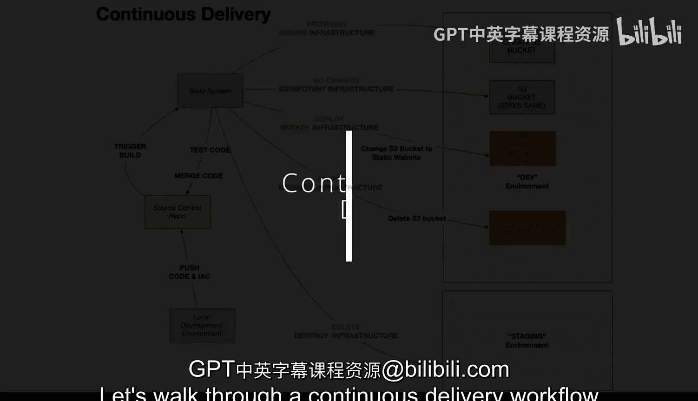
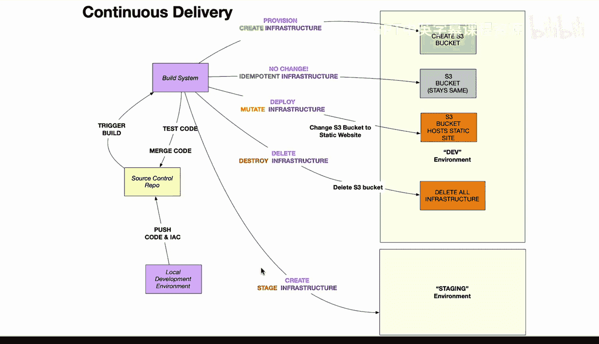

# 096：用于持续交付的基础设施即代码 🚀

在本节课中，我们将学习如何使用最新的云原生生态系统工具来构建一个持续交付工作流。我们将重点探讨“基础设施即代码”的概念及其在自动化部署流程中的核心作用。

---

## 概述

持续交付的目标是能够快速、可靠地将软件变更交付到生产环境。为了实现这一点，我们不仅需要自动化软件的构建和测试，还需要自动化其运行环境的创建和管理。这就是“基础设施即代码”发挥作用的地方。

## 开发环境

首先，开发工作通常在特定的环境中进行。很多时候，这会是一个基于云的环境，例如 AWS 上的 Cloud9 或 Azure 平台上的 GitHub Codespaces。

使用这些云原生环境的原因是，它们让你能够使用所有将在生产环境中使用的开发者工具。因此，你拥有一个与生产环境非常相似的一对一开发环境。

## 推送变更

当你构建项目时，你不仅会推送软件代码，还会推送“基础设施即代码”。

基础设施即代码允许你定义在基于云的环境或基于 Kubernetes 的环境中发生的每一个细节。请注意，当你推送变更时，构建系统将测试你的代码、合并代码，然后这个构建版本会自动进入“资源调配”阶段。

## 基础设施即代码的核心特性

基础设施即代码的一个强大特性是它的**幂等性**。

这意味着，它只在必要时才进行更改，并且总是使系统状态保持一致。

例如，如果你最初创建了基础设施，当你进行第二次构建时，它不会再次创建基础设施，因为它会注意到（比方说）这里的 S3 存储桶已经存在，因此无需进行更改。

同样，如果你修改了基础设施即代码的定义，做了一个小的更改，它就会执行并为你创建一个新的存储桶。

最后，如果你需要清理资源，使用基础设施即代码可以轻松完成。

## 灵活的环境管理

另一个强大的功能是，你可以执行任何你希望的操作。例如，你可以选择不执行删除操作，而是说：“我想在这里创建新的基础设施，我想在这个特定环境中构建一个**预发布环境**。”

这个预发布环境是进行负载测试的地方。然后，你可以同样地分叉代码和基础设施即代码，再创建一个**生产环境**。

## 总结

本节课中，我们一起学习了持续交付工作流的核心。我们了解到，使用基础设施本身来定义系统，并进行幂等性的更改，是持续交付的重要组成部分。这种方法允许你持续地将变更推送到新环境。这并不意味着在没有人工干预的情况下，变更总会直接进入生产环境，但它确实允许你将变更推送到多个环境。这正是持续交付中的关键概念。