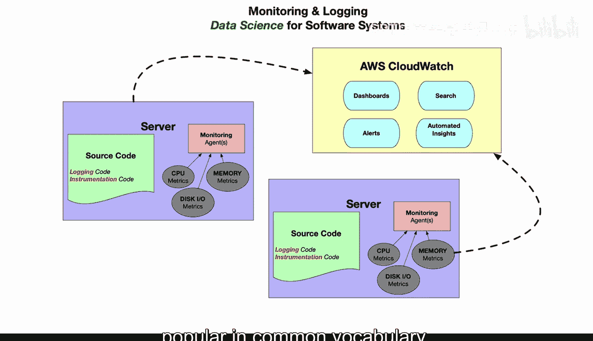
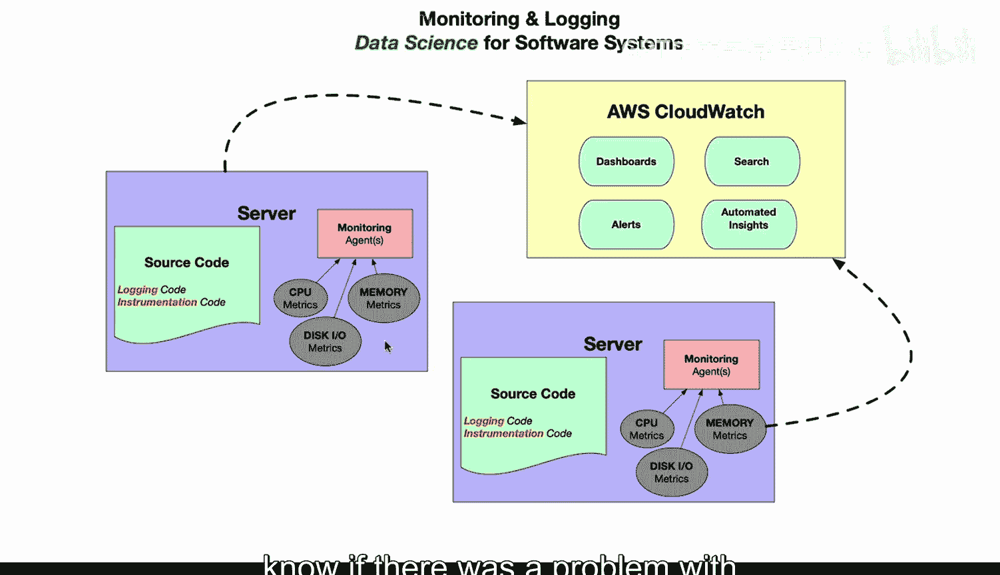
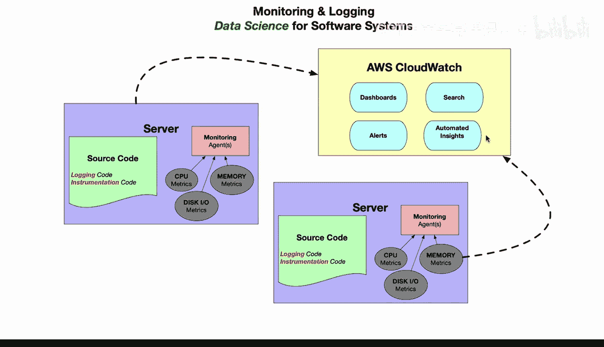
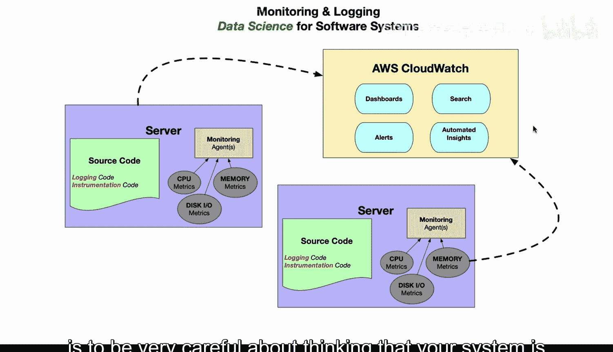
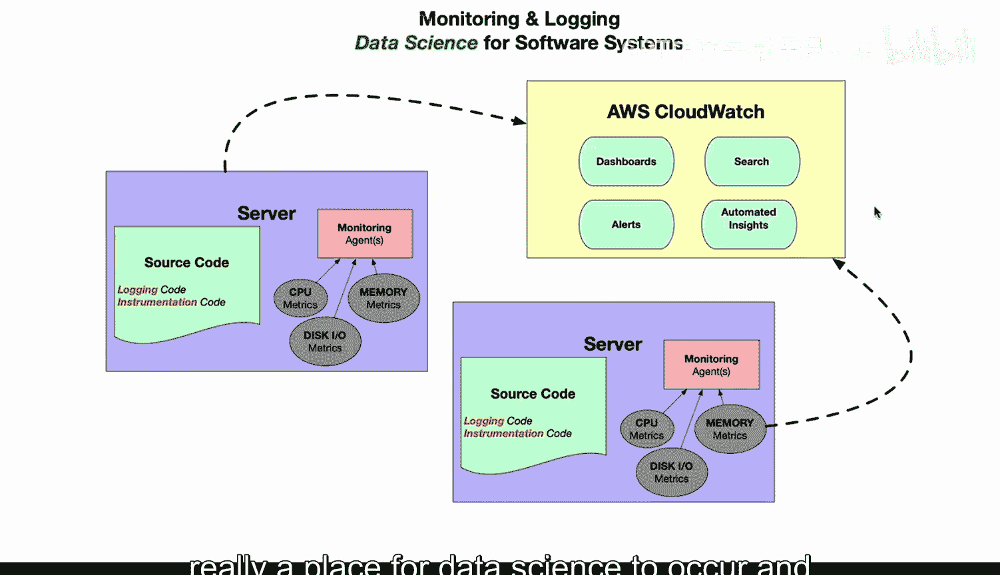
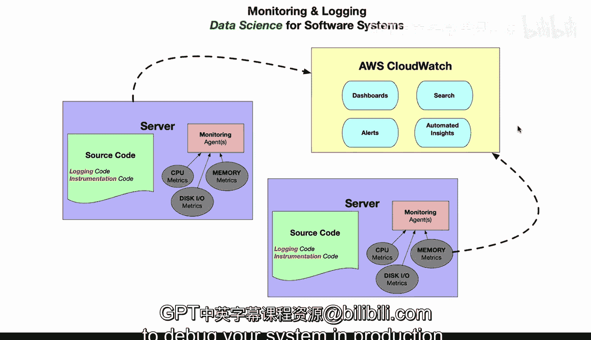

# 098：设计与实施监控告警 📊

在本节课中，我们将要学习监控与日志记录在软件系统中的核心作用，它们本质上是一种针对软件系统的数据科学实践。我们将探讨如何在部署服务器时，通过源代码中的日志记录和插桩代码来收集关键数据，并利用这些数据进行集中式分析和告警。

## 监控与日志：软件系统的数据科学 🔍

监控与日志记录是软件系统的数据科学。这一实践在“数据科学”这个术语成为流行词汇之前，就已经广泛存在了。

上一节我们提到了监控的重要性，本节中我们来看看其具体实现方式。

## 服务器部署中的日志与插桩 📝

当你部署一个服务器时，其源代码内部本身就包含了日志记录代码。它同时也包含了插桩代码。

以下是其重要性的体现：

*   **上下文信息**：日志代码必须包含其所在服务器的上下文信息。例如，如果服务器位于特定区域（如美国东海岸或西海岸），日志中应体现这一点。
*   **唯一标识**：服务器还应具有某种唯一标识，以便能够被集中追踪。
*   **关键指标**：像 **CPU**、**内存**、**磁盘 I/O** 这类指标，在发现分布式系统中发生的问题时至关重要。

## 集中式监控的必要性 🧩

很多时候，如果系统中有多台服务器（例如10台），当某台服务器出现非常细微或非确定性的问题时，几乎不可能被察觉。例如，服务器可能周期性崩溃，或者存在某种网络问题。

解决这类问题的唯一方法就是运用数据科学。具体做法是：将日志和插桩数据收集起来，输入到一个集中式的仪表板中。

以下是集中式监控带来的好处：

*   **搜索与分析**：你可以在其中搜索日志，进行深入分析。
*   **设置告警**：你可以基于特定条件设置告警规则。
*   **自动化洞察**：甚至可以通过机器学习获得自动化的洞察。

## 现代软件工程的核心 🧠

现代软件工程的核心与灵魂在于，要非常谨慎地认识到：你的系统本质上是一个数据科学可以大展身手的领域。你必须确保拥有足够的上下文信息，以便在生产环境中调试你的系统。

本节课中我们一起学习了监控与日志记录作为软件系统数据科学的基础理念。我们了解了在服务器代码中嵌入上下文丰富的日志和指标的重要性，以及如何通过集中式仪表板进行搜索、告警和自动化分析，从而有效诊断和解决分布式系统中的复杂问题。这是构建可靠、可观测的现代软件系统的关键。