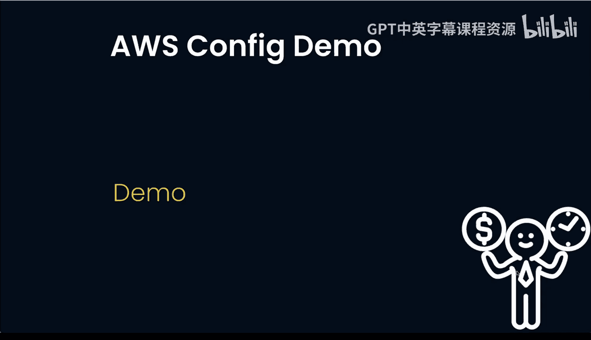
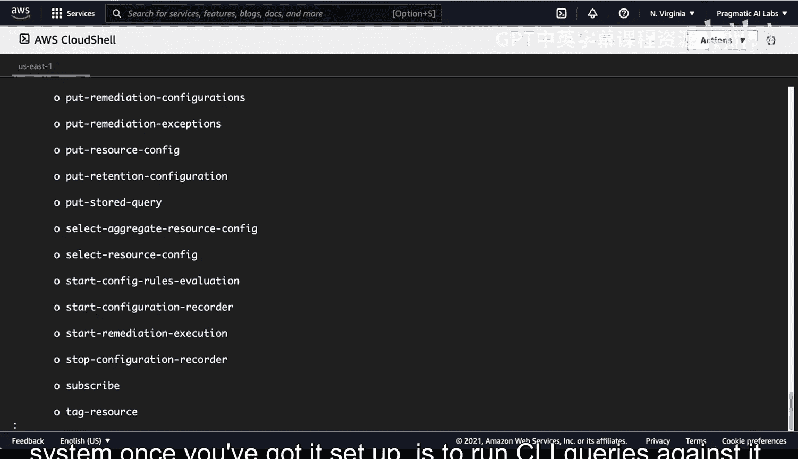

# 102：使用AWS Config实现安全 🔒

在本节课中，我们将学习如何使用AWS Config在账户级别分析AWS资源。我们将了解其核心功能、配置方法以及如何通过命令行和图形界面来审计资源合规性。


---

## 概述

AWS Config是一项服务，用于监控和评估AWS资源的配置。它记录资源配置的变更，并根据您指定的最佳实践规则评估这些变更，从而帮助您实现安全审计和合规性管理。

---

## AWS Config 的核心功能

上一节我们介绍了AWS Config的用途，本节中我们来看看它的核心工作机制。

AWS Config会监控AWS资源中发生的变更。具体来说，Config会以一致的格式记录并规范化这些变更，从而形成一个可以追踪所有活动的审计系统。它会根据您指定的配置来评估这些变更。

其工作流程的核心概念可以概括为以下步骤：
1.  **监控与记录**：监控资源变更。
2.  **规范化**：将变更转换为一致格式。
3.  **评估**：根据规则评估变更的合规性。
4.  **报告**：将结果交付到存储桶或通过API、仪表板展示。

---

## 使用AWS Config的两种方式


了解了核心功能后，我们可以通过两种主要方式来操作AWS Config：AWS命令行界面（CLI）和管理控制台。



### 通过AWS CLI使用Config

对于高级用户而言，熟悉命令行操作非常有益。AWS Cloud Shell环境是一个很好的起点。



在CLI中，您可以使用 `aws configservice` 命令。输入 `help` 可以查看所有可用选项，用于描述您组织中的所有资源。

```bash
aws configservice help
```


对于初步设置好的AWS Config系统，运行CLI查询可能是最佳的使用方式之一。

### 通过AWS管理控制台使用Config

另一种方式是使用AWS管理控制台，它提供了非常友好的图形界面。

以下是访问控制台仪表板的步骤：
1.  登录AWS管理控制台。
2.  导航到“AWS Config”服务。
3.  您将看到已设置规则的仪表板，可以查看安全组、S3存储桶、EC2实例等资源的合规状态。

---

## 配置与部署合规性包

现在我们已经知道如何访问Config，本节我们将学习如何配置具体的审计规则。

在控制台中，您可以配置“合规性包”。一个合规性包是多个规则的集合。例如，您可能有一些不合规的规则需要处理。

部署一个新合规性包的流程如下：
1.  在AWS Config控制台选择“合规性包”。
2.  点击“部署合规性包”。
3.  您可以选择使用示例模板。系统提供了许多最佳实践模板，例如：
    *   API网关的操作最佳实践
    *   AWS备份的操作最佳实践
    *   S3的操作最佳实践
4.  选择所需的模板（例如“S3操作最佳实践”），点击“下一步”。
5.  为合规性包命名（例如 `S3-Best-practices`）。
6.  再次点击“下一步”并部署。

部署完成后，这些规则将应用于与此根用户关联的所有账户，而不仅仅是单个账户。您可以根据AWS推荐的最佳实践来审计资源。

---

## 查看审计结果与问题排查

部署合规性包后，我们可以查看审计结果。例如，系统可能提示EFS（弹性文件系统）未受备份计划保护。

审计报告会明确指出：
*   哪个规则发现了问题（例如：“此规则由AWS Config创建，用于检查EFS系统是否受备份计划保护”）。
*   哪些资源不合规（例如：“这些资源未受备份计划保护”）。

这种方式的好处在于，它基于明确的规则集提供客观评估，无需依赖个人意见或手动询问团队是否执行了备份等操作。

---

## 总结


本节课中我们一起学习了AWS Config，这是一个用于在账户级别审计AWS资源的强大工具。我们了解了其记录和评估资源配置变更的核心功能，并掌握了通过AWS CLI和管理控制台两种方式来使用它。最后，我们学习了如何部署合规性包来实施AWS推荐的最佳实践规则，从而实现自动化的安全与合规审计。对于使用AWS的大型组织，尤其是需要严格合规管理的企业，AWS Config是一项强烈推荐的服务。