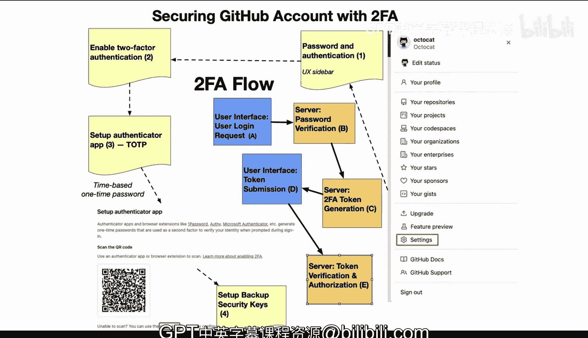

# 104：讲解如何通过双因素认证保护账户 🔐

在本节课中，我们将学习如何为GitHub账户启用双因素认证（2FA）。这是一种至关重要的企业安全实践，能确保账户遵循最佳安全标准。

## 概述

双因素认证是目前最安全的身份验证方式之一。通过结合时间性的一次性密码（TOTP），它能提供极强的账户保护。接下来，我们将分步介绍如何在GitHub上配置和使用双因素认证。

## 在GitHub界面中启用双因素认证

首先，我们需要在GitHub的用户设置中启用双因素认证功能。

以下是具体的操作步骤：

1.  进入GitHub的“Settings”（设置）。
2.  在左侧菜单中找到并点击“Password and authentication”（密码和身份验证）。
3.  在该页面中，找到“Enable two-factor authentication”（启用双因素认证）选项并点击进入。

## 设置身份验证器应用

上一节我们介绍了如何找到启用2FA的入口，本节中我们来看看如何配置具体的验证工具。

启用2FA后，系统会引导你设置身份验证器应用（如Google Authenticator或Authy）。你需要使用手机应用扫描页面提供的QR码。成功绑定后，你的验证器应用将开始生成**基于时间的一次性密码（TOTP）**，这是双因素认证中最安全的形式之一。

其核心原理可以用一个简化的公式表示：
`一次性密码 = 函数(共享密钥, 当前时间)`

## 配置备份安全密钥

在设置好基础的身份验证器应用后，为了进一步提升账户安全性，我们强烈建议配置备份安全密钥。

备份安全密钥（如YubiKey等物理安全密钥）比短信验证（SMS）更加安全，是推荐的最佳实践。完成此步骤后，你的账户将拥有多一重的恢复和保护机制。

## 双因素认证登录流程解析

现在我们已经完成了双因素认证的设置，让我们来了解一下完整的登录流程是如何工作的。

以下是用户登录时，双因素认证触发的完整步骤：

1.  **用户发起登录请求**：用户在GitHub界面输入用户名和密码。这是双因素认证中的“第一因素”。
2.  **服务器验证密码**：服务器收到请求后，会核对提交的密码与存储的凭证是否匹配。只有密码正确，流程才会进入下一步。
3.  **生成双因素令牌**：密码验证通过后，服务器会启动2FA流程。这包括通过短信或用户已绑定的OTP应用，向用户发送一个**唯一的、有时效性的令牌**。
4.  **用户提交令牌**：用户在GitHub登录界面输入收到的或OTP应用生成的令牌。这是“第二因素”，也是最后的安全层。
5.  **服务器验证令牌**：服务器将用户提交的令牌与自己生成并发送的令牌进行比对验证。在这个短暂的验证窗口期内，令牌必须匹配，登录才能成功。

这个过程确保了即使密码泄露，没有第二因素（动态令牌）也无法登录账户。

## 总结

本节课中我们一起学习了如何为GitHub账户配置双因素认证。我们了解了在设置界面启用2FA、绑定身份验证器应用、设置备份安全密钥的具体步骤，并详细分析了2FA登录的整个安全验证流程。采用基于时间的一次性密码（TOTP）是目前最安全的方法之一，未来它很可能成为所有账户的必备要求。通过本教程，你应该能够为自己的账户成功启用这一强大的安全保护措施。