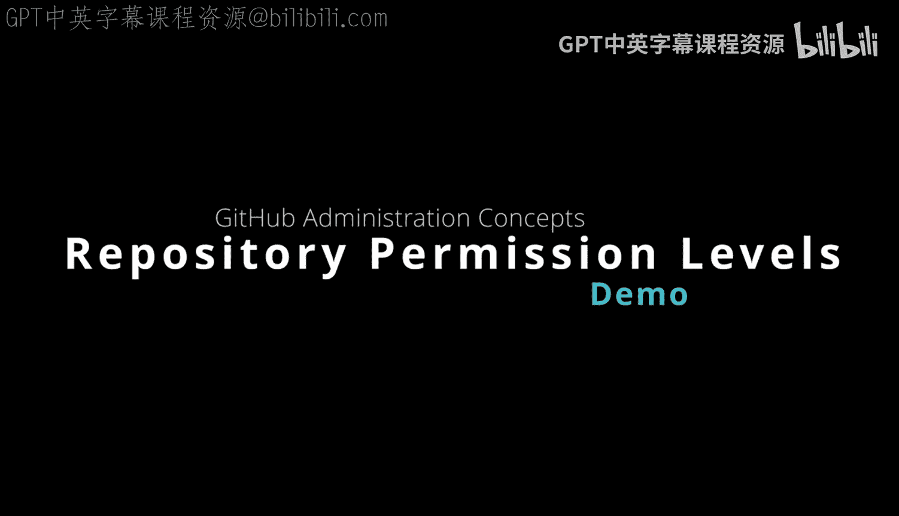

# 106：仓库权限级别详解

在本节课中，我们将学习GitHub仓库的三种主要权限级别。理解这些级别对于管理团队协作、保障代码安全至关重要。

## 权限级别概述

GitHub仓库的权限级别可以从三个主要角度来理解。

上一节我们介绍了权限级别的整体概念，本节中我们来看看具体的三种级别。

### 无访问权限

无访问权限意味着用户或协作者无法查看或与仓库进行任何交互。

其核心含义在于，这对于安全性至关重要，因为它能确保未经授权的用户甚至无法看到仓库的存在。

以下是适用此权限的场景：
*   过去的协作者不再需要访问权限。
*   不应拥有访问权限的人员，例如外部供应商。

### 只读访问权限

只读访问权限允许用户读取代码，但不能进行任何更改。

这个想法类似于GitHub中的“读取”级别权限。

其含义在于，这非常适用于审计、自动部署，甚至是非技术利益相关者，但不适用于需要做出更改的人员。

### 读写/管理访问权限

读写访问权限意味着你拥有写入甚至管理员权限，可以修改仓库本身的管理设置。

因此，这适用于核心开发人员、项目经理甚至DevOps人员。

## 权限策略详解

上一节我们介绍了三种基础权限级别，本节中我们来看看它们在GitHub企业版中对应的具体策略。

这正好对应我们下面看到的这些策略：仓库创建、仓库复刻、仓库管理以及外部协作者管理。

以下是GitHub企业版中的仓库策略，你可以看到它们如何清晰地对应之前的图表：

*   **仓库创建**：策略可以是“禁用”（无策略），或者明确指定成员可以创建公开、私有或内部仓库。
*   **仓库复刻**：你可以设置策略为“启用”或“禁用”，这分别对应可变或不可变的访问。
*   **外部协作者**：同样可以设置是否允许。
*   **仓库管理**：在仓库本身的管理方面，人们是否可以更改仓库、删除或转移仓库。如果涉及删除操作，有哪些不同的方面需要我们关注。

因此，这些都是你可以使用GitHub企业版在细粒度级别上进行控制的内容。

## 总结

本节课中我们一起学习了GitHub仓库的三种核心权限级别：无访问权限、只读访问权限和读写/管理访问权限。我们了解了每种级别的含义、适用场景，并看到了它们在GitHub企业版中对应的具体管理策略。掌握这些知识有助于你更安全、高效地管理项目协作。