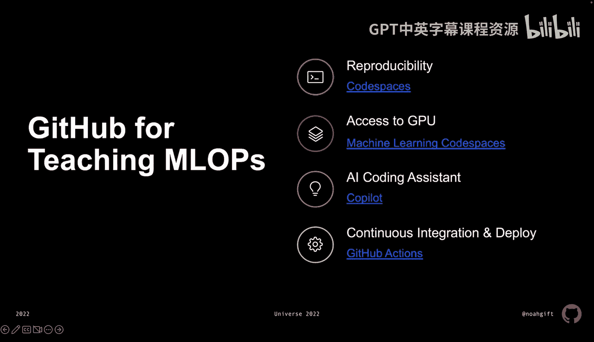
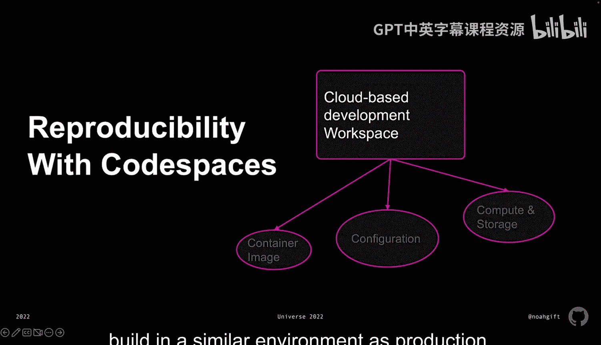
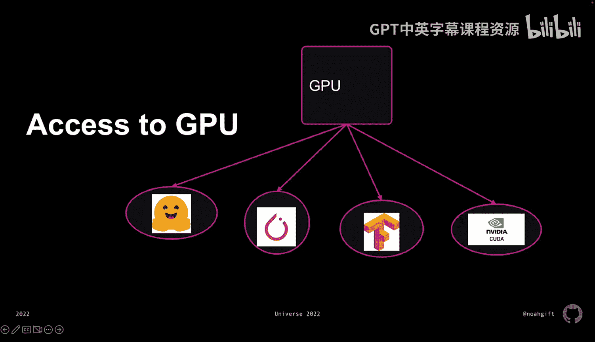

# 108： 揭示GitHub生态核心概念 🚀

在本节课中，我们将要学习如何利用GitHub生态系统来构建和部署机器学习运维（MLOps）项目。我们将探讨GitHub提供的几个核心工具，它们如何帮助团队和个人实现代码的可复现性、高效开发以及自动化部署。

---

## 概述：GitHub在MLOps中的价值

GitHub不仅是一个代码托管平台，更是一个强大的开发与协作生态系统。对于教授和学习MLOps，以及专业实践而言，它提供了关键优势。

以下是GitHub生态中四个核心概念，它们共同构成了现代MLOps工作流的基础。

---

## 1. 可复现性：Codespaces环境

上一节我们介绍了GitHub的整体价值，本节中我们来看看实现可复现性的关键工具——GitHub Codespaces。

Codespaces环境能提供极高的可复现性，确保团队其他成员或课堂上的学生都能访问与你完全相同的开发环境。

可复现性主要围绕以下三点实现：

*   **云端开发环境**：它是一个基于云的工作空间，内置了容器镜像。这个镜像可以是Ubuntu、微软官方镜像或任何与Docker兼容的镜像。
*   **自定义配置**：你可以通过 `.devcontainer` 配置文件来定制这个环境，以满足你的特定需求。
*   **计算与存储**：你可以自定义Codespaces，使其使用GPU、多核CPU或高内存机器。这非常宝贵，因为你可以在与生产环境相似的环境中进行测试和构建。

---

## 2. 计算能力：GPU访问

在拥有了可复现的环境之后，强大的计算能力是运行机器学习模型的基石。本节我们将探讨如何在GitHub生态中访问GPU资源。

访问GPU允许你执行多种任务，例如深入使用Hugging Face（预训练模型的领先提供商）。你可以下载预训练模型，并在你的设备上直接进行微调，而无需购买昂贵的独立GPU。

以下是利用GPU进行开发的主要方式：

*   **主流框架**：Hugging Face经常与PyTorch配合使用，你可以在环境中访问PyTorch。
*   **灵活选择**：你也可以使用TensorFlow，从头开始构建自己的深度学习模型。
*   **底层控制**：甚至可以深入更底层，直接使用NVIDIA CUDA SDK来构建直接应用于GPU的函数。

---

## 3. 开发效率：Copilot AI编程助手

当我们准备好环境和计算资源后，下一步就是高效地编写代码。本节我们将介绍能极大提升编码效率的工具——GitHub Copilot。

Copilot AI编程助手是一种获取代码建议、直接为项目添加细节的方式。由于Copilot能感知你项目中的所有内容，你可以形成一个持续改进的良性循环。

这个循环通常包含以下步骤：

1.  **获取建议**：向Copilot系统提出提示和问题，获取关于如何编写代码、构建代码或构建命令行工具的建议，它甚至能为你生成样板代码。
2.  **代码质量**：随后，你可以要求进行代码规范检查（如Pylint）、运行测试（如pytest）或在IPython中执行代码。
3.  **效率提升**：这种循环可以带来开发速度上数倍的提升。

---

## 4. 自动化部署：GitHub Actions

最后，当我们完成了代码开发与测试，如何将其安全、自动地部署到生产环境呢？本节我们将学习实现这一目标的自动化工具——GitHub Actions。

通过GitHub Actions实现持续集成和持续交付，允许你在构建代码的同一位置部署你的应用程序。

以下是利用GitHub Actions实现自动化部署的典型工作流：

1.  **本地构建**：在Codespaces中，执行 `make install`、`make test`、`make deploy` 等步骤（定义在你的Makefile中）。
2.  **触发CI/CD**：将代码推送到仓库，这会触发GitHub Actions中定义的持续集成步骤。
3.  **镜像构建与推送**：Actions可以构建一个Docker镜像，并将其推送到容器注册表（如Amazon ECR）。
4.  **自动部署**：推送镜像的动作可以进一步触发平台即服务（如AWS App Runner）自动部署你的应用程序。

这样，你就拥有了在**完全相同的环境**中开发和最终部署所需的所有工具，为实现持续集成和持续交付的最佳实践提供了平滑的过渡。

---

## 总结

本节课中我们一起学习了GitHub生态系统中四个核心概念，它们构成了现代MLOps工作流的关键支柱：

1.  **Codespaces** 提供了**可复现**的云端开发环境。
2.  **GPU访问** 赋予了处理复杂机器学习模型的**强大计算能力**。
3.  **Copilot** 通过AI辅助显著提升了**开发效率**。
4.  **GitHub Actions** 实现了从代码到生产的**自动化部署**流水线。

掌握这些工具，你将能够构建一个高效、协作且专业的机器学习项目开发与运维流程。