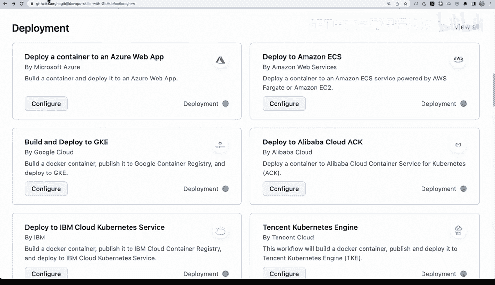
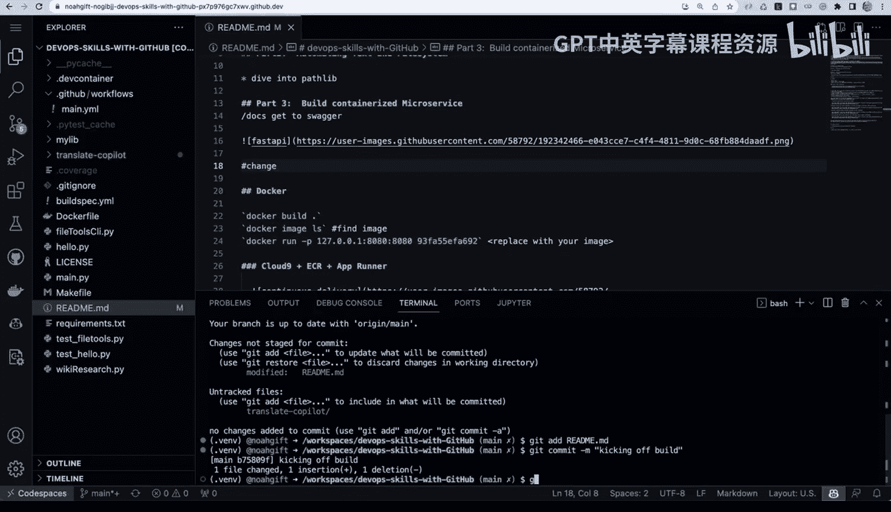
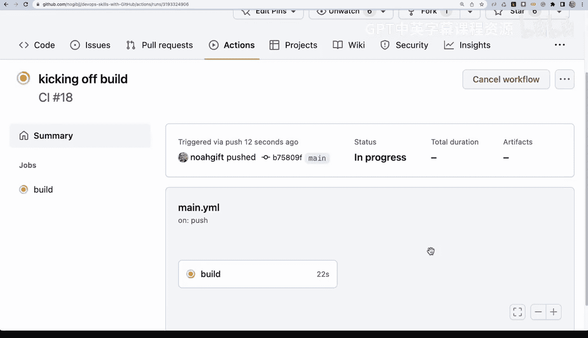

# 109：GitHub Actions实施教程 🚀

在本节课中，我们将学习如何为一个项目启用并实施GitHub Actions。GitHub Actions是一个强大的自动化工具，可以帮助我们自动执行构建、测试和部署等任务。我们将通过一个具体的例子，了解其基本结构和工作流程。

## 概述

GitHub Actions允许我们通过YAML文件定义自动化工作流。这些工作流可以在代码推送、拉取请求等事件触发时自动运行。我们将查看一个已启用Actions的项目，理解其目录结构、YAML文件的编写方式，以及如何将其与本地开发流程（如Makefile）相结合。

## 项目结构与YAML文件

任何启用了Actions的项目，都会在`.github/workflows/`目录下包含一个或多个YAML文件。

以下是一个示例工作流文件的内容，它定义了一个在`ubuntu-latest`容器上运行的作业：

```yaml
name: CI

on: [push]

jobs:
  build:
    runs-on: ubuntu-latest

    steps:
      - name: Make Install & Lint
        run: make install-lint
      - name: Make Lint & Test
        run: make lint-test
      - name: Make Test
        run: make test
      - name: Make Format
        run: make format
```

在这个YAML文件中，我们定义了几个步骤，每个步骤都对应一个在Makefile中定义的命令。


## 与Makefile的关联

将GitHub Actions工作流与Makefile直接关联的好处在于，你无需在YAML文件中反复思考要运行什么命令。你在本地开发时使用的命令（如`make format`或`make lint`）与自动化流程中运行的命令完全一致。

让我们看看对应的Makefile片段：

```makefile
install-lint:
    cargo install --path .
    cargo clippy -- -D warnings

lint-test:
    cargo clippy -- -D warnings
    cargo test

test:
    cargo test

format:
    cargo fmt --all -- --check
```

这种对应关系确保了开发环境与CI/CD环境的一致性。当代码推送到仓库时，GitHub Actions会自动执行这些在Makefile中定义的步骤。

## 在GitHub上创建工作流

在GitHub仓库页面上，你可以通过点击“Actions”标签页来创建新的工作流。



系统会提供几种选项：
1.  **自行设置**：这会提供一个基础模板，你可以直接在模板中填入想要运行的命令。这对于初学者是一个不错的起点。
2.  **使用预设示例**：GitHub提供了许多针对不同场景的预设工作流，例如“发布Python包”。这些示例是学习最佳实践的好材料。

虽然直接在YAML中编写命令是一种方法，但更推荐使用Makefile来建立本地与云端命令的对应关系。

## 实战演示：触发一次构建

现在，让我们看看GitHub Actions是如何被触发并工作的。

1.  首先，我们使用`git stash`命令将本地的临时更改暂存起来。
2.  接着，我们对项目中的某个文件（例如一个脚本）做一个小小的修改。
3.  使用`git status`查看更改，然后通过`git add`和`git commit`提交这些更改。在提交信息中，我们可以写上“Kicking off build”。
4.  一旦代码被推送到GitHub，它会立即触发一个新的GitHub Actions构建任务。

构建开始后，我们可以进入“Actions”标签页，逐步查看YAML文件中定义的每一个步骤的执行情况。这对于调试和监控自动化流程非常有用。

对于一个标准的部署流程，我建议按顺序执行以下步骤：`make install`（安装依赖）、`make lint`（代码检查）、`make test`（运行测试），最后是`make deploy`（部署到生产环境）。GitHub Actions正是构建这种专业化DevOps工作流的核心工具。



## 总结




本节课我们一起学习了GitHub Actions的基本实施方法。我们了解了工作流YAML文件的结构，认识了将其与Makefile结合以保持环境一致性的优势，并演示了如何通过代码提交来触发自动化构建。GitHub Actions功能强大，是现代化、自动化开发流程中不可或缺的一环。