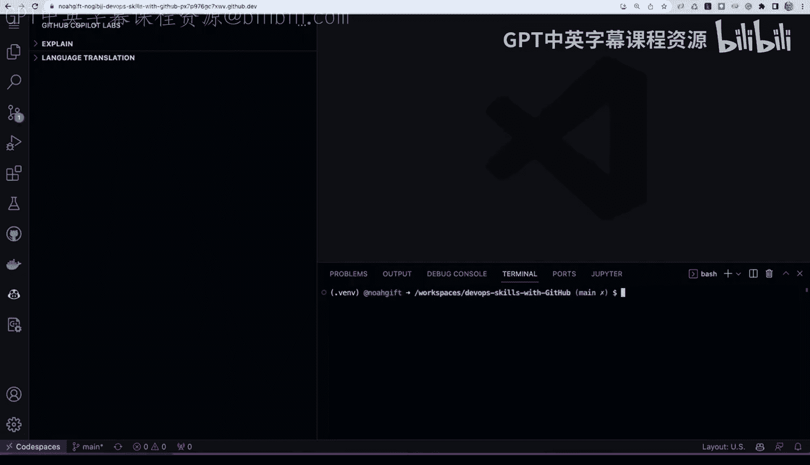
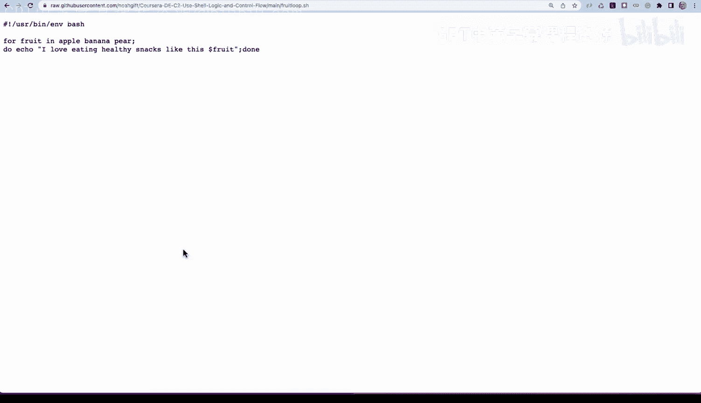

# 111：演示GitHub Copilot 🚀

在本节课中，我们将学习如何使用GitHub Copilot来辅助编程。我们将探索其代码翻译功能，并演示如何通过Copilot进行结对编程，快速构建一个命令行计算器工具。

## 概述





GitHub Copilot是一个AI驱动的编程助手，能够帮助开发者编写、理解和翻译代码。本节我们将通过两个主要部分来体验其功能：首先，使用Copilot Labs的代码翻译功能将Bash脚本转换为Python和Ruby；其次，与Copilot进行结对编程，共同构建一个功能完整的命令行计算器应用。

## 启用GitHub Copilot

首先，我们需要在一个已启用Copilot的代码仓库中工作。在VS Code中，我们可以通过扩展面板找到GitHub Copilot Labs和GitHub Copilot。Copilot Labs提供了一些实验性功能，例如代码翻译。

## 代码翻译功能

上一节我们介绍了如何启用Copilot。本节中，我们来看看如何使用其代码翻译功能来学习新语言。

以下是使用代码翻译功能的步骤：

1.  在Copilot Labs面板中，找到并启用“语言翻译”功能。
2.  准备一段你想要翻译的源代码。例如，我们可以从一个现有仓库复制一段Bash脚本。
3.  将这段代码粘贴到一个新文件中。
4.  在Copilot Labs的翻译界面，选择你想要转换成的目标语言（例如Python）。
5.  Copilot会自动生成目标语言的等效代码。

例如，我们有一段简单的Bash循环脚本 `loops.sh`：
```bash
#!/bin/bash
for i in {1..3}; do
  echo "I love eating healthy snacks like this apple"
done
```
使用Copilot将其翻译成Python后，会生成类似 `py_loops.py` 的代码：
```python
for i in range(1, 4):
    print("I love eating healthy snacks like this apple")
```
运行这两个脚本，会得到相同的输出。这个过程对于已经掌握一门语言并想快速学习另一门语言的开发者来说非常高效。我们还可以轻松地将代码翻译成其他语言，比如Ruby。

## 与Copilot结对编程

了解了基础的翻译功能后，现在让我们看看如何与Copilot进行更深入的协作，共同开发一个项目。

我们将创建一个名为 `ai_pair` 的目录，并在其中构建一个命令行计算器。首先，创建一个名为 `calc` 的文件，并在文件顶部添加描述性注释来引导Copilot。
```python
#!/usr/bin/env python3
"""
This module is used to create calculation functions such as addition and subtraction.
This module will also be invoked as a command-line script using the Click library.
"""
import click
```
添加 `#!/usr/bin/env python3` 这一行（shebang）并赋予文件可执行权限，可以让我们直接运行这个脚本。Copilot非常智能，它能根据注释理解我们的意图。当我们开始编写一个函数框架时，比如 `def add`，Copilot会自动补全整个函数体。

为了让这个工具更实用，我们告诉Copilot我们希望使用Click库来构建命令行界面。我们只需提示“构建一个Click group”，Copilot就会为我们生成所有样板代码，创建一个名为 `calculator` 的应用组。

接着，我们可以继续提示Copilot为这个group添加具体的命令。例如，在定义了 `add` 函数后，我们可以要求“为add函数创建一个click命令”。Copilot会理解上下文，自动生成对应的命令装饰器和函数封装。对于 `subtract` 命令也是如此。

完成基本功能后，我们还可以要求Copilot进行增强。例如，我们可以提示“使用Click的colored output为add函数添加彩色输出”。Copilot会相应地修改代码，为输出添加颜色。

最终，我们就能通过命令行使用这个工具：
```bash
./calc --help
./calc add 2 6
./calc subtract 10 4
```

## 总结


本节课中我们一起学习了GitHub Copilot的两个强大应用。首先，我们利用Copilot Labs的代码翻译功能，快速将Bash脚本转换成了Python和Ruby代码，这为学习新语言提供了极大便利。其次，我们体验了与Copilot进行结对编程，通过简单的提示和引导，高效地构建了一个带有彩色输出的命令行计算器应用。这个过程展示了Copilot如何理解开发者意图、生成样板代码并加速开发流程。