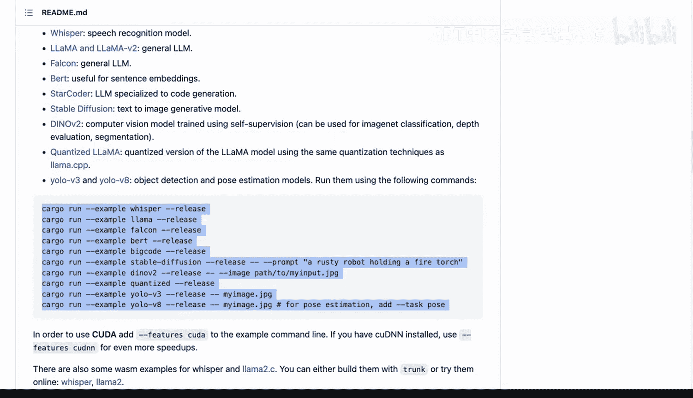

# 112：Candle - Rust极简机器学习框架 🕯️

## 概述

在本节课中，我们将学习Hugging Face Candle框架。这是一个功能强大但设计极简的Rust机器学习框架，专注于GPU支持和简易演示。我们将了解其核心特性、应用场景以及如何利用它执行机器学习任务。

---

## 框架介绍

Candle是由Hugging Face赞助开发的Rust机器学习框架。它集成了Rust语言的全部优势，专注于高性能和易用性。

例如，框架提供了在线演示，如使用Whisper模型进行音频转录。用户甚至可以用一行代码调用大多数大型语言模型。

---

## 核心特性

上一节我们介绍了Candle框架的基本概念，本节中我们来看看它的具体特性。

### 极简设计与高性能

Candle是一个为Rust设计的机器学习框架。其极简设计实现了GPU支持、高性能和易用性。

以下是其主要特性：

*   **机器学习任务支持**：支持矩阵乘法等基础机器学习操作。
*   **丰富的模型库**：提供了大量预训练模型和示例代码。
*   **大型语言模型**：支持调用常见的大型语言模型。
*   **多模态模型**：支持如Stable Diffusion这样的文生图模型。

### 跨平台与浏览器兼容性

Candle具备出色的跨平台能力。

以下是其支持的部署选项：

*   **WebAssembly**：可以构建基于浏览器的Web版本应用。
*   **CPU执行**：支持在没有GPU的环境下运行。
*   **CUDA支持**：充分利用NVIDIA GPU进行加速计算。

这意味着开发者可以构建一次模型，然后灵活地部署到多种平台。

### 面向无服务器推理

框架移除了PyTorch等重型依赖，这带来了显著优势。

以下是其主要优点：

*   **更小的二进制文件**：生成的应用程序体积更小。
*   **无服务器部署**：可以部署到AWS Lambda等支持无服务器计算的平台，这对于部署大型语言模型尤其有潜力。

### 类似PyTorch的API

对于熟悉PyTorch的开发者，Candle的学习曲线非常平缓。其API设计与PyTorch相似，便于开发者快速上手。

这是一个非常令人兴奋的框架，潜力巨大。无论是启用GPU还是仅使用CPU，执行大型语言模型都变得非常简单。

---

## 总结

本节课中，我们一起学习了Hugging Face Candle框架。我们了解了它是一个专注于高性能和易用性的极简Rust机器学习框架，支持GPU加速、丰富的模型库、跨平台部署以及类似PyTorch的友好API。这些特性使其成为在Rust生态中进行机器学习开发的强大工具。