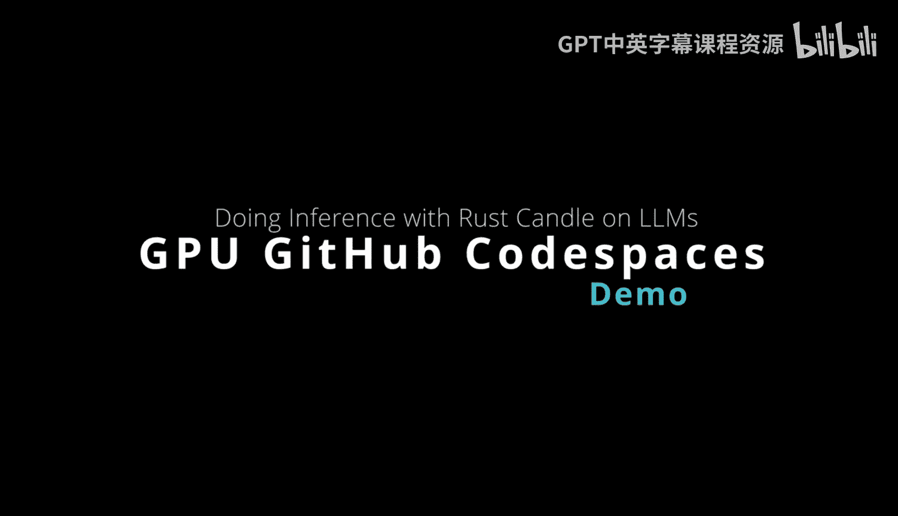

# 113：使用GitHub Codespaces进行Rust Candle GPU推理 🚀



在本节课中，我们将学习如何利用GitHub Codespaces的强大功能，为Rust Candle框架配置一个支持GPU的云端开发环境，从而高效地运行大型语言模型推理任务。

## 概述

Rust Candle框架允许你通过简单的命令（如 `cargo run --example`）运行大型语言模型（例如Falcon或Llama）的推理。一个关键技巧是传递 `--features cuda` 参数来启用GPU加速，这能显著提升推理性能。然而，获取GPU资源通常是个挑战。幸运的是，GitHub Codespaces提供了便捷的GPU访问途径。接下来，我们将一步步了解如何实现这一配置。

## 配置开发容器

首先，我们需要一个包含 `devcontainer` 配置的代码仓库。这个开发容器包含三个核心文件，它们共同定义了Codespaces的环境。

以下是配置开发容器的关键步骤：

1.  **环境变量文件 (`.env`)**
    此文件用于存储本地环境变量，例如API密钥或密码。

2.  **Dockerfile**
    此文件负责构建Codespaces的基础镜像，完成所有繁重的环境配置工作。让我们详细看看它做了什么：
    *   它基于 `rust` 开发容器镜像，这免去了我们手动安装Rust的麻烦。
    *   它安装了一系列必要的系统包，包括 `clang`、`lld` 等编译工具。
    *   根据项目需求，你可能还需要安装其他包。例如，示例中安装了 `ffmpeg`（用于音频处理）、`gcc`，以及至关重要的 **CUDA工具包**（`cuda-toolkit`、`cuda-nvcc`）。
    *   此外，它还可以自动创建Python虚拟环境，解决Python依赖问题。

3.  **`devcontainer.json` 配置文件**
    这个文件对于让CUDA环境正常工作至关重要。其中，`"features"` 部分需要设置 `"ghcr.io/devcontainers/features/cuda:1": {"install": true}`。这确保了Codespaces会安装CUDA和cuDNN库。
    你还可以在此文件中定制环境，例如设置**安装后命令**（`postCreateCommand`）或添加VSCode扩展（如Copilot、Makefile工具等）。

上一节我们介绍了开发容器的核心配置文件，本节中我们来看看如何利用 `postCreateCommand` 来完善环境设置。

在 `devcontainer.json` 中，`postCreateCommand` 指定的命令会在Codespaces创建完成后自动运行。示例中的命令执行了以下操作：
*   设置CUDA的路径环境变量，确保系统能正确找到CUDA。
*   将这个路径设置写入 `~/.bashrc` 文件，使其在每次启动终端时都生效。

这样配置的好处是，任何复刻（fork）此环境的人，在启动Codespaces后，GPU环境都应该能“开箱即用”，直接开始运行任务。

## 启动并验证GPU Codespaces

配置完成后，就可以启动Codespaces了。以下是操作流程：


1.  在GitHub仓库页面，点击 **“Code”** 按钮，然后选择 **“Codespaces”** 选项卡。
2.  点击 **“New with options”**。
3.  在 **“Machine type”** 中选择带GPU的机型（例如，“6-core, 1 GPU”）。这种机型非常适合深度学习工作，尤其配合Rust这种推理性能极高的语言。它通常提供112GB内存、128GB存储和一个GPU。
4.  创建完成后，环境会自动根据你的配置进行设置。

环境启动后，我们需要验证关键组件是否正常工作。

以下是需要验证的项目：

*   **验证Rust**：运行 `rustc --version` 命令，确认Rust已正确安装。
*   **验证CUDA环境**：运行 `nvidia-smi` 命令。这将显示NVIDIA驱动版本和GPU状态，确认CUDA驱动正常工作。
*   **监控GPU使用率**：运行 `nvidia-smi -l 1` 命令。这会以1秒为间隔循环刷新GPU状态，类似于针对GPU的 `top` 命令。这对于确认你的代码是否成功调用了GPU至关重要。

## 运行GPU推理示例

现在，让我们实际运行一个推理任务来测试GPU加速效果。

首先，在一个终端中启动GPU监控命令：
```bash
nvidia-smi -l 1
```
然后，在另一个终端中，使用Rust Candle框架运行一个示例。例如，运行一个使用StarCoder模型生成代码的示例命令（具体命令参考项目README）：
```bash
cargo run --example starcoder --features cuda -- --prompt "Python function to add two numbers"
```
观察运行推理的终端输出，同时关注GPU监控终端。你会看到GPU使用率在推理过程中显著上升（例如，从0%峰值达到80%以上），这证明GPU正在被高效利用，从而带来了快速的推理速度。

## 总结


本节课中我们一起学习了如何配置和使用GitHub Codespaces来搭建一个支持GPU的Rust Candle开发环境。我们了解了开发容器（`devcontainer`）的配置方法，学会了如何验证GPU环境，并最终通过实际运行大型语言模型推理任务，亲眼见证了GPU加速带来的性能提升。这是一种将大型语言模型推理提升到新水平的绝佳方式：你可以自己运行模型，使用Rust Candle框架调用最新模型，并实时监控GPU的工作负载。