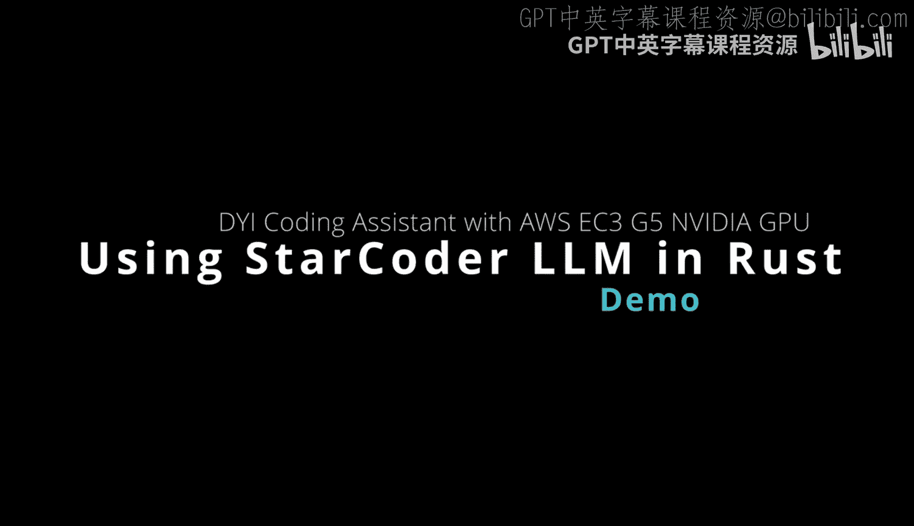
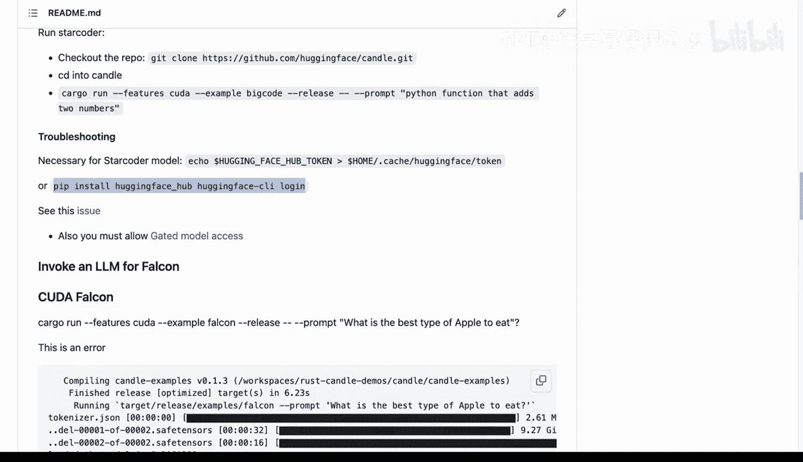
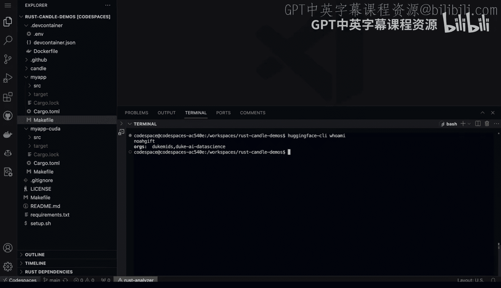
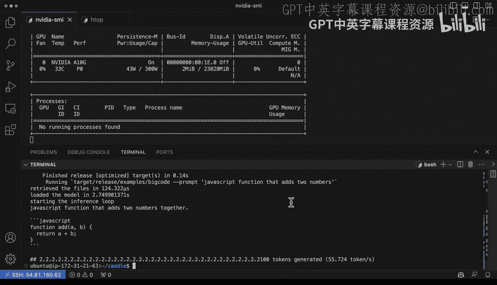

# 116：探索先进大语言模型StarCoder 🚀



在本节课中，我们将要学习如何探索和使用一个名为StarCoder的先进开源大语言模型。StarCoder专门用于代码生成，支持超过80种编程语言。我们将了解它的特点，并动手实践如何在Rust环境中运行它，体验其作为编程助手的能力。

## 什么是StarCoder？🤖

上一节我们介绍了课程主题，本节中我们来看看StarCoder模型本身。

StarCoder是Hugging Face推出的一个开源大语言模型，专为代码生成而设计。它拥有**155亿**个参数，并在来自“The Stack”数据集的80多种编程语言上进行了训练。与GitHub Copilot等工具类似，它是一个生成式AI模型，但其核心优势在于完全开源。这意味着研究人员、开发者乃至大学机构都可以自由地使用、研究和改进它，旨在“民主化生成式AI革命”，而不仅仅是将其掌握在风险投资家手中。



## 环境准备与身份验证 🔑

了解了StarCoder的基本信息后，我们需要准备运行它的环境。这包括安装必要的工具和进行身份验证。



首先，需要安装Hugging Face的命令行工具`huggingface-hub`，并使用它登录你的账户。

以下是安装和登录步骤：
1.  使用pip安装工具：`pip install huggingface-hub`
2.  在终端运行登录命令：`huggingface-cli login`
3.  根据提示输入你的Hugging Face访问令牌。

登录成功后，你可以通过运行`huggingface-cli whoami`命令来验证身份，终端会显示你的用户名，确认你已成功认证。

## 在GPU环境中运行StarCoder ⚡

身份验证完成后，我们就可以尝试运行模型了。由于模型推理计算量较大，为了获得更好的性能，我们将在配备强大GPU（例如AWS的G5实例）的远程环境中进行操作。

在准备好GPU环境并确认`huggingface-cli`登录状态后，我们可以运行一个Rust项目来调用StarCoder。该项目利用了Hugging Face的`candle`框架，这是一个用Rust编写的极简机器学习推理库。

运行模型的核心命令通常如下所示：
```bash
cargo run --features cuda --example bigcode --prompt “编写一个Rust函数，实现两个数字相加”
```
对这个命令的解析如下：
*   `cargo run`：执行Rust项目。
*   `--features cuda`：启用CUDA特性，以利用NVIDIA GPU进行加速计算。
*   `--example bigcode`：指定运行项目中的`bigcode`示例，该示例专为运行StarCoder这类大代码模型设计。
*   `--prompt`：后面跟随的是给模型的提示词，即你希望它完成的代码任务。

执行命令后，你会观察到GPU使用率上升。模型首先会加载（这可能需要几秒钟），然后开始推理并生成代码建议。例如，对于“编写一个Python函数实现两个数字相加”的提示，模型可能会生成类似以下的代码：
```python
def add_two_numbers(a, b):
    return a + b
```
你可以轻松地更换提示词中的编程语言，例如换成“Ruby function that adds two numbers”，模型会相应地生成Ruby代码。模型的加载时间是主要的耗时环节，但实际的推理生成速度非常快。

## 总结 📝



本节课中我们一起学习了开源代码大语言模型StarCoder。我们首先了解了它的背景和开源使命，然后逐步完成了从环境准备、身份验证到在GPU加速环境下实际运行模型的完整流程。通过实践，我们看到StarCoder能够根据简单的自然语言提示，快速生成多种编程语言的代码片段，展示了其作为开源编程助手的巨大潜力。借助Rust生态的高效和Hugging Face平台的便利，开发者可以相对容易地将这样的先进AI能力集成到自己的工具链中。