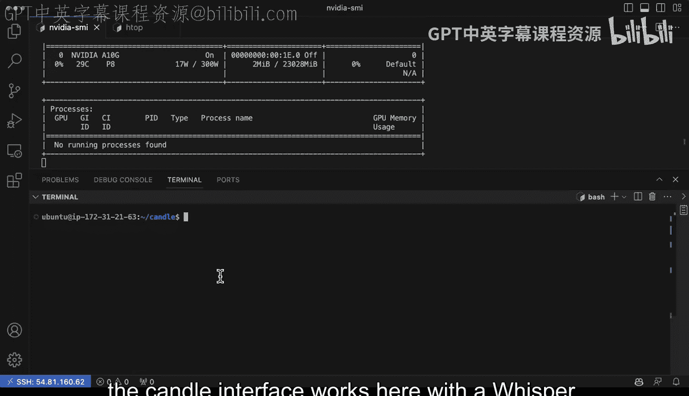
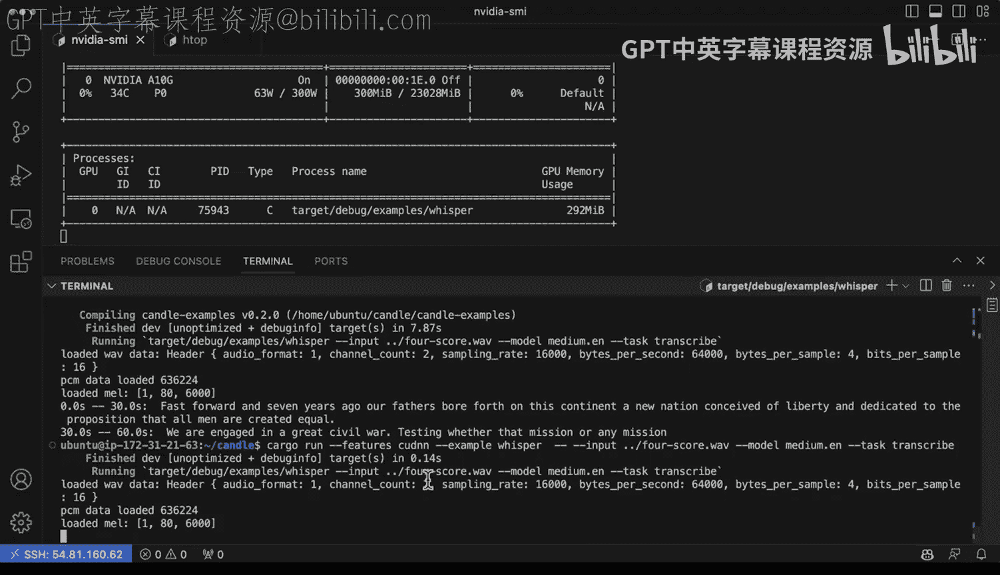

# 117：使用Candle Whisper进行语音转录 🎤


在本节课中，我们将学习如何使用Hugging Face的Candle框架运行Whisper模型，以实现自动语音识别功能。我们将从基础概念开始，逐步介绍如何配置环境、编译项目以及利用GPU加速推理过程。

---

## 概述

自动语音识别是当前新兴的技术方向之一。OpenAI的Whisper模型是一个无需微调即可使用的优秀示例。本节课将指导你如何利用Candle框架运行Whisper模型，并探索其不同参数配置。

## 环境准备与工具介绍

上一节我们介绍了Whisper模型的基本概念。本节中，我们来看看运行它所需的工具和环境。


Candle是一个极简主义的高性能框架，支持GPU加速。其代码库中已包含使用Whisper的示例。为了运行它，我们首先需要查看源代码结构。

以下是`main.rs`文件的关键观察点：
*   它使用了`clap`库来解析命令行参数。
*   我们可以查看其中定义的常量或可传入的参数。

## 配置GPU实例

为了获得最佳性能，建议使用配备GPU的计算实例。例如，AWS EC2的G5实例类型搭载了新一代NVIDIA GPU。接下来，我们将通过Visual Studio Code的远程开发功能连接到这样的实例。




在终端中，我们可以使用`nvidia-smi`命令来确认GPU是否就绪。

## 编译与运行示例

现在，让我们开始实际操作，看看Candle与Whisper的接口如何工作。

首先，我们可以运行一个基础示例。在项目目录下执行：
```bash
cargo run --example whisper
```
程序会在CPU上运行，并下载一个示例音频文件进行转录，速度仍然很快。

## 启用GPU加速

虽然CPU运行尚可，但我们可以通过启用特定功能来利用GPU加速。

以下是启用不同级别加速的步骤：
1.  首先，我们可以添加`cuda`功能来启用基础GPU支持。编译时会占用部分GPU资源。
2.  为了进一步优化，可以启用`cudnn`功能。这是针对CUDA深度神经网络的优化库，能显著提升推理效率。

启用这些功能后重新运行程序，可以观察到GPU利用率显著提升，推理速度更快。

## 处理自定义音频文件

基础的示例运行顺利。接下来，我们看看如何处理自定义格式和不同的音频文件。

假设在上一级目录中存有自定义的WAV音频文件（例如`four_score.wav`）。我们可以通过传递特定参数来转录它。

以下是运行自定义转录的命令示例：
```bash
cargo run --example whisper --release --features cuda,cudnn -- \
    --input ../four_score.wav \
    --model medium \
    --language en \
    --task transcribe
```
这个命令会：
*   以发布模式编译，并启用CUDA和CUDNN功能。
*   指定输入音频文件的路径。
*   使用`medium`规模的Whisper模型进行英语转录。

首次在CPU上运行自定义文件可能会有些缓慢。但当我们切换到强大的GPU实例并启用优化功能后，可以看到GPU利用率最高可达70%，实现了非常快速的推理。这种性能使得该工具适合用于需要处理大量音频转录任务的场景，例如结合AWS Batch服务构建数据处理系统。

## 总结



本节课中我们一起学习了如何使用Candle框架运行Whisper语音识别模型。我们从环境准备开始，逐步完成了示例运行、GPU加速功能启用以及自定义音频文件处理。关键点在于利用`--features cuda,cudnn`参数来充分发挥硬件性能。这套工作流程为构建高效的批量语音转录服务提供了基础。