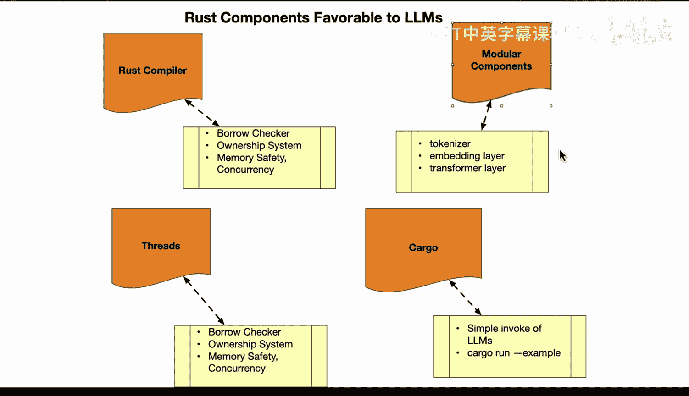

Rust编程4-5：31：Rust在大语言模型中的优势 🚀


在本节课中，我们将探讨Rust编程语言在构建和部署大语言模型（LLM）应用时的独特优势。我们将逐一分析其核心组件如何为LLM项目带来安全性、性能与可维护性。

---

### 概述

Rust的组件特性使其非常适合用于大语言模型应用。接下来，我们将逐步分析这些具体组件。

---

### 编译器与内存安全

上一节我们介绍了Rust在LLM中的整体优势，本节中我们来看看其编译器如何保障安全。

在Rust编译器中，借用检查器（Borrow Checker）能够防止数据竞争和不安全的内存访问错误。其所有权系统会在对象离开作用域时自动释放内存，因此无需手动管理内存。编译时检查能在代码部署前发现错误，确保大语言模型部署的健壮性。

**核心概念示例**：
```rust
// 借用检查器确保内存安全
fn main() {
    let s1 = String::from("hello");
    let s2 = s1; // 所有权转移，s1不再有效
    // println!("{}", s1); // 此处编译会报错
    println!("{}", s2); // 正确
}
```

---

### 模块化组件设计

接下来，我们看看Rust如何通过模块化设计来构建LLM的核心处理单元。

分词器（Tokenizer）将文本转换为用于词嵌入（Word Embeddings）的数值ID。嵌入层（Embedding Layer）将词语映射到高维稠密向量。变换层（Transform Layer）则使用神经网络模型处理文本。这种模块化设计允许通过Rust的Trait来灵活混合与匹配特定组件。

**核心概念示例**：
```rust
// 使用Trait定义组件接口
trait Tokenizer {
    fn tokenize(&self, text: &str) -> Vec<u32>;
}
trait EmbeddingLayer {
    fn embed(&self, tokens: &[u32]) -> Vec<f32>;
}
```

---

### 并发与并行执行

了解了数据处理组件后，我们来看看Rust如何高效利用计算资源。

轻量级的Rust线程允许并发与并行执行。通道（Channels）可以安全地在线程间传递数据，没有数据竞争的风险。这使得应用能够充分利用多核CPU，以实现高性能和高可扩展性。

**核心概念示例**：
```rust
use std::sync::mpsc;
use std::thread;

fn main() {
    let (tx, rx) = mpsc::channel();
    thread::spawn(move || {
        tx.send("Hello from thread").unwrap();
    });
    println!("{}", rx.recv().unwrap());
}
```

---

### Cargo包管理器与生态系统

最后，我们来探讨Rust强大的构建与依赖管理工具如何简化LLM项目的开发。

Cargo是Rust内置的包管理器，它简化了应用依赖管理。庞大的生态系统提供了丰富的包，可以轻松扩展功能，例如构建命令行工具或Web框架。它可以方便地在项目和团队间共享代码，并通过语义化版本控制确保稳定性。这使得调用大语言模型变得非常简单，例如在Rust Candle项目中，只需运行 `cargo run --example` 命令即可。

**核心概念示例**：
```bash
# 使用Cargo运行示例
cargo run --example my_llm_example
```

---

### 总结



本节课中，我们一起学习了Rust在大语言模型应用中的关键优势。我们从**编译器与内存安全**、**模块化组件设计**、**并发与并行执行**，以及**Cargo包管理器与生态系统**四个方面进行了探讨。这些特性共同使Rust成为一个构建高效、安全、可维护的LLM应用的强大工具。