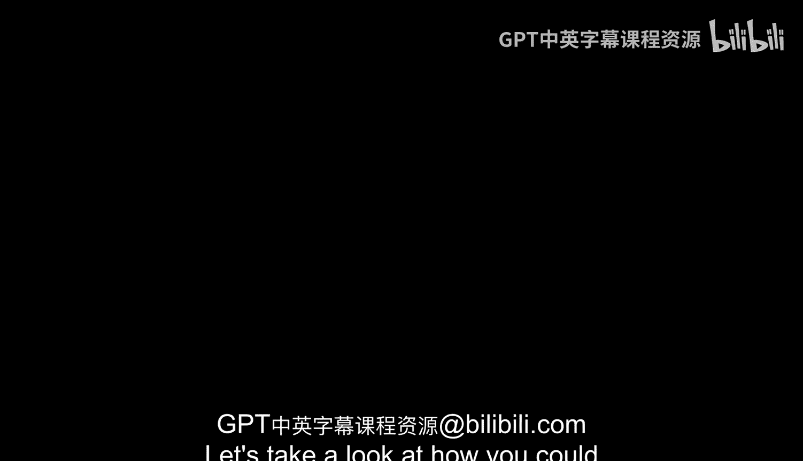
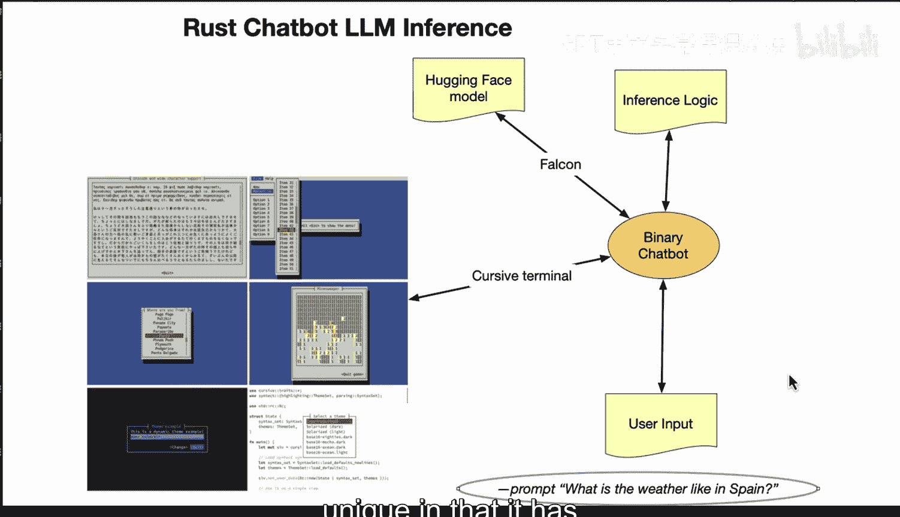

# 122：使用Rust构建聊天推理机器人 🤖

在本节课中，我们将学习如何利用Rust生态系统中的一些即插即用组件，构建一个用于大型语言模型推理的Rust聊天机器人。

## 概述

我们将从选择模型开始，逐步完成加载模型、构建用户界面和实现核心聊天逻辑的过程。整个过程将展示如何将强大的自然语言处理能力集成到Rust应用程序中。

## 选择与加载模型 🧠

首先，你可以考虑使用Falcon模型。这是一个非常适合入门的起点。该模型在自然语言对话方面表现出色。

接下来，你可以使用类似`candle`这样的库将模型加载到Rust程序中。`candle`是一个Rust机器学习框架，可以访问Hugging Face上的模型。

## 构建聊天机器人界面 💬

上一节我们介绍了模型的选择与加载，本节中我们来看看如何构建用户交互界面。

你可以使用`cursive`这样的crate来构建一个聊天机器人用户界面。`cursive`是一个基于终端的Rust界面库。这个界面可以接收用户输入并打印机器人的回复。

## 实现核心聊天逻辑 🔄

以下是实现核心聊天循环逻辑的步骤：

1.  **持续提示用户输入**：程序会不断提示用户输入文本。
2.  **传递输入至模型**：将用户输入的文本传递给之前加载的Hugging Face模型。
3.  **打印模型响应**：将模型生成的回复打印出来。

这个Hugging Face模型将处理所有的自然语言处理工作，包括分析用户输入、生成连贯的回复，甚至考虑对话的上下文。Rust代码则负责促进这种交互。

## 功能扩展与展望 🚀

你可以添加额外的逻辑来增强机器人，例如进行情感分析，以使回复更加自然。在完成这个原型之后，你甚至可以将界面适配成一个Web应用程序。

总而言之，你需要做的是：
1.  从Hugging Face选择合适的模型（例如最新的Falcon模型）。
2.  将其加载到Rust中。
3.  构建聊天用户界面。
4.  利用Hugging Face模型实现聊天逻辑。
5.  持续提示用户并生成回复。

## 总结

本节课中我们一起学习了构建Rust聊天推理机器人的完整流程。对于开发者来说，这是一个令人兴奋的时代，因为我们可以将所有工具直接集成到像Rust这样对命令行友好的语言中。Rust的独特之处在于，它在构建二进制文件方面拥有强大的能力。