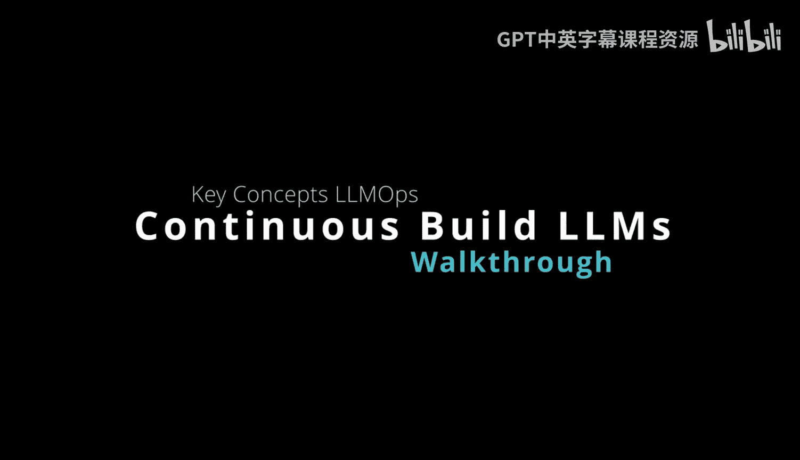
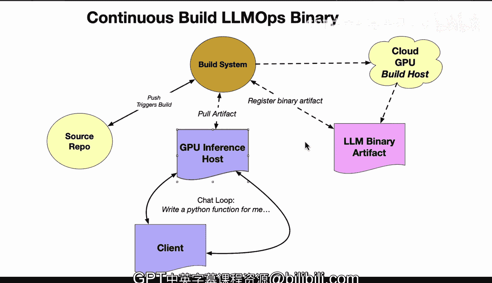

# 123：35_02_01_LLMOps二进制文件持续构建 🚀



在本节课中，我们将学习LLMOps中的一个核心概念：**持续构建**。我们将探讨如何为特定的硬件架构（尤其是GPU）构建二进制文件，并创建可供后续使用的制品。这对于确保你的机器学习应用能在正确的环境中高效运行至关重要。

---

## 概述 📋

在LLMOps中，持续构建是一个非常重要的概念。你需要解决两个关键问题：如何构建一个针对正确硬件架构的二进制文件，以及如何创建一个可供后续使用的制品。本节将详细介绍这个流程。

---

## 持续构建流程详解 🔄

上一节我们介绍了持续构建的重要性，本节中我们来看看其具体的工作流程。整个过程可以清晰地分为几个步骤。

### 1. 源代码仓库

流程始于一个源代码仓库。这里存放着你的项目框架，例如，它可能是一个像 **Rust Candle** 这样的机器学习框架。当你对代码进行修改时，这些更改会触发构建系统。

### 2. 触发云构建主机

在LLMOps的上下文中，构建系统需要指向一个云主机。这是因为云主机通常配备了GPU，并且预先安装了正确的驱动程序（例如 **CUDA 驱动程序**）。这台云主机将作为构建主机，远程连接到你的构建系统。

以下是构建系统可能的选择：
*   GitHub Actions
*   AWS CodeBuild
*   其他基于云的构建系统

具体使用哪个系统并不重要，核心在于它能连接到具备特定GPU环境的构建主机。

### 3. 编译与注册制品

一旦连接到正确的构建主机，系统就会为特定的GPU架构编译软件。编译完成后，生成的二进制文件（即制品）需要被注册到一个存储库中。

**这是一个必要的步骤**，因为你必须针对特定的硬件架构进行构建。其核心逻辑可以用伪代码表示：
```rust
// 在具备特定GPU驱动（如CUDA）的构建主机上执行
fn build_for_target_architecture(source_code: &str, target_gpu_arch: &str) -> BinaryArtifact {
    compile(source_code, target_gpu_arch); // 针对目标架构编译
    let artifact = generate_artifact(); // 生成二进制制品
    register_artifact(artifact); // 将制品注册到仓库
    artifact
}
```

### 4. 拉取与部署制品

当你准备使用这个已注册的二进制文件时，下一步就是从存储库中拉取该制品，并将其部署到一台GPU主机上。

此时，你的二进制文件已经就绪，可以用于：
*   构建一个聊天循环
*   构建一个API端点
*   或任何你计划用该二进制文件实现的功能

### 5. 核心要点总结

LLMOps的思维方式与传统软件开发有所不同。关键在于：
*   你需要准备正确的硬件（特别是GPU）。
*   你需要设置自动化流程。
*   你必须能够轻松拉取针对特定GPU类型构建的二进制文件，以便在自己的应用（例如聊天循环）中直接使用。

---

## 总结 🎯



本节课我们一起学习了LLMOps中的持续构建流程。我们了解到，从源代码变更开始，到最终在GPU主机上部署可用的二进制文件，整个过程涉及**触发云构建主机**、**针对特定架构编译**、**注册制品**以及**拉取部署**等关键步骤。掌握这个流程对于高效、可靠地部署机器学习应用至关重要。