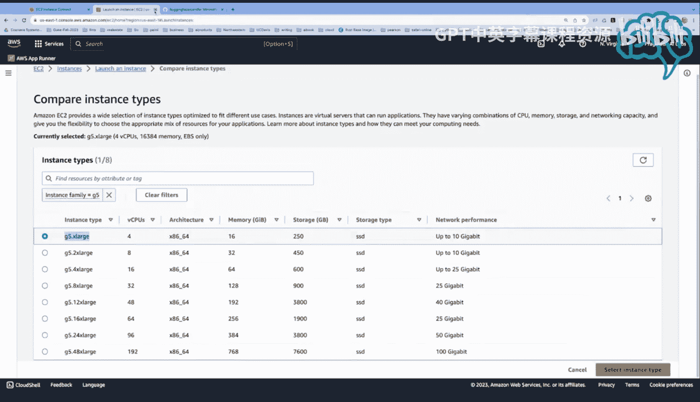
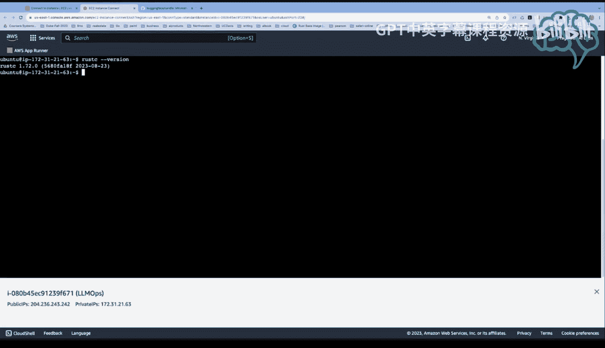
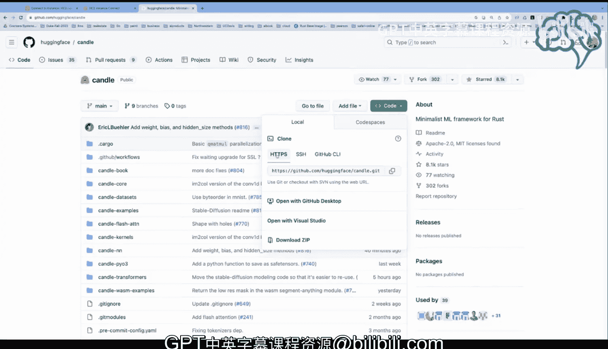

# 125：在AWS G5实例调用Rust Candle（第一部分）🚀


在本节课中，我们将学习如何利用Rust的包管理系统来调用大型语言模型。我们将使用Hugging Face的Candle框架，并在AWS的G5 GPU实例上运行它。整个过程旨在展示其简洁性，无需复杂的设置或依赖外部API服务。

---

## 概述

本周我们将探讨一个有趣的场景：使用Rust的包管理系统来调用大型语言模型。虽然很多人都在讨论大型语言模型的强大功能，但其应用流程往往显得复杂。然而，借助Rust和Cargo包管理系统的优势，我们可以通过简单的命令直接运行这些模型。本教程将使用Hugging Face Candle框架，并在AWS的G5 GPU实例上演示具体步骤。

---

## 选择AWS实例与镜像

上一节我们介绍了使用Rust包管理系统调用LLM的便利性。本节中，我们来看看如何在AWS上配置合适的运行环境。

首先，我们需要在AWS控制台中启动一个实例。建议选择“Deep Learning Base AMI”作为基础镜像。这个镜像预装了必要的CUDA驱动和cuDNN库，但没有多余的软件，非常适合我们的需求。

以下是启动实例的关键步骤：

1.  在AWS控制台导航到“实例”页面，点击“启动实例”。
2.  在“应用程序和镜像”部分，搜索并选择“Deep Learning Base AMI”。
3.  接下来，实例类型的选择至关重要。

---

## 配置GPU实例类型

上一节我们选择了基础镜像，本节中我们来看看如何选择正确的GPU实例类型。

为了获得GPU加速，我们需要选择基于NVIDIA的实例类型。在筛选器中，可以选择“加速计算”或直接查看“G5”系列。G5实例配备了NVIDIA GPU，非常适合运行机器学习工作负载。

在本例中，我启动了一个名为“LLM Ops”的`g5.16xlarge`实例。连接该实例非常简单，只需在AWS控制台点击“连接”，然后选择“EC2 Instance Connect”即可，无需配置SSH密钥。

---

## 安装Rust与克隆代码库

现在我们已经有了可用的GPU实例，接下来需要安装运行环境。

连接到实例后，只需执行一个命令来安装Rust：

```bash
curl --proto '=https' --tlsv1.2 -sSf https://sh.rustup.rs | sh
```

安装完成后，可以通过 `rustc --version` 验证。接着，我们需要克隆Hugging Face Candle的代码库：

```bash
git clone https://github.com/huggingface/candle.git
```



Candle是一个为Rust设计的极简机器学习框架。其代码简洁，但最令人兴奋的特点是，运行大型语言模型可能只需要一行命令。这使得它成为LLM Ops领域一个非常强大的工具。


---

## 总结





本节课中，我们一起学习了在AWS G5 GPU实例上配置环境以运行Rust Candle框架的初步步骤。我们了解了如何选择合适的基础镜像和GPU实例类型，以及如何安装Rust并获取必要的代码。这一切的准备工作，都是为了下一节实际运行模型打下基础。通过这种方式，我们可以直接、高效地利用本地硬件运行大型语言模型。