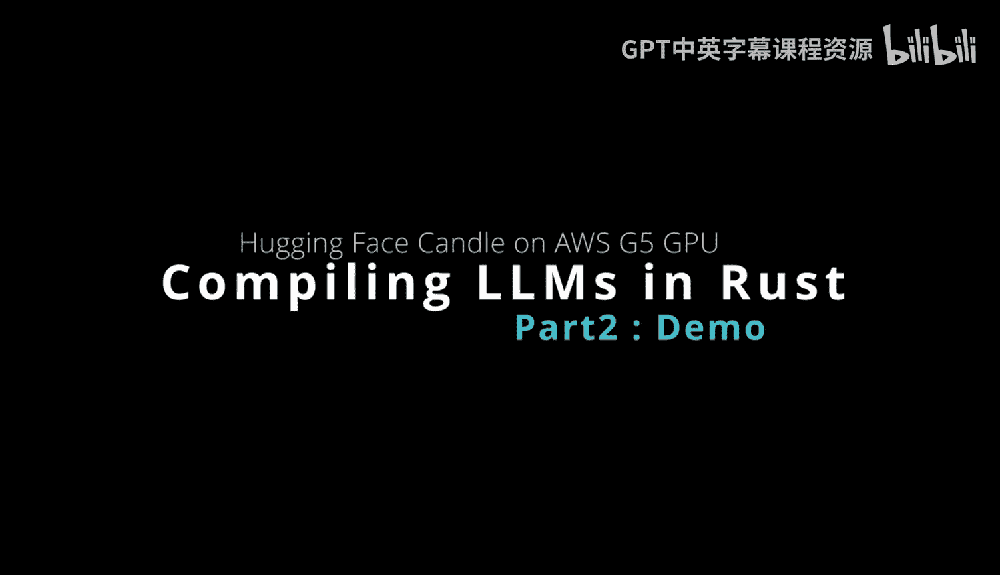
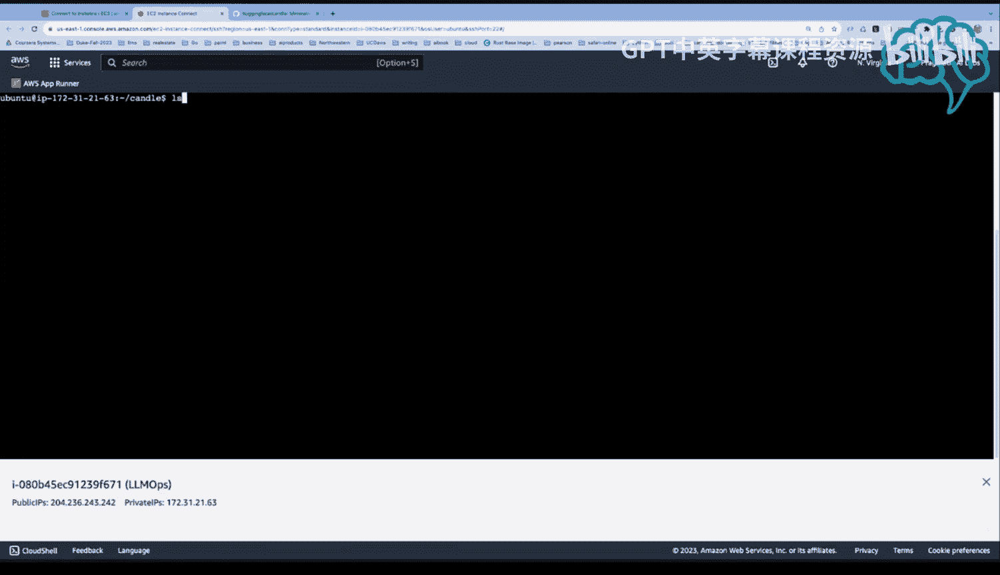
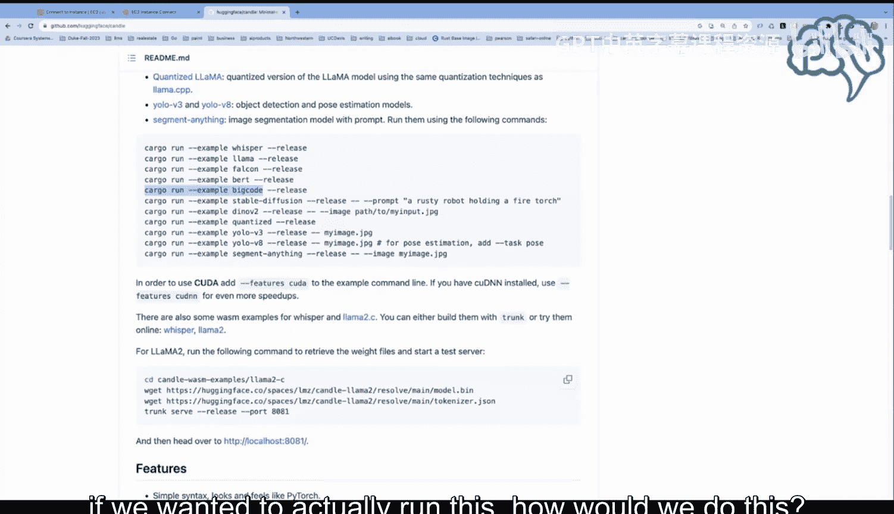
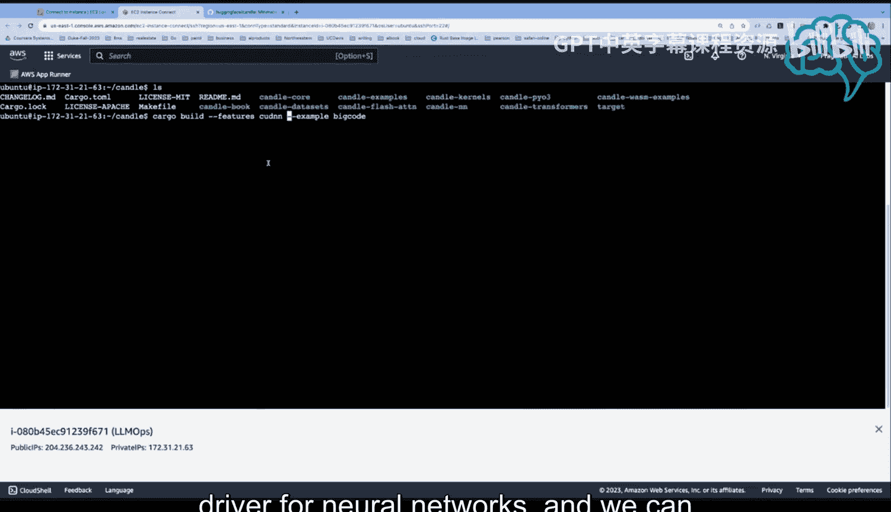
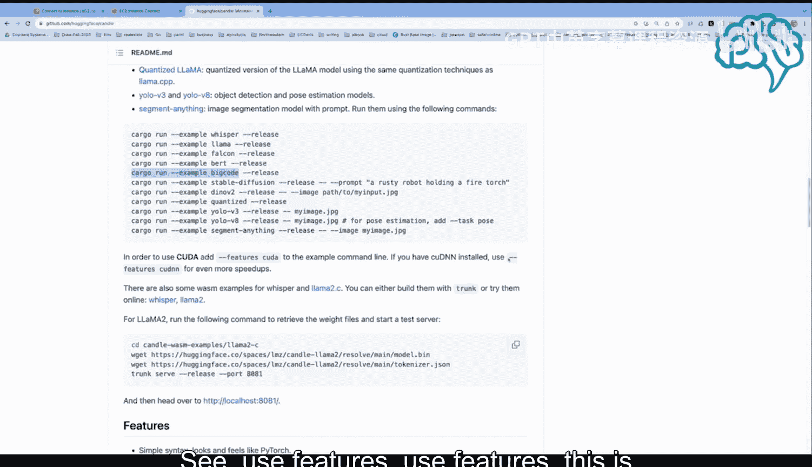
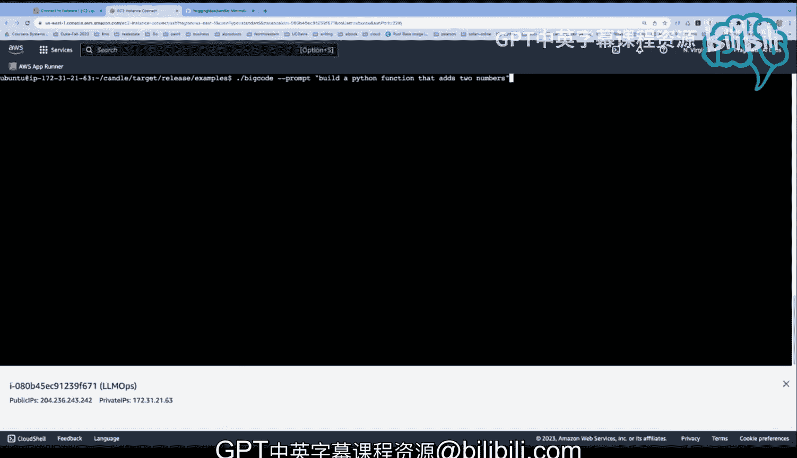

# 126：在AWS G5实例调用BigCode（第二部分）🚀

在本节课中，我们将学习如何在AWS G5实例上构建并运行开源的BigCode模型，将其作为一个本地的代码生成助手。我们将从克隆仓库开始，一步步完成模型的构建与调用。

## 概述

上一节我们介绍了AWS G5实例的配置。本节中，我们将实际操作，克隆BigCode项目，构建其Rust二进制文件，并最终运行它来生成代码。

## 克隆与准备项目

首先，你需要访问项目仓库，复制其地址并进行克隆。我已经完成了这一步。

如果项目已有本地副本，你可以使用 `git pull` 命令来获取最新的更新，因为该项目正在被积极开发。

完成这些后，我们就可以准备运行它了。具体的操作说明可以在项目文档中找到。

## 构建模型的方法

有两种主要方式来调用这些大型语言模型。一种是直接运行，但我认为更好的方式是先构建它，然后进入目标目录再使用模型。

例如，BigCode本质上是GitHub Copilot的开源竞争对手。如果我们想运行它，具体该怎么做呢？

以下是操作步骤。

## 构建二进制文件

我们需要执行一个类似下面的命令，但需要稍作调整。

我们使用 `cargo build` 命令，因为我们实际上想要构建一个可供使用的二进制文件。

同时，我们需要添加 `--features` 标志。具体命令是 `cargo build --features cuda`。这样做会启用针对神经网络的优化CUDA驱动支持。

我们可以通过查看项目的 `Cargo.toml` 文件来验证这一点，其中定义了 `[features]` 部分。

`--features cuda` 这个参数将指示构建系统为我们启用CUDA支持。

我认为目前使用这种方法的人还不够多。因为很多人都在注册每月20美元的昂贵服务，但实际上，你可以启动自己的实例并运行一个大型语言模型，这在很多情况下性能更好。

## 运行模型

构建完成后，进入目标目录。你会看到一个名为 `bigcode` 的可执行文件。只需输入 `./bigcode` 即可启动。

这样，你就拥有了一个完整的大型语言模型编程助手。

现在，我可以输入 `./bigcode -p “构建一个将两个数字相加的Python函数”` 来让它生成代码。

这非常强大，我惊讶于没有更多人讨论这个。这再次展示了Rust的能力，让你能够实现这样的功能。

我们可以看到它的速度非常快。如果我想要运行得更快，或者将其封装在bash脚本中以满足特定需求，我都可以做到。现在，我有了自己的结对编程助手，我们还可以进一步调整和优化它。

## 总结

本节课中，我们一起学习了如何在AWS G5实例上克隆、构建并运行开源的BigCode模型。我们了解了通过 `cargo build --features cuda` 命令构建支持GPU加速的二进制文件，并最终将其作为本地代码生成助手运行起来。这为获得高性能、可定制的AI编程辅助提供了一种强大的替代方案。