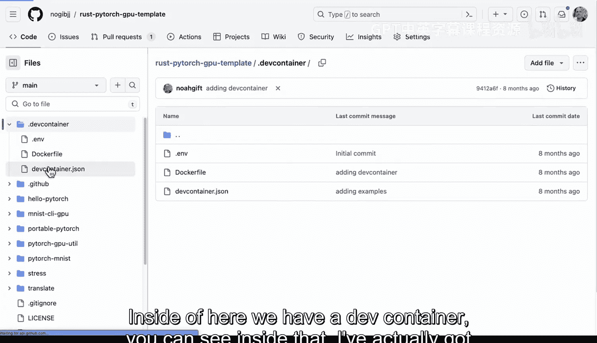
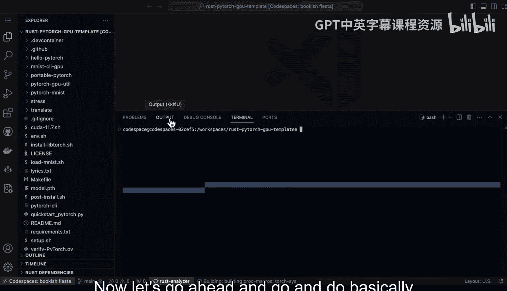
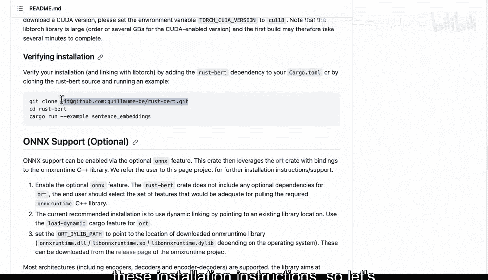
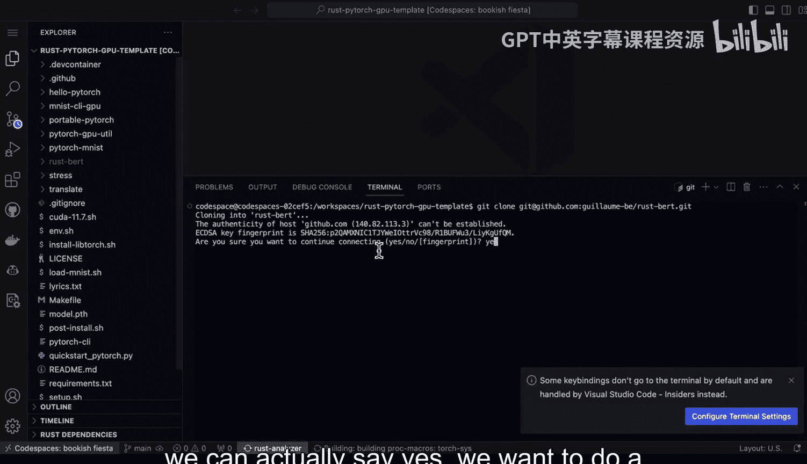
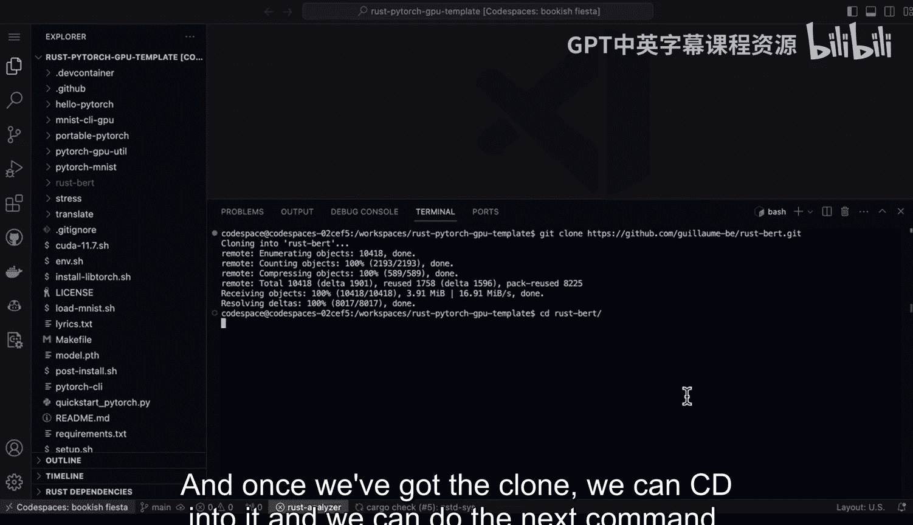
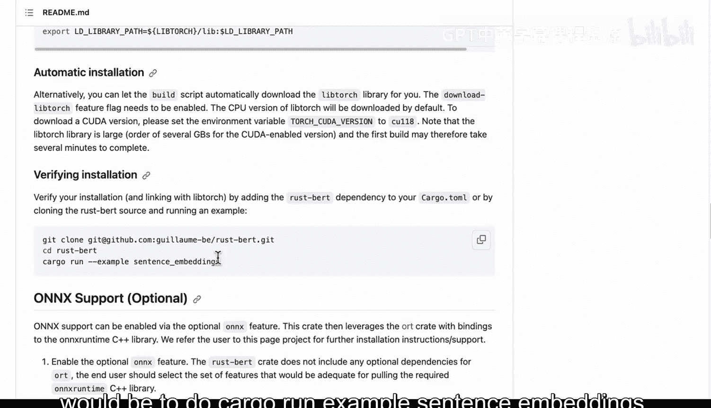
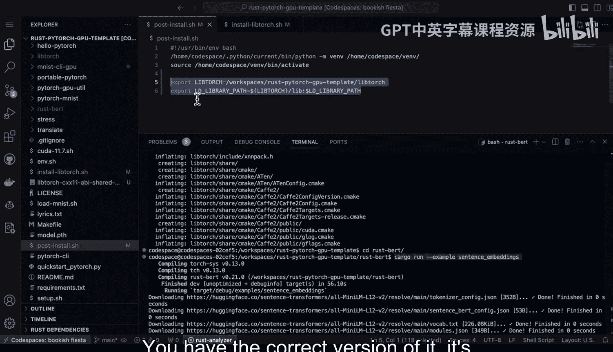
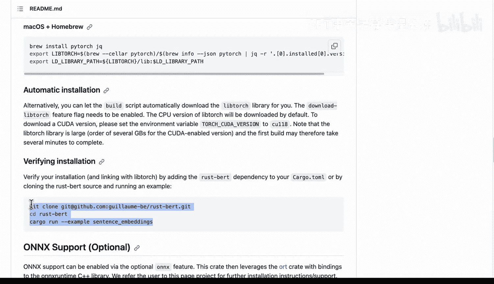

# 128：LLMOps工具库安装与配置指南 🛠️


在本节课中，我们将学习如何安装和配置一个强大的Rust原生自然语言处理库。这个库是Hugging Face Transformer库的Rust移植版本，它利用了Rust的PyTorch绑定或ONNX运行时绑定，以及Rust分词器，能够提供多线程分词和GPU推理等高性能功能。

## 库的核心功能与优势

上一节我们介绍了课程目标，本节中我们来看看这个Rust库的主要特点和能力。

该库是一个用于自然语言处理的Rust原生工具。它本质上是Hugging Face Transformer库的Rust移植版本，使用了Rust的PyTorch绑定或ONNX运行时绑定，并集成了Rust分词器。

它的强大之处在于支持多线程的、基于Rust的分词处理，因此能提供卓越的性能。同时，它也支持GPU推理。

从使用方式上看，它非常简单直观。你只需要将几条不同的语句组合起来，就能够使用任何模型。

以下是该库支持的一些主要任务：
*   **翻译**
*   **文本摘要**
*   **多轮对话**
*   **零样本分类**

你可以浏览所有支持的功能。这是一个开始使用高性能Hugging Face模型与Rust结合的非常强大的方式。

## 安装注意事项与配置

了解了核心功能后，本节我们将重点关注安装过程中需要注意的几个关键问题。

使用该库时，它会有一个用于下载预训练模型的缓存文件夹。如果你的机器存储空间有限，需要注意这一点，可能需要定期清理缓存。有些模型可能达到数百兆字节甚至数GB。

你可以自定义这个缓存路径。例如，如果你在组织中与多人协作，并且有一个高性能的网络挂载文件服务器，你可以将环境变量设置指向那个网络挂载点。这样，每个开发者就不需要重复下载同一个可能高达10GB的模型文件。这对于大型公司来说可能是一个非常好的策略。

你还可以手动安装LibTorch。LibTorch本身非常庞大，是一个数GB的库。需要注意的是，除非你手动安装并创建符号链接指向它，或者设置相应的环境变量，否则构建工具（Cargo）会在每个项目安装时自动下载它。如果你只是进行一个独立项目，可以不进行特殊处理。但重要的是要意识到，你可能不希望每次创建一个新的Rust项目时都重复下载这个巨大的库。

在Windows和macOS上，你也可以设置相同的环境变量。如前所述，构建工具（Cargo）会自动为你下载LibTorch。但由于这是数GB的、支持CUDA的库，你肯定不希望每次执行 `cargo new` 命令时都下载它。这可能是安装过程中最需要注意的一点。

此外，该库也支持ONNX运行时，这非常棒，因为它允许我们拥有一个可移植的运行时环境。我们可以通过设置这些环境变量，为LLMOps（大语言模型运维）建立一个良好的安装方案。

这是一个非常值得了解的库，并且相当令人兴奋。

## 实战：验证安装步骤

理论介绍完毕，现在让我们进入实战环节，按照安装说明一步步验证环境是否正常工作。

我们将使用一个预先设置好的、名为“Rust PyTorch GPU模板”的GitHub开发环境。这个环境内部已经配置好了CUDA等所需组件。现在，让我们按照安装指南进行操作，验证一切是否正常。

首先，我们尝试执行一个命令来克隆仓库并验证。我们输入命令，系统提示权限被拒绝。为了解决这个问题，我们需要使用HTTPS版本进行克隆。



我们切换到代码目录，复制HTTPS克隆链接，然后回到终端环境，将命令中的URL部分替换为HTTPS版本。执行克隆命令。








克隆完成后，我们使用 `cd` 命令进入该仓库目录。



接下来，我们执行验证安装的命令，即运行示例程序。命令是：
```bash
cargo run --example sentence_embeddings
```

运行后，嵌入向量功能正常工作。安装过程中一个非常重要的环节就是在最后通过运行仓库中的这个示例`cargo`命令来进行完整性检查，以确保你已经正确导出LibTorch库路径，并且拥有正确的版本。

始终需要回到文档中注意版本信息，这里指明应该使用版本2，未来可能是版本3等等。查看文档非常重要。

最后，就像我们刚才做的那样，继续验证你的安装。我们可以看到，嵌入向量功能确实正常工作。





---



本节课中我们一起学习了如何安装和配置一个用于LLMOps的高性能Rust NLP库。我们了解了它的核心功能、安装时的关键注意事项（特别是模型缓存和LibTorch库的管理），并通过一个实战演示逐步验证了安装是否成功。正确配置环境变量和进行安装后验证是确保库能高效运行的关键步骤。