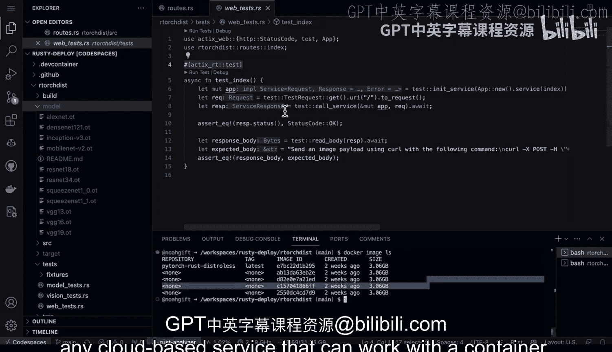

# 134：Linux命令行工具、LLMOps 🦀


## 第134课：运行PyTorch预训练模型

在本节课中，我们将学习如何将一个预训练的PyTorch模型与Rust Axum微服务结合运行。我们将从代码结构、构建过程、本地测试，到最终的Docker容器部署，完整地走一遍流程。

---

### 概述与项目结构 📁


这里有一个预训练的PyTorch模型和一个Rust Axum微服务。

让我们深入查看代码。我在GitHub Code Spaces中运行此项目，并拥有这个 `r-torch-disk` 目录。

首先，我们将进入该目录并开始操作。

```bash
cd r-torch-disk
```

现在，如果我们查看这个目录，我喜欢使用Makefile。你可以看到，如果我执行 `make debug`，它将构建Docker容器。如果我执行 `make build`，它将构建发布版本。

---

### 构建项目 🔨

让我们执行 `make build`。你可以看到它显示了我可以运行的具体命令。

```bash
cargo build --release
```

很好，我们之前已经构建过这个项目，所以它只是检查了二进制文件。

现在，如果我想运行它，我也可以直接输入 `cargo run`。这是运行项目的另一种方式。`build` 只是编译它，而 `run` 会运行它。这种基于本地二进制文件运行的好处是，它允许我测试一些东西，例如冒烟测试。

当它在运行时，我们可以看看冒烟测试是什么样子的。这个冒烟测试会遍历并让我们 `curl` 每一个路由。这里有第二个路由，第三个路由，第四个路由。冒烟测试的好处是，它会上传图像，以便我使用不同的端点进行图像预测。

让我们打开一个新的终端，进入 `r-torch-disk` 目录并运行冒烟测试。

```bash
./smoke_test.sh
```

你可以看到它遍历了每个端点并运行测试。因此，在构建微服务时，创建一个能轻松测试不同预测并添加良好日志记录的工具，是非常强大的做法。

---

### 日志记录与代码结构 📝

接下来，让我们看看我是如何设置所有这些日志记录的。

如果我们进入源代码，查看 `main.rs` 文件，请注意我的做法。实际上，我在这里使用了这个日志记录器。这将被传递到这个微服务中。

然后，如果我们进入实际的逻辑代码，你可以看到我有很多 `info` 消息，这些消息允许我查看我正在执行的操作的各个方面，以便我可以在生产环境中调试和查看问题。

因此，在构建微服务时，添加日志记录非常重要，这样你才能知道实际发生了什么。

关于路由，我需要指出的另一点是，在生产环境中我只会使用这个路由。但我确实设置了不同的路由。例如，这个路由用于检查PyTorch是否工作，这个用于检查图像上传是否工作，而这个用于检查我是否可以对本地磁盘上的图像进行预测。

我将这个特定问题分解为三个不同的子路由，以便验证微服务是否正常工作。这是一个很好的健康检查系统。我可能不会在生产环境中向用户公开所有这些路由，而只公开最下面的路由。但这些路由都可以作为自检类型的监控点，用于验证每个不同组件（安装、图像上传以及图像预测本身）是否正常工作。这是一个你可以使用的小技巧。

---

### Docker容器化部署 🐳

如果我想进一步了解容器是如何工作的，让我们接下来尝试一下。我需要做的就是停止当前运行的服务。

再次查看 `Dockerfile`，它相当直接。我们有Docker代码，我下载了PyTorch，在这里设置了一些环境变量。在这个特定部分，这个 `distroless` 镜像，是我复制所有构件的地方，包括LibTorch和预训练模型，然后我直接运行二进制文件本身。

至于Makefile，我们可以看到Docker构建过程就是 `docker build`。要运行它，我们只需执行那个命令。

我将运行那个命令：

```bash
make run
```

这将运行Docker镜像。我喜欢使用Makefile，因为这个命令非常冗长，容易打错字。

我们可以看到，实际上，我之前所做的一切都完全相同地工作。冒烟测试有效。我可以看到我的应用程序很容易部署。

---

### 镜像大小与优势 📦

现在，我们可以查看的另一点是这个镜像的大小。这是这种方法的一个巨大优势。

如果我们查看 `docker image ls`，我们可以看到这是一个3GB的镜像。对于这个特定的PyTorch安装来说，PyTorch本身就有几个GB。因此，这里的大部分代码实际上只是PyTorch。模型本身相当小，不到100MB，而Rust代码本身可能大约20MB。所以，这里的大部分内容只是PyTorch及其部署环境。但这比一个可能达到6GB、8GB或10GB的常规镜像要小得多。因此，使用这种 `distroless` 类型的包是减少镜像大小的好方法。

---

### 测试与模型选择 🧪

我还要指出的另一点是，在这个结构中，在这个特定的测试里，我们有模型测试，它只是运行一些模型测试。我还有一些视觉测试，它运行绑定的安装测试。我还有一些Web测试，例如，验证索引是否正常工作的功能测试。这些都是需要了解的重要步骤。

如果我们还想看看模型本身，我实际上有这个模型。我有一系列不同的模型可供选择，可以放入这个构建过程中。在这个特定的例子中，我使用了一个ResNet模型，但同样，你可以使用任何类型的预训练模型。

---

### 总结 🎯

本节课中，我们一起学习了如何将PyTorch预训练模型集成到Rust微服务中。你亲眼看到，你可以使用二进制文件进行部署，也可以使用Docker `distroless` 镜像进行部署。一旦你完成了这个设置，就可以很容易地将它部署到任何可以处理容器的云服务上。



这些就是整个工作流程的概述。