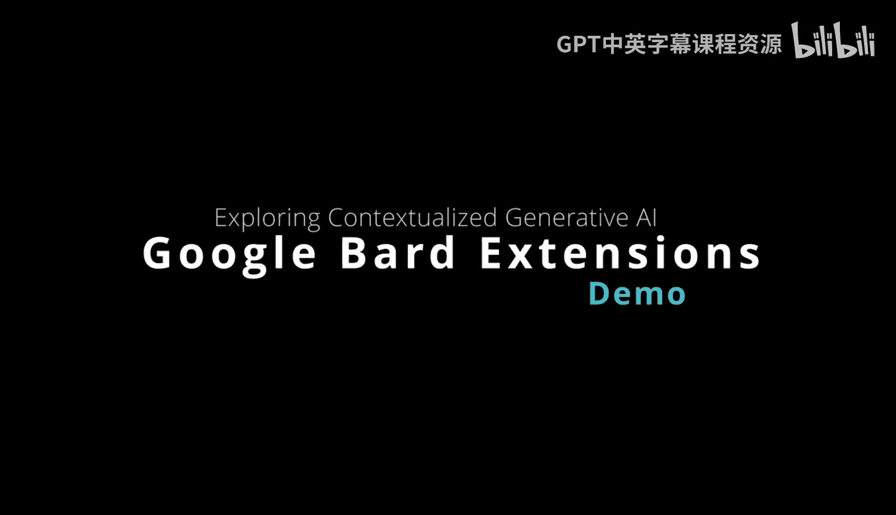
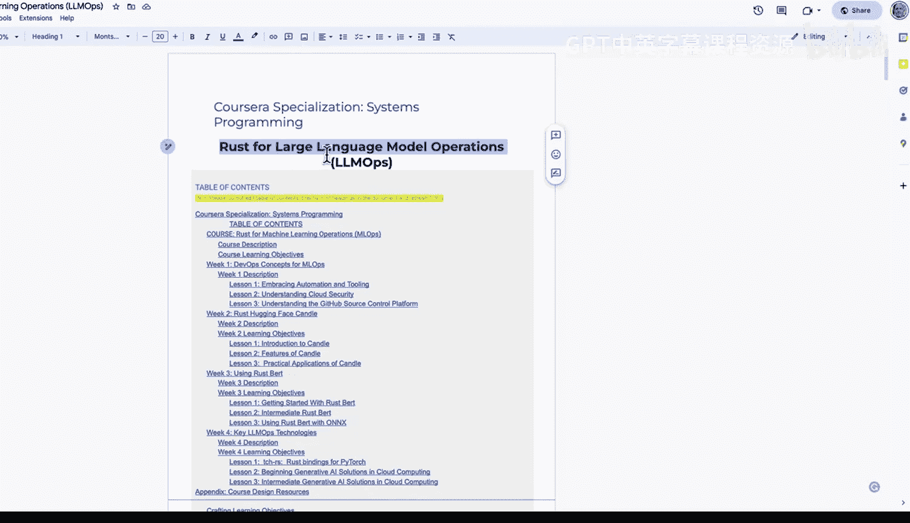

# 137：扩展Google Bard 🧠

在本节课中，我们将学习如何利用Google Bard的扩展功能，特别是其与Google Workspace的集成，来分析和处理个人文档与数据，从而获得更具针对性的AI辅助。

---

Google Bard提供了一些非常有趣的功能，其中包括使用扩展的能力。扩展功能的一个有趣之处在于，它允许你拥有个性化的上下文环境，你可以向AI助手询问独特的内容，例如航班、酒店、地图，甚至是你的工作空间文档或YouTube视频。

接下来，我们将看看如何让它帮助我处理正在开发的一个Coursera专项课程。

## 连接个人文档

在上图中，你可以看到我有一个关于“使用Rust进行大语言模型运维”的专项课程大纲。如果我复制这段文本，我可以请求我的Google Workspace Bard集成扩展来执行一些操作。

例如，我可以点击链接并输入指令：“给我这份文档的关键点概述。”

## 分析与总结

Bard将执行以下操作：它会进入我的Google Drive，找到我的文档，访问文档内容，查找其中的关键事实，然后给我一个摘要。

它总结道，这份文档将涵盖使用Rust进行LLM运维的好处，使用Rust构建大语言模型，大语言模型的部署，以及使用Rust的真实世界项目案例研究。我们可以看到，这里实际上包含了许多我正在处理的不同事项的信息。能够深入挖掘文档的这些特定方面并查看不同的信息片段，这非常酷。

## 深入探索与代码示例

更令人着迷的是，我还可以进一步深入。例如，我可以提出更具体的请求：“谢谢，你能给我一些我录制的Rust代码示例吗？比如.MP4文件中的内容。”

让我们看看它有多智能。它能否进入文件内部，以文本格式提取数据并提供一些样本？

结果显示，它给出了一些示例。不过，它似乎有点混淆，认为我想要处理MP4文件本身。因此，我换一种方式提问：“给我一个涵盖我课程中某个主题的Rust代码示例。”

## 生成新创意

我们来看看它是否能利用上下文给出一些新的创意想法。这是使用生成式AI的另一个新兴领域——不仅仅是利用其“魔法”，而是可以设定上下文并获得新灵感。

这里出现了一个代码片段，我在这个专项课程中确实涵盖了二叉搜索树。Bard正在给我一些关于如何在课程中讲解这个主题的新想法。

## 核心概念与应用模式

我认为这是一个伟大的新兴领域。其核心不仅在于盲目使用生成式AI，更在于在特定扩展的上下文中使用生成式AI，并最终利用你文档中的具体上下文。这样，你就能以更专业的方式直击问题核心，而不是盲目地请求通用想法。

**核心交互模式可以概括为：**
`用户查询 + 扩展权限（访问特定数据源） + 个性化上下文 = 高度相关且具体的AI输出`

我认为生成式AI的一个新兴领域，正是能够在解决特定应用或问题的背景下，与你的数据进行这类对话的能力。

---

本节课中，我们一起学习了如何激活并使用Google Bard的扩展功能，特别是与Google Workspace的集成，来分析和总结个人文档，并基于此上下文获取新的代码创意和课程设计灵感。关键在于结合个性化数据与AI能力，实现更精准、高效的辅助。