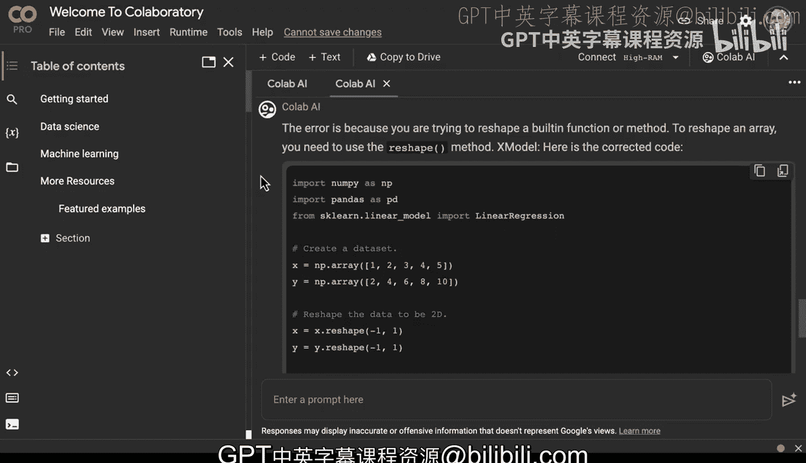

# 139：探索Colab AI 🧠

在本节课中，我们将探索Google Colaboratory（简称Colab）及其内置的AI助手功能。我们将学习如何利用Colab提供的强大硬件加速资源，并掌握如何有效地使用其生成式AI功能来辅助编程，特别是处理代码错误和迭代开发。

---

## 概述：Colaboratory与AI助手

Colaboratory是一个著名的云端Jupyter Notebook解决方案。它提供了一些非常强大的功能。

首先，我们可以查看运行时设置。在这里，我们可以更改运行时类型。请注意，Colab内置了多种出色的硬件加速类型，包括使用高性能Tensor处理单元（TPU）、A100 NVIDIA GPU、V100 NVIDIA GPU和T4 GPU的能力。这些是我们在此获得的非常强大的功能。

现在，我们可以做的另一项新兴功能是，直接在Notebook中使用生成式AI。

---

## 激活并使用Colab AI助手

接下来，让我们尝试使用这个功能。我们可以在界面中找到“Colab AI”选项。事实上，我们可以滚动查看，甚至可以将整个环境设置为专注于生成式AI。这本质上是一个隐藏在界面内的AI助手。

我们可以尝试使用默认查询。例如，输入“如何过滤pandas数据框”，我们会看到它给出了一个很好的示例。我们也可以返回并给它更多信息。例如，我们可以说“我想要一个如何进行简单线性回归的示例”。

好的，现在我们有了一个代码示例。让我们来试试看。复制这段代码，然后转到“文件”>“新建笔记本”。我们可以直接将代码粘贴进去。如果我们运行它，我们将能够获得一个可视化结果，展示具体发生了什么。

---

## 调试与迭代：与AI协作

我们遇到了一个问题：代码期望一个2D数组，但我们得到了一个1D数组。那么，如何修复这个问题呢？让我们在这里输入错误信息，看看AI会告诉我们什么。它建议我们尝试使用`reshape`方法将数组重塑为`(-1, 1)`。让我们试试看。

我们回到代码这里。我们可以修改数组部分。我们可以输入`x = ...`和`y = ...`。注意，它甚至帮我自动补全了代码。这能解决我们的问题吗？哦，我们遇到了另一个问题：它提示“没有‘reshape’属性”。

那么，让我们把这个问题反馈给AI助手。看起来AI在将函数或方法当作数组使用。我可以回到AI助手这里，直接说“也许整个示例有问题”，或者“你能帮我修复这个吗？”。

AI给出了修正后的代码。好的，让我们把它粘贴回去，看看会发生什么。成功了！现在我们可以看到，线性回归的可视化结果正确显示了。

---

## 核心策略：有效使用AI助手的技巧

从这个过程中，你很容易被诱惑去盲目接受AI给出的答案，然后在它们不工作时就放弃。但就像处理真实的编程问题一样，使用生成式AI的一种方法是：假设AI生成的结果在某个频率下（比如25%的时间）总会存在问题。

现在的问题是，即使它没有给出完全正确的答案，你该如何继续推进？实现这一点的方法之一是**缩小范围**，并将错误追踪信息反馈给AI助手，持续向前推进。这样，你就能将问题**二分**为正确的部分和错误的部分。

这实际上是传统的调试思维，只是我们有了一个能提供大量帮助的新高级工具。通过Colab AI，你可以看到一个成功使用它的重要策略。

---

## 总结

本节课中，我们一起探索了Google Colab及其内置的AI助手功能。我们学习了如何利用Colab的硬件加速资源，并通过一个线性回归的代码示例，实践了如何与AI助手协作来调试和修复代码。关键在于理解AI辅助编程是一个迭代过程，需要你主动提出问题、反馈错误并引导对话，才能高效地解决问题。