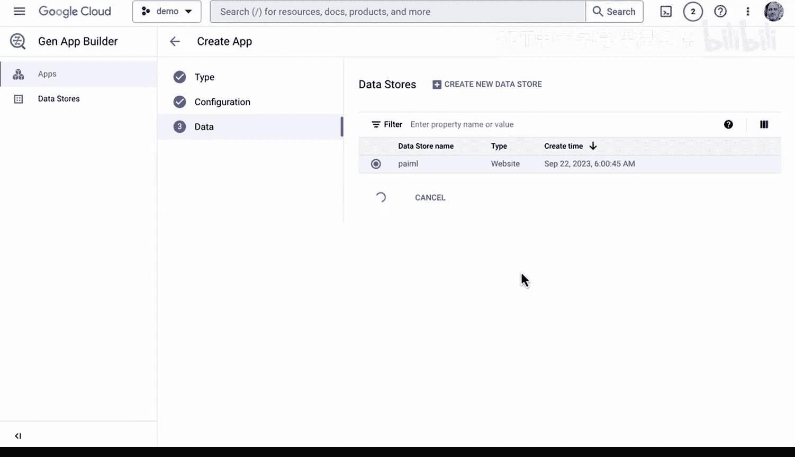

# 140：探索Gen App Builder 🧠

在本节课中，我们将学习生成式AI领域的一项新兴技术：如何利用生成式AI来更快地构建应用程序。我们将以Google Cloud的Gen App Builder为例，了解其核心组件和功能。

---

## 概述

生成式AI领域的一项新兴技术是利用生成式AI来更快地构建应用程序。

## 核心组件

如果我们查看Google Cloud的Gen App Builder，可以看到这里有类型配置和数据。这是使用生成式AI构建应用程序的三个组成部分。

我们拥有搜索、聊天和推荐功能。

## 搜索功能

首先，我们来看看搜索功能。可以看到，您能够使用企业版。例如，您可以进行提取式回答。您也可以使用高级LLM功能，例如搜索摘要和带后续问题的搜索。这是在构建应用程序时，利用现成的LLM技术的一个强大功能。

## 聊天功能

接下来，我们看看可以构建的另一个功能：聊天。让我们来看看它是如何工作的。

如果我们进入聊天界面，我将能够构建一个新的应用程序，该应用程序使用聊天功能，并且我们可以使用Dialogflow API。在这个例子中，我们将其称为聊天机器人。

对于公司名称，我们称之为Pretend Co。对于数据存储，我们将选择数据源。我们可以选择网站URL，以便自动从列出的域名爬取网站内容。

让我们选择一个我拥有的域名，例如PL.com。然后我们点击继续，并将其命名为PIML。

## 构建过程

此时，我们将能够选择这个作为数据源，这同样是一个自定义数据源。然后，将构建一个基于LLM的聊天应用程序，这实际上只需要低代码甚至无代码技术。

## 优势

使用这类工具的优势在于，它将先进的大型语言模型技术的力量交到了开发者手中。这些开发者可能没有时间完全开发一个应用程序，或者不具备传统的软件开发技能。只要他们了解要搜索的上下文，他们就能非常快速地构建出应用程序。

---

## 总结

本节课中，我们一起学习了如何利用生成式AI，特别是通过Google Cloud的Gen App Builder这样的工具，来快速构建具备搜索、聊天等功能的应用程序。这项技术降低了开发门槛，让更多人能够高效地利用先进的AI能力。