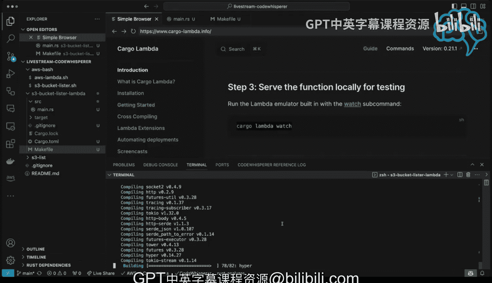

# 145：AWS CodeWhisperer实时编码（第一部分）🚀


## 概述
在本节课中，我们将学习如何结合使用AWS CodeWhisperer和Cargo Lambda工具，在本地Visual Studio Code环境中进行实时编码，以创建和部署运行在AWS上的Rust函数。

## 开始使用

首先，我打开了名为“简单浏览器”的工具。你可以从命令面板中找到它。输入“website”即可打开。这个工具的好处是可以在编码时查看文档，同时将所有内容保持在同一个屏幕上。

接下来，我们转到CDK CodeWhisperer。你可以看到这些都是AWS开发者工具集的一部分。我们可以看到CodeWhisperer实际上已经启用。

## 设置Cargo Lambda

我首先要做的是查看入门指南，确保所有功能都能正常工作。我们在本地进行设置，因为我运行的是OS 10系统，不过这个工具在Linux上也能运行。

以下是设置步骤：

1.  输入 `brew tap cargo-lambda/cargo-lambda` 命令。
2.  我们看到它已经存在。
3.  如果输入 `brew install cargo-lambda`，它不仅会检查是否已安装，还会在需要时进行更新。我已经全部设置好了，所以不需要做任何操作。

## 创建Lambda项目

现在我们已经有了Cargo Lambda，我们可以用它来创建一个新的Lambda项目。输入以下命令：

```bash
cargo lambda new lambda_project
```

然后进入该目录：

```bash
cd lambda_project
```

我将这个项目命名为“S3 Bucket Lister”。创建过程中，系统会询问一些问题。例如，这个函数是否是HTTP函数？我选择“否”。然后，我选择不接收任何事件。这样，我们就有了一个良好的起点。

## 查看项目代码

进入项目目录后，我需要查看其中的代码。在主函数中，我们可以看到一些文档注释。为了缩短代码长度，便于在屏幕上完整显示，我将删除这些注释。

以下是代码的主要部分：

1.  请求和响应部分，这是Lambda函数的标准组成部分。
2.  函数处理程序的主体部分，负责执行所有工作。
3.  一些样板代码，你不需要过多担心。

为了保持代码紧凑，我还会删除其他注释。

## 使用Makefile

接下来，我们想使用Makefile。我可能在其他地方有一个现成的Makefile。我会快速从另一个项目中复制一个过来。

操作步骤如下：

1.  转到我的另一个项目。
2.  快速复制一个Makefile。
3.  将其粘贴到当前项目中。

然后，我使用 `touch` 命令创建一个新文件。现在，我已经有了Makefile，接下来可以查看其中可用的不同功能。

例如，运行 `make release-version` 命令来检查一切是否正常工作。但首先，我需要确保Makefile保存在正确的位置。保存后，再次运行命令，一切就正常工作了。

Makefile中还有一些其他命令，如测试等。回到项目，我们可以看到接下来的步骤。例如，运行 `cargo lambda watch` 命令，这将编译代码并实时监控变化。



## 总结
本节课中，我们一起学习了如何在本地Visual Studio Code环境中，结合AWS CodeWhisperer和Cargo Lambda工具进行实时编码。我们设置了开发环境，创建了一个新的Lambda项目，查看了项目代码结构，并引入了Makefile来管理构建和监控过程。这为后续在AWS上部署和运行Rust函数奠定了基础。