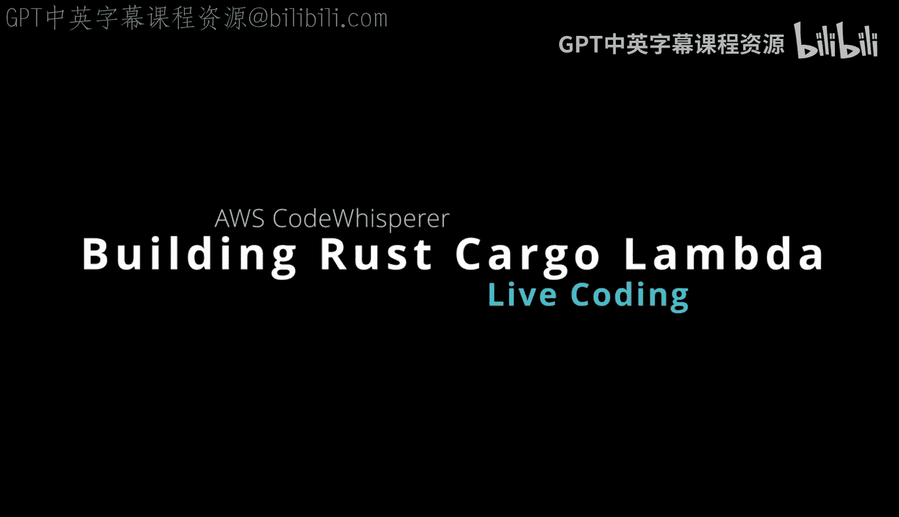
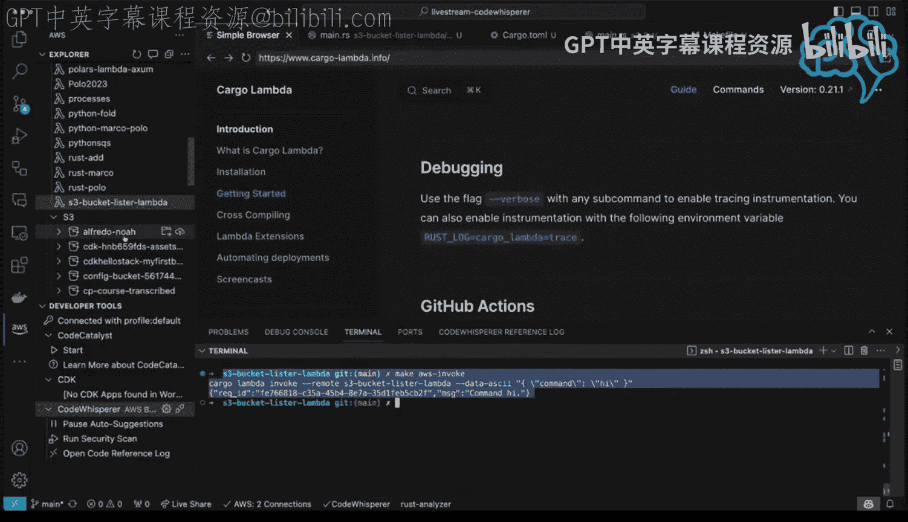
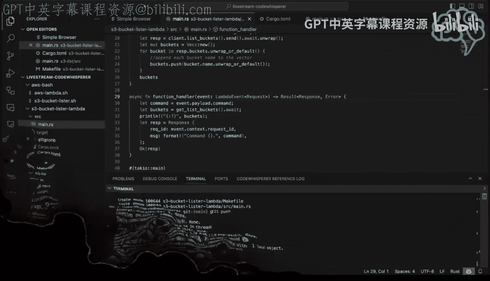

# 147：AWS CodeWhisperer实时编码（第三部分）



在本节课中，我们将学习如何将一个使用AWS CodeWhisperer辅助编写的Rust Lambda函数，进行构建、部署到AWS平台，并进行远程调用测试。我们将重点关注发布构建、跨平台编译以及Lambda权限配置等关键步骤。

## 构建发布版本

上一节我们完成了Lambda函数的代码编写，本节中我们来看看如何将其构建为可部署的版本。

首先，我们需要使用Cargo Lambda工具构建一个发布版本。发布版本经过优化，更适合在生产环境中运行。

以下是构建命令：
```bash
cargo lambda build --release
```
此命令会生成一个针对默认平台架构的优化二进制文件。

## 跨平台编译以节省成本

构建完成后，我们可以考虑进行跨平台编译。AWS Graviton处理器（基于ARM64架构）通常比同性能的x86实例成本更低。

为了针对ARM64架构（Graviton）进行编译，我们需要先清理之前的构建产物，然后指定目标平台。

以下是相关步骤：
1.  清理构建目录：`rm -rf target`
2.  针对ARM64架构构建：`cargo lambda build --release --arm64`

## 部署到AWS Lambda

构建成功后，下一步是将函数部署到AWS Lambda。

部署过程非常简单，只需一条命令：
```bash
cargo lambda deploy
```
由于部署的是编译好的二进制文件，这个过程通常非常快速。部署完成后，Lambda函数会被创建在您的AWS账户中。

## 配置Lambda函数权限

部署后尝试远程调用函数时，可能会遇到权限错误。这是因为新创建的Lambda函数默认的执行角色可能没有访问其他AWS服务（如S3）的权限。

为了解决这个问题，我们需要为Lambda函数的执行角色添加必要的权限策略。

以下是配置权限的途径：
*   通过AWS管理控制台，导航到该Lambda函数的“配置”->“权限”选项卡，编辑其执行角色，附加所需的策略（例如AmazonS3ReadOnlyAccess）。
*   如果使用基础设施即代码工具（如AWS CDK），可以在代码中定义权限。

## 测试与调用Lambda函数



权限配置完成后，就可以测试Lambda函数了。


有多种方式可以调用已部署的Lambda函数：
*   使用`cargo lambda invoke`命令进行远程调用。
*   直接在AWS管理控制台的Lambda函数界面中，使用“测试”功能创建并执行测试事件。
*   通过AWS CLI或其他SDK进行调用。

在控制台测试时，您可以即时看到函数执行的日志输出和返回结果，便于调试。

## 代码管理与后续计划

功能测试通过后，最后一步是将本项目的代码提交到版本控制系统（如Git）进行管理。



以下是常用的Git命令序列：
```bash
git status
git add .
git commit -m "添加Lambda函数演示"
```
本节课中我们一起学习了使用Rust和Cargo Lambda工具进行函数构建、针对ARM架构的跨平台编译、部署到AWS Lambda、配置权限以及远程测试的完整流程。整个过程展示了如何高效地开发和部署无服务器函数。基于此次成功的尝试，后续可以探索构建更复杂的Lambda函数应用。